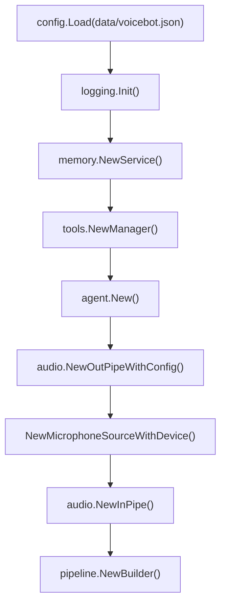
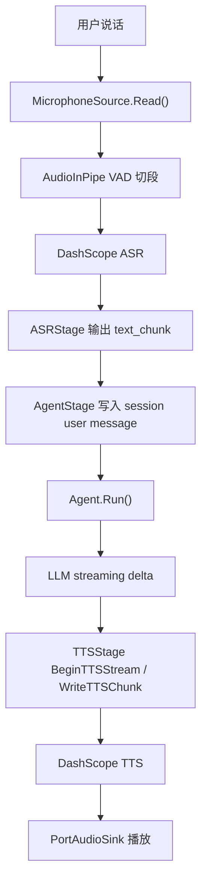
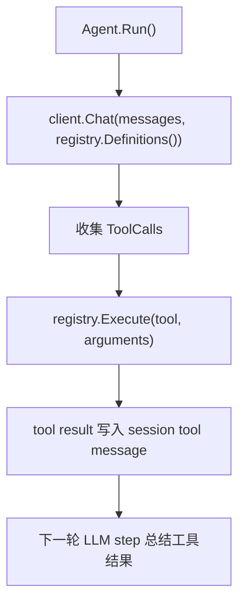
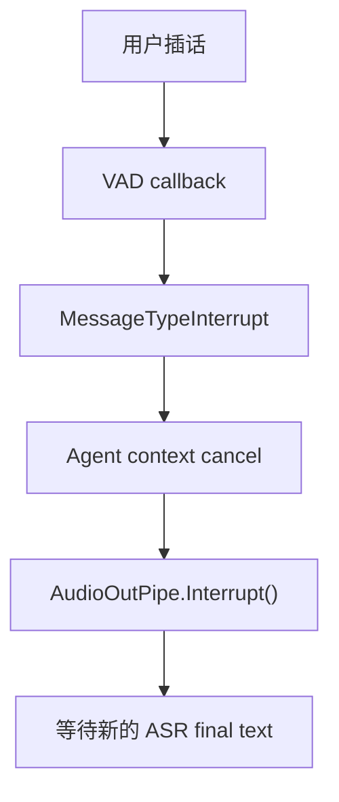

# 系统架构

Orion-X 当前版本以 `cmd/voicebot` 作为本地语音 Agent 试验入口。主流程是一个线性 Pipeline：

启动代码集中在 `cmd/voicebot/main.go`。它负责加载配置、初始化日志、创建工具管理器、记忆服务、Agent、PortAudio 输入输出对象，然后通过 `pipeline.NewBuilder()` 组装运行时链路。

## 运行时对象

Pipeline 当前由三个 Stage 组成：

| Stage | 输入 | 输出 | 职责 |
|---|---|---|---|
| `ASRStage` | 麦克风音频 | `text_partial`、`text_chunk`、`interrupt` | 启动 `AudioInPipe`，接收 ASR 回调和 VAD 打断事件 |
| `AgentStage` | 用户最终文本 | `text_chunk`、`finished`、`interrupt` | 把用户文本写入 session，运行 Agent，并在新输入到来时取消本轮 Agent |
| `TTSStage` | Agent 文本流 | TTS 播放事件和透传消息 | 建立 TTS stream，写入文本 chunk，完成或打断时结束播放 |

## 数据流

一次正常对话的消息流如下：

当 LLM 触发工具调用时：

Agent 当前默认最多执行 2 个 step：第一步可产生工具调用，第二步用于基于工具结果生成回复。没有工具调用时，Agent 直接输出文本并结束。

## 中断模型

`AudioInPipe` 在 VAD 检测到用户说话时会通过 `ASRStage` 发出 `interrupt` 消息。`AgentStage` 在运行 Agent 时同时监听上游输入，一旦收到新消息或打断，会取消本轮 Agent context。`TTSStage` 收到 `interrupt` 后调用 `AudioOutPipe.Interrupt()` 清空并停止当前播放任务。

## 工具系统

工具由 `internal/tools.Manager` 创建并注册到 `Registry`：

- 本地内置工具：当前包含 `getTime`
- MCP 工具：通过 `tools.mcp` 配置加载
- LLM 工具定义：由 `Registry.Definitions()` 转为 provider 可用的 tool schema
- 执行入口：`Registry.Execute(ctx, name, json.RawMessage)`

当前工具结果是文本数据，写回 session 后交给 LLM 继续生成自然语言回复。

## 会话与记忆

`internal/session` 保存当前 CLI 进程内的对话历史，包括 user、assistant、tool message 和 tool call ID。`internal/memory` 提供上下文注入与长期记忆能力：

| 模式 | 行为 |
|---|---|
| `none` | 只使用当前 session |
| `session` | 使用 session buffer 和可选摘要 |
| `long_term` | 使用 SQLite store、FTS 查询和 LLM 抽取记忆项 |

`cmd/voicebot` 当前用固定 `UserID=local`、`SessionID=local` 创建 memory context。后续接入 WebSocket、GUI 或多用户服务时，这里需要改成真实用户和会话标识。

## Provider 边界

当前支持的 provider 边界如下：

| 能力 | 包 | 当前实现 |
|---|---|---|
| ASR | `internal/provider/asr` | 阿里云 DashScope |
| TTS | `internal/provider/tts` | 阿里云 DashScope |
| LLM | `internal/llm/provider` | OpenAI-compatible |
| 音频输入输出 | `cmd/voicebot` + `internal/audio` | PortAudio |

ASR/TTS 通过 factory registration 创建，LLM provider 在 `main.go` 中通过 blank import 注册 OpenAI-compatible 实现。
