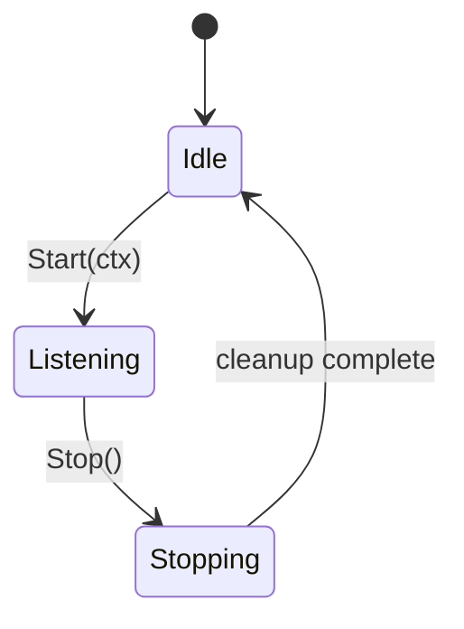
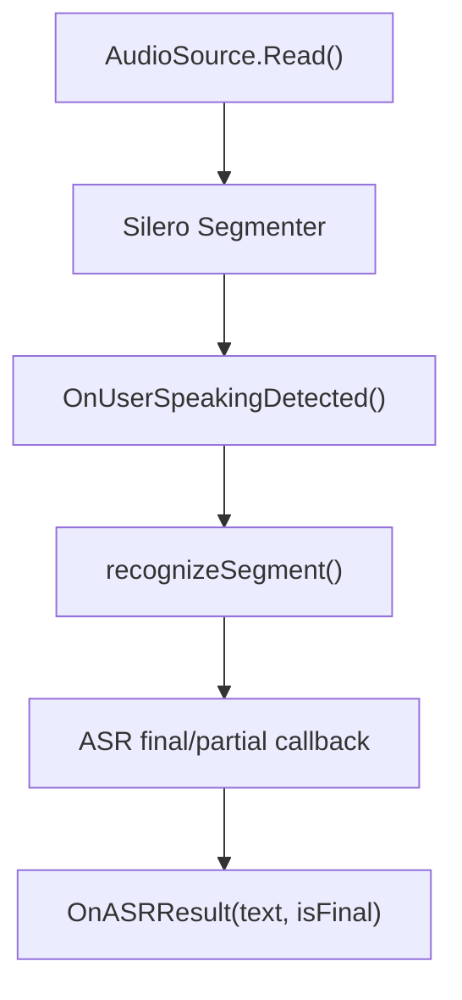
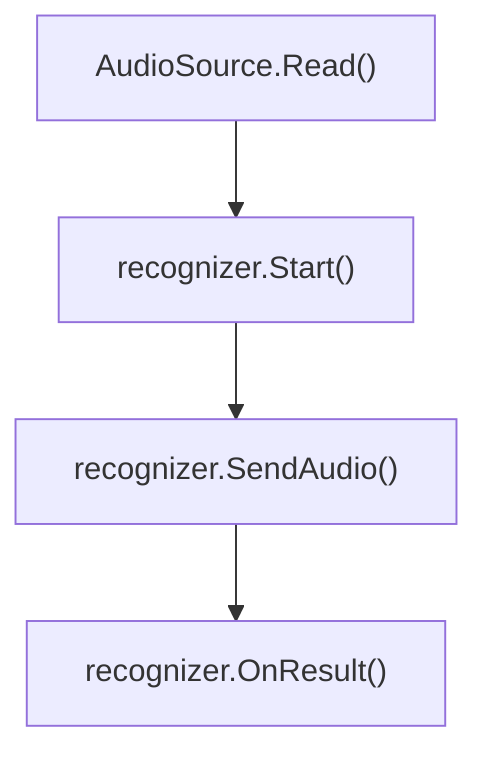
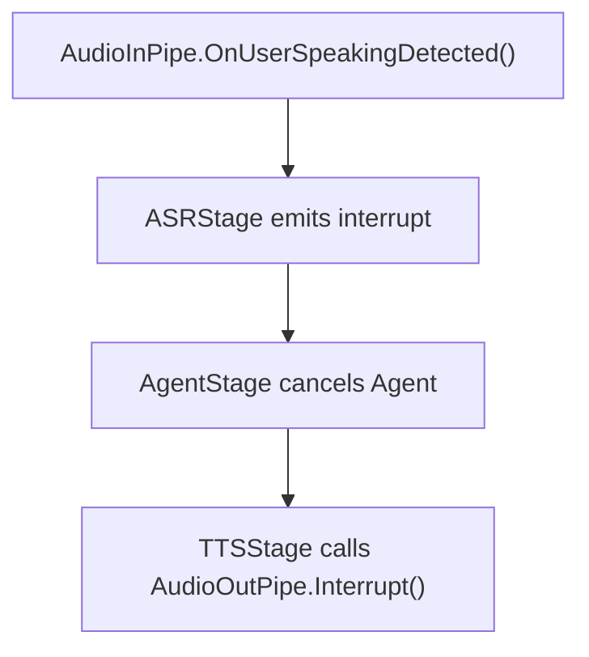

# AudioInPipe

`AudioInPipe` 负责接收音频、可选 Silero VAD 切段、调用 ASR recognizer，并通过回调把识别结果交给 `ASRStage`。

## 位置

```text
internal/audio/inpipe.go
cmd/voicebot/microphone.go
internal/audio/vad/
internal/provider/asr/
```

`AudioInPipe` 不直接依赖 PortAudio。它通过 `AudioSource` 接口读取音频；当前本地麦克风实现在 `cmd/voicebot`。

## AudioSource

```go
type AudioSource interface {
    Read(ctx context.Context) ([]byte, error)
    Close() error
}
```

当前 `MicrophoneSource` 特性：

- PortAudio 输入
- 16-bit PCM little endian
- 支持指定输入设备名称
- 蓝牙设备自动启用高延迟模式
- `Read(ctx)` 支持 context 取消
- `Close()` 会 Abort 阻塞读取，避免退出卡住

## 状态机



`Start(ctx)` 启动 ASR 回调和音频读取协程。`Stop()` 会关闭音频源、等待读取协程和 ASR 任务退出，并关闭 VAD segmenter。

## 配置

```go
type InPipeConfig struct {
    SampleRate      int
    Channels        int
    EnableVAD       bool
    VADThreshold    float64
    VADType         string
    VADModelPath    string
    VADMinSilenceMs int
    VADSpeechPadMs  int
    ASRAPIKey       string
    ASRProviderType string
    ASRModel        string
    ASREndpoint     string
}
```

JSON 中的 `audio.in_pipe` 还包含 CLI 麦克风参数：

```json
{
  "sample_rate": 16000,
  "channels": 1,
  "enable_vad": true,
  "vad_threshold": 0.5,
  "vad_type": "silero",
  "vad_model_path": "models/silero_vad.onnx",
  "vad_min_silence_ms": 500,
  "vad_speech_pad_ms": 300,
  "buffer_size": 3200,
  "high_latency": false,
  "input_device": ""
}
```

`buffer_size`、`high_latency`、`input_device` 由 `cmd/voicebot` 创建 `MicrophoneSource` 时使用。

## 数据流

启用 VAD：



关闭 VAD：



`ASRStage` 会把回调转换为 pipeline message：

| 回调 | Pipeline message |
|---|---|
| `OnASRResult(text, false)` | `text_partial` |
| `OnASRResult(text, true)` | `text_chunk` |
| `OnUserSpeakingDetected()` | `interrupt` |

## ASR Provider

当前 ASR provider 通过 factory 创建，实际实现是阿里云 DashScope：

```go
recognizer, err := asr.NewRecognizer(asr.ProviderConfig{
    Type: config.ASRProviderType,
    Config: asr.Config{
        APIKey:     config.ASRAPIKey,
        Model:      config.ASRModel,
        Endpoint:   config.ASREndpoint,
        Format:     "pcm",
        SampleRate: config.SampleRate,
    },
})
```

## 打断

打断不是由 `AudioInPipe` 直接停止 TTS。它只发出用户说话信号：



## 测试

单元测试使用 inline mock，不使用 mock generator。音频设备相关测试需要本机设备和 ASR key。
