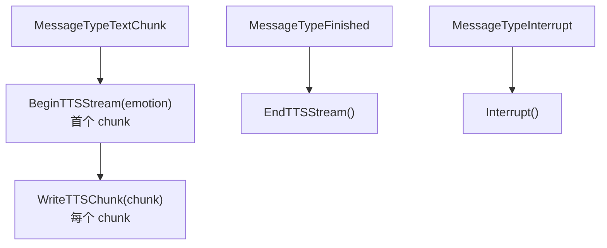
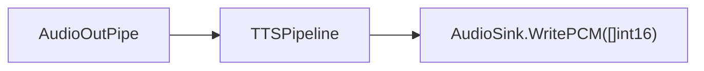
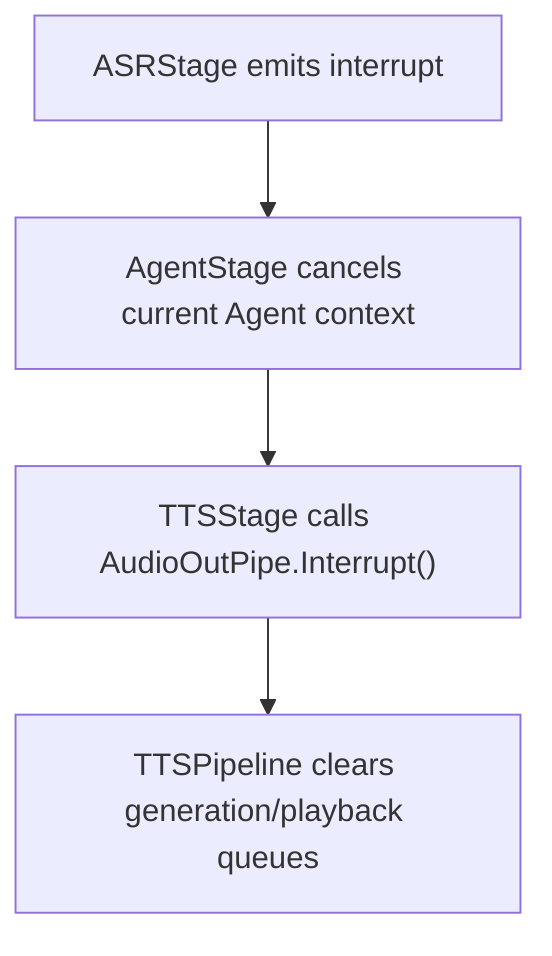

# AudioOutPipe

`AudioOutPipe` 是当前 TTS 输出边界，负责启动异步 TTS Pipeline、把文本写入流式 TTS 会话、把 PCM 音频送到 `AudioSink` 播放，并在用户打断时清空队列。

## 接口

```go
type AudioOutPipe interface {
    Start(ctx context.Context) error
    Stop() error

    PlayTTS(text string, emotion string) error
    PlayResource(audio io.Reader) error

    BeginTTSStream(emotion string) error
    WriteTTSChunk(chunk string) error
    EndTTSStream() error

    Interrupt() error
    SetSink(sink AudioSink)

    SetOnPlaybackFinished(callback PlaybackFinishedCallback)
    SetOnTTSItemStarted(callback TTSItemStartedCallback)
    Stats() PipelineStats
}
```

`TTSStage` 当前使用流式接口：



## 配置

`cmd/voicebot` 从 `audio.tts_pipeline` 和 `provider.tts.aliyun` 构造 `OutPipeConfig`。

```go
type OutPipeConfig struct {
    SinkFormat      *AudioFormat
    TTS             tts.Config
    TTSProviderType string
    TTSProvider     tts.Provider
    TTSPipeline     *TTSPipelineConfig
    VoiceMap        map[string]string
}
```

JSON 中相关字段：

```json
{
  "provider": {
    "tts": {
      "type": "aliyun",
      "aliyun": {
        "model": "cosyvoice-v3-flash",
        "voice": "longanyang",
        "format": "pcm",
        "sample_rate": 16000,
        "volume": 50,
        "rate": 1.0,
        "pitch": 1.0,
        "voice_map": {
          "default": "longanyang"
        }
      }
    }
  },
  "audio": {
    "tts_pipeline": {
      "max_tts_buffer": 3,
      "max_concurrent_tts": 2,
      "text_queue_size": 100
    }
  }
}
```

## 音色映射

`VoiceMap` 用于把 emotion 映射为 DashScope TTS voice。当前 `TTSStage` 如果消息 metadata 没有 emotion，会使用 `default`。

默认映射：

| emotion | voice |
|---|---|
| `happy` | `longanyang` |
| `sad` | `zhichu` |
| `angry` | `zhimeng` |
| `calm` | `longxiaochun` |
| `excited` | `longanyang` |
| `default` | `longanyang` |

## 播放 Sink

当前 CLI 使用 `cmd/voicebot` 中的 `PortAudioSink`：



WebSocket、GUI 或测试场景可以实现自己的 `AudioSink`。

## 中断

用户插话时：



## 文件

```text
internal/audio/outpipe.go
internal/audio/outpipe_impl.go
internal/audio/tts_pipeline.go
internal/audio/tts_pipeline_impl.go
cmd/voicebot/portaudio_sink.go
```
