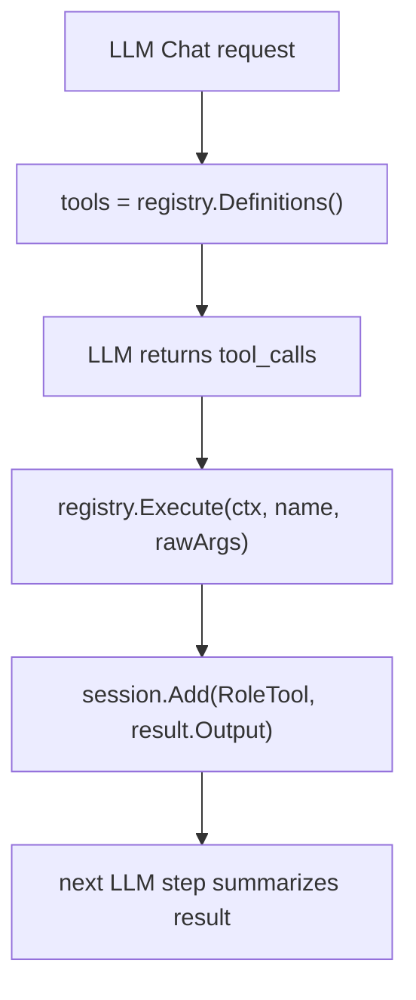

# 工具开发

当前工具系统由 `internal/tools.Manager` 和 `Registry` 管理。Agent 不区分旧版 query/action 类型，而是把 registry 中的 tool schema 提供给 LLM；LLM 请求工具后，Agent 执行工具并把结果作为 `tool` message 写回 session，再进入下一步 LLM 生成。

## 工具来源

| 来源 | 说明 |
|---|---|
| 本地工具 | 由 `LocalSpecs()` 返回，当前内置 `getTime` |
| MCP 工具 | 通过 `tools.mcp` 配置加载，支持 stdio、SSE、streamable |

## 本地工具结构

本地工具使用 `tools.Spec`：

```go
type Spec struct {
    Name         string
    Description  string
    Parameters   map[string]any
    ParallelSafe bool
    Execute      func(ctx context.Context, arguments json.RawMessage) (Result, error)
}
```

返回值：

```go
type Result struct {
    Output string
    Error  error
}
```

`Output` 应该是适合写入 LLM tool message 的文本。结构化结果建议编码成 JSON 字符串。

## 添加本地工具

在 `internal/tools/manager.go` 的 `LocalSpecs()` 中追加 `Spec`：

```go
{
    Name:        "getTime",
    Description: "获取当前时间",
    Parameters: map[string]any{
        "type":       "object",
        "properties": map[string]any{},
    },
    Execute: func(ctx context.Context, args json.RawMessage) (Result, error) {
        data := map[string]any{
            "current": time.Now().Format("2006-01-02 15:04:05"),
        }
        b, _ := json.Marshal(data)
        return Result{Output: string(b)}, nil
    },
}
```

参数 schema 会通过 `Registry.Definitions()` 暴露给 LLM provider。工具实现应自行解析 `json.RawMessage` 并返回明确错误。

## 配置 MCP 工具

```json
{
  "tools": {
    "mcp": [
      {
        "id": "local-search",
        "transport": "stdio",
        "command": "node",
        "args": ["server.js"],
        "tool_name_list": ["search"],
        "timeout_ms": 10000
      }
    ]
  }
}
```

字段说明：

| 字段 | 说明 |
|---|---|
| `id` | MCP server 唯一标识 |
| `transport` | `stdio`、`sse` 或 `streamable` |
| `command` / `args` | stdio server 启动命令 |
| `endpoint` | sse/streamable server 地址 |
| `tool_name_list` | 只加载指定工具；为空加载全部 |
| `timeout_ms` | 工具加载和调用超时 |

## Agent 调用流程



当前 Agent 默认 `maxSteps=2`，适合一次工具调用加一次总结。需要更复杂的多工具链路时，可以通过 `Agent.SetMaxSteps(n)` 调整。

## 测试建议

- 本地工具测试直接构造 `json.RawMessage`
- MCP 工具测试优先用小型 stdio server
- Agent 工具流测试使用 inline mock，不使用 mock generator
