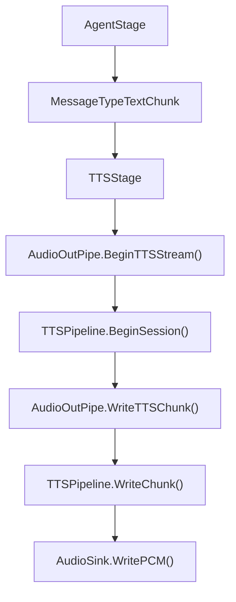

# TTS 异步管道

`TTSPipeline` 管理文本到语音的异步生成、播放缓冲、sink 输出和快速中断。当前由 `AudioOutPipe` 持有并启动。

## 接口

```go
type TTSPipeline interface {
    EnqueueText(text string, emotion string) error

    BeginSession(emotion string) error
    WriteChunk(chunk string) error
    EndSession() error

    Interrupt() error
    Start(ctx context.Context) error
    Stop() error
    Stats() PipelineStats
    SetSink(sink AudioSink)
    SetOnPlaybackFinished(callback PlaybackFinishedCallback)
    SetOnItemStarted(callback TTSItemStartedCallback)
}
```

接口同时支持两种写入方式：

| 方式 | 使用场景 |
|---|---|
| `EnqueueText(text, emotion)` | 已经分好句的文本 |
| `BeginSession` / `WriteChunk` / `EndSession` | LLM 流式输出 |

当前主 pipeline 的 `TTSStage` 使用流式写入方式。

## 配置

```go
type TTSPipelineConfig struct {
    MaxTTSBuffer     int `json:"max_tts_buffer"`
    MaxConcurrentTTS int `json:"max_concurrent_tts"`
    TextQueueSize    int `json:"text_queue_size"`
}
```

默认值：

| 字段 | 默认值 | 说明 |
|---|---:|---|
| `max_tts_buffer` | 3 | 已生成音频缓冲容量 |
| `max_concurrent_tts` | 2 | 并发 TTS 生成数 |
| `text_queue_size` | 100 | 文本队列容量 |

## 当前链路



收到 `MessageTypeFinished` 后，`TTSStage` 调用 `EndTTSStream()`，表示本轮文本输入结束。

## 中断

中断由 `AudioOutPipe.Interrupt()` 传入 `TTSPipeline.Interrupt()`。

目标行为：

- 停止当前播放
- 清空等待生成和等待播放的队列
- 取消当前流式 TTS session
- 让后续新一轮对话可以重新开始写入

## 统计信息

`Stats()` 返回：

```go
type PipelineStats struct {
    TextQueueSize   int
    TTSBufferSize   int
    IsPlaying       bool
    TotalEnqueued   int
    TotalPlayed     int
    TotalInterrupts int
}
```

这些字段主要用于调试和后续监控接入。

## 文件

```text
internal/audio/tts_pipeline.go
internal/audio/tts_pipeline_impl.go
internal/audio/tts_pipeline_test.go
```
