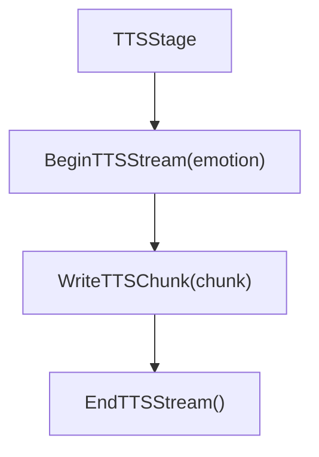

# TTS 语音合成

当前 TTS 实现是阿里云 DashScope CosyVoice 的 WebSocket provider，位于 `internal/provider/tts/aliyun/dashscope.go`。

## 接口

```go
type Provider interface {
    Start(ctx context.Context, cfg Config) (Stream, error)
}

type Stream interface {
    WriteTextChunk(ctx context.Context, text string) error
    Finish(ctx context.Context) error
    Close(ctx context.Context) error
    AudioReader() io.ReadCloser
    SampleRate() int
    Channels() int
}
```

## 配置

```go
type Config struct {
    APIKey               string
    Endpoint             string
    Workspace            string
    Model                string
    Voice                string
    Format               string
    SampleRate           int
    Volume               int
    Rate                 float64
    Pitch                float64
    EnableSSML           bool
    TextType             string
    EnableDataInspection *bool
}
```

应用层默认值：

- `model`: `cosyvoice-v3-flash`
- `voice`: `longanyang`
- `format`: `pcm`
- `sample_rate`: `16000`
- `text_type`: `PlainText`

`cmd/voicebot` 和 `audio.DefaultOutPipeConfig()` 会传入 16 kHz。直接调用 provider 且不传 `sample_rate` 时，`normalizeConfig()` 的 fallback 是 22050。

## 使用方式

```go
provider, _ := tts.NewProvider(tts.ProviderConfig{Type: tts.TypeAliyun})
stream, _ := provider.Start(ctx, cfg)

_ = stream.WriteTextChunk(ctx, "你好")
_ = stream.Finish(ctx)
reader := stream.AudioReader()
```

在当前主链路中：



## 音色映射

`provider.tts.aliyun.voice_map` 用于 emotion -> voice 映射。若 emotion 未命中，则使用 `default`。

## 重采样

`Stream.SampleRate()` 和 `Stream.Channels()` 会被 `TTSPipeline` 用来决定是否重采样。当前默认输出 16 kHz 单声道 PCM，因此大多数情况下会直接透传。

## 注意事项

- `WriteTextChunk` 前需要等待 TTS stream 已建立
- `Finish` 表示文本输入结束，不代表音频播放已经结束
- `Close` 会等待完成并回收连接
- 这里不处理分句，分句由 `Agent`/`Segmenter` 或流式 `TTSStage` 上层完成
