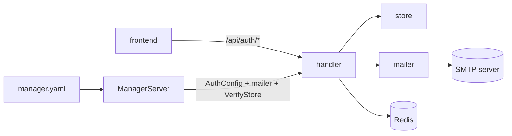
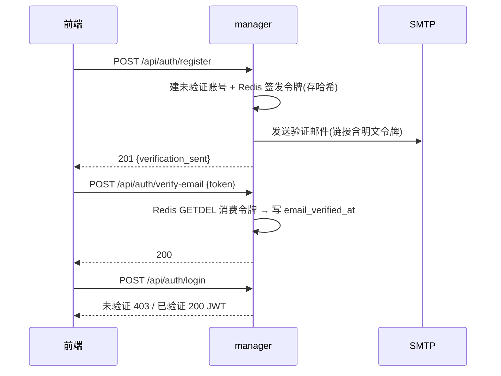

# 非 GitHub 注册邮箱验证设计

> 状态：已实现 | 日期：2026-10-03 | 范围：manager（config / handler / store / web 控制台）+ SMTP 发信 | 关联：`cmd/manager/handler/auth.go`、`cmd/manager/handler/oauth.go`、`cmd/manager/config.go`、`manager.example.yaml`、`docs/api-key-design.md`（配置开关的既有范式）

## 评审面（≤3 屏）

### 1. 结论与边界

给 manager 增加开关 `auth.email_verify`。开启后，走邮箱密码注册的账号必须先点击邮件里的链接完成验证才能登录；经 GitHub OAuth 创建（或邮箱匹配）的账号免验证。开关默认关闭，注册/登录行为与现状完全一致。

关键决策表：

| 决策 | 选择 | 一句话理由 | 代价 |
| --- | --- | --- | --- |
| 验证状态载体 | `users.email_verified_at`（可空时间戳），AutoMigrate 建列 | 登录门禁只读它，状态可逆 | 服务未上线，不做存量兼容（无需 backfill） |
| 令牌形态 | Redis 直存（SET 带 TTL + GETDEL 原子消费 + SET NX EX 冷却），不搞接口抽象 | 单实例/多副本都正确、不引额外存储层；Redis 6.2+ | 多一个 Redis 依赖（开启验证时必填） |
| 邮件链接落地 | 前端 `/login?verify_token=…`，页面 POST 验证 | 邮件安全网关预取不执行 JS，不会替用户消费令牌 | 前端多一段处理 |
| 链接域名 | 配置 `auth.verify_url_base`，不信任请求 Host/Origin | 防 Host Header 注入（OWASP） | 多一个必填配置 |

现状：注册成功直接返回 JWT（`cmd/manager/handler/auth.go:65-77`），GitHub 回调建号后同样直接登录（`cmd/manager/handler/oauth.go:167-181`），仓库没有邮件发送能力；GitHub provider 只取已验证邮箱（`internal/oauth/github/github.go:146-159`）。展开见 §A。

非目标：
- 不做「禁止邮箱密码注册/登录、仅 GitHub」（最初设想的 github_only）；本期只加验证门槛。
- 不做修改邮箱（`POST /api/auth/bind-email`）后的重新验证。
- 不做找回密码、营销/通知类邮件。
- 不删除长期未验证账号；注册接口不做 IP 级限流（风险见 §4）。

关键约束：开启开关但 SMTP、Redis 或链接地址缺失时进程必须启动失败（fail closed），Redis 还会启动期探活；验证链接不落日志；GitHub 账号与配置创建的管理员视为已验证；服务未上线，不做存量数据兼容。

### 2. 骨架

| 模块 | 职责 | 不负责 | 依赖 | 落点 |
| --- | --- | --- | --- | --- |
| config | 解析配置文件；`auth` / `smtp` 段直接复用模块 Config（`handler.AuthConfig` / `mailer.Config`，带 yaml tag） | 发信、验证 | `yaml` | `cmd/manager/config.go` |
| ManagerServer | 装配路由与依赖、初始化 mailer 与 Redis 客户端，持有 gin 引擎与 http.Server | 业务逻辑 | server.go | `cmd/manager/server.go` |
| mailer | 组装 MIME 邮件、SMTP 会话（starttls / implicit / none）；进程单例 | 令牌、用户状态 | `net/smtp` | `internal/mailer/mailer.go` |
| store | `email_verified_at` 读写（令牌不进关系库） | 发信、HTTP | gorm | `internal/store/user.go` |
| handler | 注册/登录门禁、验证/重发端点、Redis 令牌/冷却存储、auth 配置判定 | SMTP 细节 | store、mailer、redis | `cmd/manager/handler/auth.go`、`handler/email_verify.go`、`handler/email_verify_store.go` |
| frontend | 处理 `verify_token`、注册/登录的验证态交互 | 任何判定逻辑 | authApi | `web/manager/src/pages/LoginPage.tsx` |



依赖单向：handler 不直接实现 SMTP，store 不感知邮件；mailer 与 Redis 客户端由 `NewManagerServer` 初始化后注入 handler（`VerifyStore` 是具体类型，不做接口抽象），配置只在启动装配时被读。



关键约束：验证邮件发送失败不影响建号（返回 `verification_sent:false`），用户可通过登录页重发；令牌消费在内存存储里加锁保证单次成功，随后写用户状态（写失败则用户重发，令牌已作废）。

### 3. 契约

#### 3.1 接口

```go
// internal/store
func (s *UserStore) Create(email, username, passwordHash, creator string) (*User, error)            // 创建即已验证（管理员、关闭开关时的注册）
func (s *UserStore) CreateUnverified(email, username, passwordHash, creator string) (*User, error)  // email_verified_at = NULL
func (s *UserStore) CreateWithOAuth(email, oauthUID, creator string) (*User, error)                 // 创建即已验证
func (s *UserStore) MarkEmailVerified(userID string) error

// cmd/manager/handler（直接用 Redis，无接口抽象）
type VerifyStore struct{ /* rdb *redis.Client */ }
func NewVerifyStore(rdb *redis.Client) *VerifyStore
func (s *VerifyStore) Ping(ctx context.Context) error                                                    // 启动期探活
func (s *VerifyStore) IssueToken(ctx context.Context, userID string, ttl time.Duration) (string, error)  // 签发新令牌并让旧令牌立即失效；明文只进邮件
func (s *VerifyStore) ConsumeToken(ctx context.Context, rawToken string) (string, error)                 // GETDEL 原子消费；无效/过期/已用一律 ErrTokenNotFound
func (s *VerifyStore) AllowResend(ctx context.Context, userID string, cooldown time.Duration) (bool, error) // SET NX EX

// internal/mailer
type Config struct{ Host string; Port int; TLS, Username, Password, From string } // TLS: starttls|implicit|none；同时用于 manager.yaml 的 smtp 段
func New(cfg Config) (*Mailer, error) // smtp.host 为空 = 未配置，返回 (nil, nil)；其余配置错误在启动期暴露
func (m *Mailer) Send(ctx context.Context, to, subject, body string) error

// cmd/manager/handler
type AuthConfig struct{ EmailVerify bool; VerifyURLBase string } // 同时用于 manager.yaml 的 auth 段
func NewAuthHandler(users, bindings, signToken, cfg AuthConfig, mail *mailer.Mailer, verify *VerifyStore) (*AuthHandler, error) // 构造时判定配置：开启验证缺 SMTP/Redis/链接地址即报错
```

错误语义：`ConsumeToken` 对无效/过期/已消费统一返回 `handler.ErrTokenNotFound`（不区分，防枚举）；handler 映射为 400 同一文案。配置判定在 `NewAuthHandler` 构造时完成（不改写传入配置，链接拼接时才去尾部斜杠），`mailer.New`/`VerifyStore.Ping` 的配置错误与它一起经 `NewManagerServer` 传到 main 转成启动失败。并发：GETDEL 原子消费，保证单次成功，第二个并发请求得到 `ErrTokenNotFound`。

#### 3.2 对外端点

| 方法 | 路径 | 谁可调 | 说明 | 状态码 |
| --- | --- | --- | --- | --- |
| POST | `/api/auth/register` | 匿名 | 变更：开关开启时建未验证账号并发信，不返回 JWT | 201 / 400 / 409 |
| POST | `/api/auth/login` | 匿名 | 变更：开关开启且未验证 → 403 `code=email_unverified` | 200 / 401 / 403 |
| POST | `/api/auth/verify-email` | 匿名 | 新增：用邮件令牌完成验证 | 200 / 400 |
| POST | `/api/auth/resend-verification` | 匿名 | 新增：重发验证邮件；恒 200，60s 冷却 | 200 |

```bash
# 开关开启时注册：无 token，只有发信结果
curl -s -X POST localhost:9090/api/auth/register -H 'Content-Type: application/json' \
  -d '{"email":"a@example.com","password":"secret123"}'
# 201 {"email":"a@example.com","message":"验证邮件已发送，请查收","verification_sent":true}

# 未验证登录：403
curl -s -X POST localhost:9090/api/auth/login -H 'Content-Type: application/json' \
  -d '{"email":"a@example.com","password":"secret123"}'
# 403 {"code":"email_unverified","error":"邮箱未验证，请先完成邮箱验证"}
```

`verify-email` 成功返回 `200 {"message":"邮箱验证成功"}`；无效/过期/已消费一律 `400 {"error":"验证链接无效或已过期"}`。幂等：`resend-verification` 恒 200（不存在/已验证/冷却中同文案）；`verify-email` 非幂等。三个新增/变更端点均匿名，刻意不接 API key/JWT。

#### 3.3 数据结构

`users` 新增 `email_verified_at timestamptz NULL`：NULL = 未验证，非空 = 验证时间；登录门禁只看它。由 AutoMigrate 建列，不做存量回填（服务未上线，见 §4）。

令牌与重发冷却**存 Redis**（`cmd/manager/handler/email_verify_store.go`，需要 Redis 6.2+）：

| key | 值 | TTL |
| --- | --- | --- |
| `orionx:auth:verify:token:<sha256(raw)>` | userID | 24h |
| `orionx:auth:verify:user:<userID>` | token hash（签发时删旧用） | 24h |
| `orionx:auth:verify:cooldown:<userID>` | `"1"`（SET NX EX） | 60s |

不变量：同一用户同时至多一条有效令牌（签发先删旧）；令牌单次使用（GETDEL 原子）；Redis 里只存 SHA-256，明文只进邮件。Redis 不可用时：已登录用户与登录门禁不受影响（门禁只读 `users.email_verified_at`），未验证用户无法完成验证或重发；开启验证时启动期探活失败直接不启动。

### 4. 决策与风险

| 难点 | 候选 | 决策 | 理由 | 代价 / 改主意的条件 |
| --- | --- | --- | --- | --- |
| 存量兼容 | ① 回填老用户为已验证；② 不做兼容 | ② | 服务未上线，没有需要保护的数据 | 上线前若已有真实用户，补一次回填 |
| 令牌存储 | ① Redis 直连（SET TTL / GETDEL / SET NX EX）；② 进程内内存；③ 关系库新表 | ① | 多副本也正确、不为两个操作引抽象层；单实例同样够用 | 开启验证必须部署 Redis 6.2+ |
| 令牌形态 | ① 随机 32B + 存哈希；② 自包含 JWT | ① | JWT 无法单次消费/撤销，OWASP 明确提示额外风险 | Redis 里只存 SHA-256 |
| 链接落地 | ① 前端页 POST；② 后端 GET 直接验证 | ① | 邮件安全网关会预取 GET 链接，等于没点就被验证；POST 由用户浏览器发起 | 前端需处理 `verify_token` |
| 发信实现 | ① `net/smtp`；② `go-mail` 等第三方库 | ① | Go 1.26 `NewClient` 已识别 TLS 连接，465 隐式 TLS 用 `PlainAuth` 不再报 unencrypted；LOGIN-only 服务器自实现 30 行回调 | MIME 头自拼，有测试兜底 |
| mailer 生命周期 | ① ManagerServer 初始化进程单例，构造函数注入依赖方；② 每个模块各自 `New` | ① | 一份发信配置只应有一份连接器；authOpts 的组装与校验也收在 auth 模块内部 | 暂无 |
| 重发限流 | ① Redis `SET NX EX`（60s/用户）；② 进程内计数 | ① | 与令牌同一 Redis，多副本天然一致 | Redis 故障时重发被跳过（记日志），用户稍后再试 |

风险表：

| 风险 | 影响 | 缓解 | 触发条件（换方案/回滚信号） |
| --- | --- | --- | --- |
| SMTP 账号被注册接口刷爆 | 发信配额耗尽或被服务商封禁 | 重发 60s 冷却；文档建议用带日限额的账号；IP 限流列为非目标 | 服务商限额告警 → 临时把开关关回 false |
| Redis 不可用 | 未验证用户无法完成验证或重发；开启验证时启动探活失败直接不启动 | 登录与已登录用户不受影响（门禁只读 DB）；恢复后重发即可；日志告警 | Redis 连接错误日志/告警 → 恢复 Redis，必要时临时把开关关回 false |
| 验证邮件进垃圾箱 | 用户收不到、反复重发 | 文档给 SPF/DKIM 提示；登录页提供重发入口 | 重发量异常升高 → 检查发信域名配置 |
| 链接被预取或转发泄漏令牌 | 他人可抢先验证 | 令牌单次、24h 过期、只存哈希；链接不落日志 | 出现异常验证时间 → 缩短 TTL（常量改动） |

待验证假设：主流 SMTP 服务至少声明 PLAIN/LOGIN 之一（QQ/163 需授权码而非登录密码）。验证动作见 §D。

### 5. 未决问题

无阻塞性问题。关键假设「目标 SMTP 可正常发信」的验证方式：上线前用 §D 的手工步骤跑通一封真实邮件；失败则开关保持 false，不影响系统其它部分。

另一个非阻塞项：生产 compose 已改为挂载 `deploy/manager.yaml`（2026-10-09 移除 `applyManagerEnv` 后，manager 配置只从文件读取，`redis.addr` 也写在该文件）；Redis 实例由部署体系统一处理。

## 支撑材料

### A. 背景与现状（展开）

| 现状 | 位置 |
| --- | --- |
| 邮箱密码注册：查重 → bcrypt → 建号 → 直接签 JWT | `cmd/manager/handler/auth.go:32-78` |
| 密码登录：查邮箱 → 校验密码 → 直接签 JWT | `cmd/manager/handler/auth.go:86-122` |
| GitHub 回调：已有绑定→登录；邮箱匹配→绑定+登录；新用户→建号+绑定+登录 | `cmd/manager/handler/oauth.go:131-182` |
| GitHub 邮箱来源保证 verified、排除 noreply | `internal/oauth/github/github.go:146-159` |
| 用户表结构（Email 唯一、无验证字段） | `internal/store/models.go:20-29` |
| 迁移入口（AutoMigrate 列表） | `internal/store/db.go:13-24` |
| 配置加载（`loadManagerConfig`，只读文件） | `cmd/manager/config.go` |
| 生产部署挂载配置文件（compose → `/app/data/manager.yaml`） | `deploy/docker-compose.yml`、`deploy/README.md` |

为什么现在做：开放注册的控制台需要挡住「随手填个邮箱就建号」，但完全禁止邮箱密码注册（github_only）过于激进，改为邮箱验证门槛。

### B. 需求与约束（展开）

| 编号 | 需求 | 判定方式 |
| --- | --- | --- |
| FR-1 | `auth.email_verify` 默认 false；关闭时注册/登录响应与现状一致 | 关闭态单测 + 手工回归 |
| FR-2 | 开启后邮箱密码注册不发 JWT，建未验证账号并发验证邮件 | handler 单测 + 手工 curl |
| FR-3 | 未验证账号密码登录 403 + `code=email_unverified`；GitHub 登录不受影响 | handler 单测 + 手工 |
| FR-4 | 邮件链接完成验证；令牌单次使用、24h 过期、只存哈希 | handler 的 miniredis 单测（消费/重放/过期/并发） |
| FR-5 | 重发接口恒定响应、不泄露邮箱是否存在、60s 冷却 | handler 的 miniredis 单测 |
| FR-6 | GitHub 创建/邮箱匹配绑定、配置管理员视为已验证 | oauth 代码审查 + 单测 |
| FR-7 | 开关开启但 `smtp.host/from` 或 `auth.verify_url_base` 缺失 → 启动失败 | `NewAuthHandler` 单测 + 手工 |
| FR-8 | SMTP 支持 starttls / implicit / none；敏感值本阶段只从配置文件读取 | mailer 单测 + `manager.example.yaml` |

约束：向后兼容（默认关闭）；不引入新依赖；本阶段不新增环境变量，配置只从 manager 配置文件读取（`applyManagerEnv` 已于 2026-10-09 移除，环境变量覆盖彻底取消）。

### C. 业界调研

| 做法 | 可借鉴 | 为什么不直接用 | 来源 |
| --- | --- | --- | --- |
| OWASP：邮箱归属必须在启用账号前验证；令牌随机、单次、限期、存储安全 | 采用「未验证不可登录 + 哈希存储 + 单次 + TTL」 | 不适用部分：JWT 方案被否（撤销/单次难做） | OWASP Email Validation and Verification Cheat Sheet（2026-10-03 访问） |
| OWASP Forgot Password：不泄露邮箱是否存在、限流、链接用配置的受信域名而非 Host 头 | 重发恒 200 + `verify_url_base` 配置 | — | OWASP Forgot Password Cheat Sheet（2026-10-03 访问） |
| Go issue #22166 / Alibaba Cloud SMTP Go 示例：Go 1.9 的 `PlainAuth` 对隐式 TLS 报 unencrypted，需自实现 LOGIN 或包装 Auth | ① 现代 Go 已修复（本仓库 go 1.26，`smtp.NewClient` 会 `_, c.tls = conn.(*tls.Conn)`）② 仍保留 LOGIN 回退以兼容只声明 LOGIN 的服务端 | 不采用「包装 PlainAuth 伪造 TLS」的旧绕法 | golang/go#22166；阿里云《how to call smtp using go》（2026-10-03 访问） |
| 高熵令牌用 SHA-256 即可（不需要 bcrypt） | 存 SHA-256 hex，比对靠哈希查找 | bcrypt 对 256bit 随机会话令牌没有额外收益 | OWASP ASVS 5.0 §6.5.2（2026-10-03 访问） |

结论：落地为 §3.3 的「哈希 + 单次 + 24h + 配置域名」，并给 mailer 增加 LOGIN 认证回退（§4 发信实现）。

### D. 落地与验证

阶段拆分（可独立上线）：
1. 代码 + 迁移：默认开关关闭，上线后行为不变；`users` 加列由 AutoMigrate 完成（无存量回填）。
2. 手工验证（见下），通过后在目标环境把 `auth.email_verify` 置 true。
3. 观察一周：注册→验证转化、重发次数、SMTP 服务商限额。

手工验证步骤（staging）：
```bash
# 0) 准备 Redis 6.2+ 与 SMTP 账号
# 1) 配置 SMTP + Redis + 链接地址（可用 mailhog/本地 SMTP 的 tls:none 先联调）
#    auth: { email_verify: true, verify_url_base: "https://console.example.com" }
#    redis: { addr: "127.0.0.1:6379" }
# 2) 注册 → 收信 → 点链接 → 登录
curl -s -X POST https://console.example.com/api/auth/register -H 'Content-Type: application/json' \
  -d '{"email":"you@example.com","password":"secret123"}'
# 3) 未验证登录确认 403；4) 重发确认 200 且 60s 内不重复发信
# 5) GitHub 新用户登录确认直接可用
```

回滚：`auth.email_verify: false` 重启即恢复旧行为（已验证状态保留）；代码回滚 = revert 本 PR（`email_verified_at` 列保留，旧代码不读，无害）。

上线后观测：注册接口 201 数 vs 验证成功数、重发接口调用量、mailer 错误日志（`auth: send verify email`）、SMTP 服务商配额。

### E. 失败路径

- **建号成功、发信失败**：注册返回 201 + `verification_sent:false`，账号保持未验证；前端提示用重发入口。重发仍失败则日志报错，用户联系管理员。
- **令牌并发消费**：GETDEL 原子消费，只有一个请求成功，其余得到 `ErrTokenNotFound` → 400；用户侧表现为「点两次，第二次显示已失效」，可接受。
- **Redis 不可用**：登录与已登录用户不受影响；`IssueToken` 失败 → `verification_sent:false`；`ConsumeToken` 失败 → 500；`AllowResend` 失败 → 跳过发送并记日志。开启验证时启动期探活失败直接不启动。
- **验证期间账号被 GitHub 绑定**：GitHub 邮箱匹配会把账号标为已验证；旧令牌消费时再写一次时间（无害）。
- **启动时 SMTP 不可达**：进程照常启动（只校验配置，不握手）；首封邮件失败按「发信失败」处理。避免 SMTP 抖动拦住整个 manager。

### F. 附录

术语：
- 「未验证账号」：`email_verified_at IS NULL` 的账号；关闭开关时不参与门禁。
- 「验证令牌」：邮件链接中的 64 位 hex；Redis 里只存其 SHA-256（handler `VerifyStore`）。

来源：
- OWASP Email Validation and Verification Cheat Sheet，https://cheatsheetseries.owasp.org/cheatsheets/Email_Validation_and_Verification_Cheat_Sheet.html（2026-10-03）
- OWASP Forgot Password Cheat Sheet，https://cheatsheetseries.owasp.org/cheatsheets/Forgot_Password_Cheat_Sheet.html（2026-10-03）
- OWASP ASVS 5.0 §6.5.2，https://github.com/OWASP/ASVS/blob/master/5.0/en/0x15-V6-Authentication.md（2026-10-03）
- golang/go issue #22166，https://github.com/golang/go/issues/22166（2026-10-03）
- Alibaba Cloud Direct Mail《how to call smtp using go》，https://www.alibabacloud.com/help/en/direct-mail/smtp-go（2026-10-03）

变更记录：
- 2026-10-03：初稿。范围从「禁止纯账号注册 / 仅 GitHub 登录」调整为「非 GitHub 注册需邮箱验证」（用户 2026-10-03 决定）。
- 2026-10-03：评审调整。开关名改为 `email_verify`；本期不新增环境变量（配置只读文件，`applyManagerEnv` 记 TODO）；mailer 改为 main 初始化的单例并按构造函数注入，authOpts 组装与校验收回 auth 模块内部。
- 2026-10-03：评审再调整。`auth` / `smtp` 段直接复用模块 Config（`handler.AuthConfig` / `mailer.Config`，带 yaml tag），删除 cmd 侧的重复结构体与 `ServiceConfig()` 转换。
- 2026-10-03：评审三调整。配置判定收进 `NewAuthHandler`（返回 error，经 `newRouter` 传到 main），删除独立的 `Validate`；构造不再改写配置；`newMailer` 包装去掉，main 直接构造单例 mailer。
- 2026-10-03：评审四调整。`mailer.New` 自己判定未配置（smtp.host 为空返回 `(nil, nil)`）；引入 `ManagerServer`/`NewManagerServer`：mailer 与路由装配收进去，持有 gin 引擎并自维护 `http.Server`（`Start`/`Shutdown`），main 只做依赖构造与信号处理。
- 2026-10-03：评审五调整。服务未上线，删除存量回填与兼容逻辑；令牌/重发冷却从关系库移到内存实现（接口 `TokenStore`/`ResendThrottle`，预留 Redis），handler 字段存接口；删除 `email_verification_tokens` 表与相关 store 代码。
- 2026-10-03：评审六调整。不为两个小接口单开 `internal/emailverify` 包，接口与内存实现收进 handler 包（`handler/email_verify_store.go`），由 `NewManagerServer` 注入。
- 2026-10-03：评审七调整。去掉接口抽象与内存实现，直接使用 Redis（`handler.VerifyStore`：SET TTL / GETDEL / SET NX EX，Redis 6.2+）；新增 `redis` 配置段与启动探活，handler 配置判定新增 `redis.addr` 缺件报错；测试改用 miniredis。
- 2026-10-09：移除 `applyManagerEnv`，manager 配置单一来源（文件）；生产 compose 改为挂载 `deploy/manager.yaml`，敏感值暂随配置文件注入（独立加解密方案另议）。
