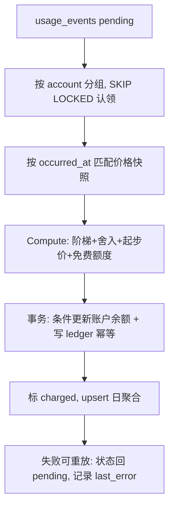

# 计费模块设计

> 状态：设计提案 | 日期：2026-09-20 | 范围：manager（控制面）+ wsserver/voicebot（数据面）

## 1. 结论

计费模块不按"计费模式"分支，而是把所有模式归一为 **`quantity × unit_price`**：

| 计费模式 | quantity 来源 | 计价单位 `unit` | 例子 |
| --- | --- | --- | --- |
| 按次收费 `count` | 固定为 1（或调用次数） | `call` | 音色复刻、MCP 工具调用 |
| 按使用时长 `duration` | 秒/分钟数 | `second` | ASR 识别时长、通话时长 |
| 按用量计费 `usage` | token / 字符数 | `token` / `char` | LLM input/output tokens、TTS 字符数 |
| 周期计费 `recurring`（预留） | 账期内固定 | `period` | 包月套餐 |

差异只落在三处：**计量点**（谁产生 quantity）、**舍入/阶梯规则**、**价格匹配范围**。因此新增一个计费项 = 一条计费项目录 seed + 一条价格行 + 一个数据面埋点，**不改结算代码、不加表**。这是"计费项可能很多"这个前提下的关键设计约束。

职责划分与现有控制面/数据面架构对齐：

- **数据面（wsserver / voicebot）只上报事实**：会话开始做准入校验，过程中本地聚合用量，turn / 会话结束批量上报。不持有定价逻辑、不碰账户余额。
- **控制面（manager）独占钱**：定价目录、价格匹配、金额计算、账户余额、流水、对账、报表。用量事件先落库（append-only 事实），再由结算 worker 幂等派生账单。
- **一过性费用（复刻音色）在控制面同步扣费**：它本来就在 manager 进程内发生，不需要绕数据面一圈。

## 2. 现状与约束（代码事实）

| 事实 | 位置 | 对计费的意义 |
| --- | --- | --- |
| 设备 → voicebot → `OwnerID`(user) | `internal/store/models.go` | 计费主体可由 device 反查出来，无需数据面传 user_id |
| LLM 用量已有结构化字段 | `internal/llm/types.go` `Usage{InputTokens, OutputTokens, ReasoningTokens, CacheReadTokens, CacheWriteTokens, TotalTokens}` | LLM 计费只差埋点，不缺数据 |
| ASR 有厂商返回的音频时长 | `internal/provider/asr/factory.go` `Result.UsageDuration *int`（秒） | 按厂商口径计费，避免自有计时与厂商账单打架 |
| TTS 在 `internal/audio/tts.go` 按住进程分句合成，句子文本与音频字节都在手 | `TTSChunk{Text, Audio}`、`SynthesizeRequest.Input.Text` | 字符数与音频时长两种口径都可得 |
| provider/model 有 `IsSystem` 区分平台代付与用户自带 | `internal/store/models.go` `Provider.IsSystem`、`AIModel.IsSystem` | BYOK 必须免费，否则是错账 |
| manager 已有 `/internal/*` 无鉴权内部接口模式 | `cmd/manager/handler/internal.go`、`internal/channels/xiaozhi/device_config.go` | 用量上报沿用同一通道，但**必须补内部鉴权**（伪造用量=直接篡改账单） |
| 现有上报是 best-effort 异步 | `internal/memory/service.go` `saveTurnAsync` | 计费可复用该模式，但需要事件落盘/重试，不能纯丢包 |

## 3. 领域模型

### 3.1 计费项（Item）

```go
// internal/billing/item.go
type ChargeMode string

const (
    ChargeModeCount    ChargeMode = "count"    // 按次
    ChargeModeDuration ChargeMode = "duration" // 按时长
    ChargeModeUsage    ChargeMode = "usage"    // 按用量
    ChargeModeRecurring ChargeMode = "recurring" // 包月，预留
)

// Unit 是计价单位，也是 quantity 的物理含义。
type Unit string

const (
    UnitCall   Unit = "call"   // 次数
    UnitSecond Unit = "second" // 秒
    UnitToken  Unit = "token"  // token 数
    UnitChar   Unit = "char"   // 字符数
    UnitByte   Unit = "byte"   // 字节（对象存储类，预留）
)

type Item struct {
    Code        string     // llm:tokens:input / tts:characters / voice:clone
    Name        string     // 展示名
    ChargeMode  ChargeMode // 仅用于 UI 与校验，结算逻辑不分支
    Unit        Unit
    MeterSource string     // llm | tts | asr | voice:clone | session | mcp
    Enabled     bool
}
```

首批计费项（系统内置 seed，放在 `internal/store/billing_seed.go`，模式同 `agent_template_seed.go`）；code 用 `:` 分段，遵循 AGENTS.md 的命名约定：

| Code | 模式 | 单位 | 计量点 | 说明 |
| --- | --- | --- | --- | --- |
| `llm:tokens:input` | usage | token | agent step | 含缓存命中拆分维度 |
| `llm:tokens:output` | usage | token | agent step | 与 input 单价不同，必须分项 |
| `llm:tokens:reasoning` | usage | token | agent step | 可独立定价或并入 output |
| `tts:characters` | usage | char | TTS 合成 | 主流厂商口径 |
| `tts:audio:seconds` | duration | second | TTS 合成 | 备选口径，二者取一 |
| `asr:audio:seconds` | duration | second | ASR final | 用厂商 `UsageDuration` |
| `voice:clone` | count | call | manager 复刻接口 | 一过性 |
| `voice:retention` | recurring | period | 定时任务 | 复刻音色按月保留，预留 |
| `mcp:tool:call` | count | call | tools 执行 | 预留 |
| `kb:embedding:tokens` | usage | token | 知识库入库 | 预留 |

> 口径提醒：`tts:characters` 与 `tts:audio:seconds`、`asr:audio:seconds` 与"通话时长"是**互斥的计费口径**，同一部署只应启用一组，否则重复计费。

### 3.2 价格（Price）

价格是**版本化**的，适用范围由两个**互不混用**的维度表达：

- **主体维度** `AccountID`：谁的协议价。空 = 平台标准价。
- **资源维度** `ResourceType` + `ResourceID`：**择一**停在某一级粒度，`item`（兜底）→ `provider` → `model` → `voice`。

之所以不让 `provider` / `model` / `voice` 作为三个并列的可空外键，是因为它们本身是一条**层级链**（`ModelVoice.ModelID → AIModel.ProviderID`），voice 已隐含 model，model 已隐含 provider，不是正交维度。并列成多列会：

1. 允许表达矛盾行（`provider_id=X` 但 `aimodel_id=M`，而 M 不属于 X）；
2. 让优先级失去定义（"账户 A" 与 "模型 M" 谁更具体？没有天然答案，两行同特异性时结果不确定）；
3. 组合爆炸（4 个可空列 = 16 种组合，绝大多数冗余）。

```go
type ResourceType string // item | provider | model | voice

type Price struct {
    ID             string
    ItemCode       string
    AccountID      string       // '' = 平台标准价（沿用仓库 not null default '' 惯例，避免 PG 中 NULL 互不相等导致唯一索引失效）
    ResourceType   ResourceType // 粒度停在哪一级
    ResourceID     string       // 该级实体 ID；item 级为空
    Currency       string       // 单币种部署，P1 不做汇率
    UnitPriceMicro int64        // 微单位单价（1e-6 元）
    UnitSize       int64        // 每 N 个 unit 计价，如 "2 元 / 百万 token" → 2_000_000 / 1_000_000
    MinChargeMicro int64        // 起步价
    Rounding       string       // none | ceil | half:up
    Tiers          []Tier       // 阶梯价 [{UpTo, UnitPriceMicro}]，UpTo=0 表示无上限档
    EffectiveFrom  time.Time    // 生效时间，版本化的核心
    EffectiveTo    *time.Time
}
```

唯一索引 `(item_code, account_id, resource_type, resource_id, effective_from)` 保证同一 scope 同一时刻只有一版价格。匹配收敛为一条 SQL，`ORDER BY` 即优先级，不再有歧义：

```sql
SELECT * FROM billing_prices
WHERE item_code = $1 AND enabled
  AND (account_id = $2 OR account_id = '')
  AND (resource_type = 'item' OR (resource_type, resource_id) IN /* 由事件带有的非空资源 ID 动态拼接 */)
  AND effective_from <= $3 AND (effective_to IS NULL OR effective_to > $3)
ORDER BY (account_id <> '') DESC,   -- 账户协议价优先
         CASE resource_type WHEN 'voice' THEN 3
                            WHEN 'model' THEN 2
                            WHEN 'provider' THEN 1
                            ELSE 0 END DESC,  -- 资源越具体越优先
         effective_from DESC                -- 同 scope 取最新版本
LIMIT 1
```

扩展新维度（`channel` / `device` / `org`）只需加枚举值与一个 rank，不改表结构。若将来真出现**多维正交**条件（地区 × 渠道 × 套餐并存），"单链择一"就不够用，需要升级为 `price_bindings(price_id, scope_type, scope_id)` 或 conditions jsonb——在此之前属于提前优化。

若担心管理端误把协议价当目录价改，可按同一模型拆成 `billing_account_prices`（`account_id` 必填）与 `billing_prices`（`account_id` 恒空）两张表，匹配时先查前者、miss 再回退后者：语义不变，只是管理面隔离。

两个必须遵守的规则：

1. **按 `occurred_at` 匹配价格，而不是 `now`**。异步结算会晚几秒到几分钟，跨调价时刻时必须用事件发生时的价格。
2. **结算时把命中价格快照写进用量事件**（`price_id` + 单价 + 币种）。历史账单永不因调价或改价而变动。

### 3.3 金额与舍入

- 金额用 **int64 微单位**（1e-6 元），全链路不用 float。
- 计算：`amountMicro = round(Σ 阶梯内 quantity × UnitPriceMicro / UnitSize)`，中间量用 `big.Int` 防溢出，**在一次结算内只舍入一次**，避免逐 token 舍入误差累积。
- `duration` 类默认向上取整（`ceil`），`usage` 类默认精确（`none`），起步价 `MinChargeMicro` 在舍入后取 `max`。
- 免费额度不单独建表：实现为**限定 `item_code` 的赠送额度（grant）**，消耗优先级 `grant → balance → credit_limit`。

### 3.4 账户与账本

```go
type Account struct {
    ID          string // 主键 = 计费主体 ID（P1：user id；P3 泛化为 subject_type+subject_id）
    SubjectType string // user | org
    Currency    string
    BalanceMicro     int64 // 可用余额（可以为负 = 后付欠款）
    FrozenMicro      int64 // 预冻结（会话预授权占用）
    CreditLimitMicro int64 // 后付额度：0 = 纯预付费
    Status           string // active | suspended | closed
}

type Ledger struct { // append-only，只增不改
    ID            int64
    AccountID     string
    Direction     string // debit | credit
    AmountMicro   int64
    BalanceAfterMicro int64
    Kind          string // charge | grant | recharge | refund | adjust | reserve | release
    ItemCode      string
    RefType       string // usage:event | reservation | order | manual
    RefID         string
    IdempotencyKey string // unique，如 settle:<event_id>
    OccurredAt    time.Time
}
```

预付费与后付费是**同一条代码路径**，差别只在 `CreditLimitMicro` 是否为 0。准入判断统一为：

```
allowed = amount ≤ balance + credit_limit − frozen
```

## 4. 数据模型（Postgres / GORM）

新增 7 张表，全部加入 `store.Open` 的 `AutoMigrate`：

| 表 | 作用 | 关键约束 |
| --- | --- | --- |
| `billing_items` | 计费项目录 | `code` unique |
| `billing_prices` | 版本化价格 | `(item_code, account_id, resource_type, resource_id, effective_from)` unique：同 scope 同时刻单版本 |
| `billing_accounts` | 账户/钱包 | 主键 = 主体 ID |
| `billing_ledger` | 流水（append-only） | `idempotency_key` unique |
| `billing_usage_events` | 原始用量事实 | **主键 = 数据面生成的 `event_id`（天然幂等）**；`status` pending/charged/skipped；索引 `(status, created_at)` |
| `billing_reservations` | 会话级预冻结 | `session_id` + `status` open/settled/expired |
| `billing_daily_stats` | 日聚合报表 | `(account_id, date, item_code, aimodel_id, voice_id)` unique，`INSERT ... ON CONFLICT DO UPDATE` 累加 |

用量事件是**唯一的事实来源**，也是结算队列（outbox 模式）：

```go
type UsageEvent struct {
    ID         string // 数据面生成 uuid，服务端主键 → 重试天然去重
    AccountID  string
    VoicebotID string
    DeviceID   string
    SessionID  string
    TurnID     int64
    ItemCode   string
    Quantity   int64  // 已在数据面按 unit 归一
    AIModelID  string // 计价匹配用快照
    ProviderID string
    VoiceID    string
    BYOK       bool   // 用户自带 key：只计量不计费
    OccurredAt time.Time
    Dimensions map[string]any // cache_read_tokens / channel / aborted ...
    // 结算产物
    Status      string
    PriceID     string
    AmountMicro int64
}
```

保留策略：原始事件保留 90 天（可按月分区），聚合表永久保留。

## 5. 结算引擎

`internal/billing` 分两层：**纯领域（`money.go` / `price.go` / `engine.go` 的计算部分）** 与 **仓储（`internal/store/billing_*.go`）**。领域层不 import store / gin，数据面也能安全引用其中的 wire 类型。

结算函数是唯一的定价入口，同步/异步、单条/批量都走它：

```go
func Compute(ev UsageEvent, p Price, usedGrantMicro int64) ChargeResult
```

流程：



要点：

- **认领并发安全**：`SELECT ... FOR UPDATE SKIP LOCKED LIMIT n`，多实例 manager 可同时跑 worker。
- **扣费原子性**：`UPDATE billing_accounts SET balance_micro = balance_micro - $1 WHERE id = $2 AND balance_micro - $1 >= -credit_limit_micro`，用 `RowsAffected` 判定成功；失败按 `overdraft_policy` 处理：
  - `deny`（默认，预付费）：事件标 `unpaid` 并告警，账户置 `suspended`，数据面准入随即拒绝。
  - `allow`（后付）：允许余额转负至额度下限。
- **幂等**：`ledger.idempotency_key = "settle:" + event_id`，唯一索引兜底；worker 重放不会重复扣钱。
- **死锁规避**：同一批事件先按 `account_id` 排序再加锁。
- **结算延迟 = 最大透支窗口**。预付费场景靠三件事收敛：预冻结（`billing_reservations`）+ 数据面本地预算熔断 + worker tick 1~5s。若业务要求强一致，把同一个 `Settle` 函数改为请求内同步调用即可（`settlement_mode: sync|async` 开关），不改领域代码。

## 6. 数据面接入

### 6.1 三个内部接口

| 接口 | 时机 | 语义 |
| --- | --- | --- |
| `POST /internal/billing/authorize` | 会话建立时 | 校验 `balance+credit-frozen`，返回决策、限额、预留额、价格快照 |
| `POST /internal/billing/usage-events` | turn 结束 / 会话结束 | 批量上报事实，落库即返回，不做定价 |
| `POST /internal/billing/settle` | 会话结束 | 结算会话的预留（多退少补）并释放预冻结 |

`authorize` 返回给数据面（用于本地熔断，避免每 token 一次 RPC）：

```json
{
  "allowed": true,
  "account_id": "u_123",
  "reservation_id": "r_456",
  "reserved_micro": 500000,
  "max_session_seconds": 600,
  "price_snapshot": [
    {"item_code": "llm:tokens:input",  "billable": true,  "unit_price_micro": 2, "unit_size": 1},
    {"item_code": "tts:characters",    "billable": false, "reason": "byok"},
    {"item_code": "asr:audio:seconds", "billable": true,  "unit_price_micro": 24, "unit_size": 1}
  ]
}
```

`billable=false` 由**控制面判定**（BYOK / 系统代付 / 账户协议），数据面不做这个判断——判定逻辑只能有一份。

### 6.2 埋点位置

沿用仓库现有的回调风格（`OnChunk` / `OnResult`），给计量加同构的 `OnUsage`：

| 计量点 | 埋点位置 | 数据 |
| --- | --- | --- |
| LLM | `internal/agent/step.go` 收集，`FinishedEvent` 带出 | 每 turn 汇总 input/output/reasoning/cache token 与调用次数 |
| TTS | `internal/audio/tts.go` 说话人分句分发处 | 每句字符数；同时记录音频字节数 → 秒数作为维度 |
| ASR | `internal/audio/asr.go` `runOneSession` | `result.UsageDuration`（秒） |
| 会话时长 | 通道层（`internal/channels/xiaozhi`、`tg`）会话生命周期 | wall-clock 秒；启用了 ASR/TTS 时长计费时禁用 |
| 复刻音色 | `cmd/manager/handler/voice_clone.go` | 见 6.3 |
| MCP 工具 | `internal/tools` 每次调用 | 次数（预留） |

数据面组件实现一个窄接口，不 import 计价逻辑：

```go
// internal/billing/sink.go
type Sink interface {
    // Record 非阻塞：写入会话内存缓冲，按 unit 累加
    Record(itemCode string, quantity int64, dims map[string]any)
    // Flush 在 turn/会话边界批量上报（含补报重试）
    Flush(ctx context.Context) error
}
```

装配：`channels.Dependencies`（`internal/channels/channel.go`）新增 `Billing billing.Sink`，由 `cmd/wsserver/main.go` 构造（参照 `memory.NewService` 的写法），每个设备会话一个 Sink 实例。

### 6.3 复刻音色（一过性费用）

控制面内同步完成，不需要上报链路：

```
余额校验/预冻结(voice:clone) → 调厂商 CloneVoice → 失败：释放预留，不计费
                                              → 成功：写 ModelVoice + 事务内扣费(幂等键 voice:clone:<voice_id>) + 读流水
```

顺序不能反：**先预冻结再调厂商**，否则余额不足的用户可以白嫖复刻。若扣费事务失败，事件落 `pending`，由 worker 补偿；不允许"先给结果后补扣"的静默失败。

## 7. 平台代付 vs BYOK

| 场景 | `Provider.IsSystem` | 是否计费 | 理由 |
| --- | --- | --- | --- |
| 平台内置模型/音色 | true | **计费** | 平台承担厂商成本，需向用户回收 |
| 用户自建 key（BYOK） | false | **不计费**，只记用量 | 用户已直接付给厂商，再收一次是错账 |
| 复刻音色（用平台 key 调厂商） | true | 计费 | 一次性成本 |
| 用户自带 TTS key 复刻 | false | 只记用量 | 同上 |

规则落在 `authorize` / 价格匹配阶段：命中 BYOK 的计费项返回 `billable=false`，仍写 `billing_usage_events`（`byok=true`）供额度限制与用量统计，金额为 0。这样"限额"与"计费"两件事解耦。

## 8. 对外的 API 面

管理端（`is_admin`，`middleware.IsAdmin`）：

| 方法 | 路径 | 说明 |
| --- | --- | --- |
| GET/POST/PUT | `/api/billing/items` | 计费项目录（系统内置项只读） |
| GET/POST/PUT/DELETE | `/api/billing/prices` | 价格版本管理（改价 = 新增 `effective_from`，不覆盖历史；按 `account_id` + `resource_type/resource_id` 定位 scope） |
| GET | `/api/billing/accounts` | 账户列表（余额、欠费、状态） |
| POST | `/api/billing/accounts/:id/adjust` | 人工调整（赠送/扣减，写 `adjust` 流水，必须带备注） |
| GET | `/api/billing/ledger` | 流水查询 |
| GET | `/api/billing/stats` | 报表（按账户/计费项/模型/时间段聚合） |

用户端（JWT）：

| 方法 | 路径 | 说明 |
| --- | --- | --- |
| GET | `/api/billing/summary` | 余额 + 本月消耗 + 按计费项 Top |
| GET | `/api/billing/usage` | 用量明细（分页，可按 item_code / 时间段过滤） |
| GET | `/api/billing/prices` | 当前生效价格公示 |

内部（数据面）：见 6.1，**必须加内部鉴权**（`X-Internal-Token` 或 mTLS）——现有 `/internal/*` 无鉴权，对读接口尚可接受，对写账单不可接受。

## 9. 一致性与可观测性

- **幂等三道闸**：事件 `event_id` 主键 → 流水 `idempotency_key` unique → worker 状态机（pending→charged 单向）。
- **重放**：`charged=false` 的事件保留 `last_error`，支持按账户/时间段手工重放。
- **对账**：日聚合金额与流水金额按账户做校验任务（`SUM(ledger.amount) == SUM(stats.amount)`），不一致告警。
- **指标**：待结算事件数、结算延迟 P99、未结算金额、欠费/停服账户数、BYOK 占比。
- **日志**：走 `internal/logging`，关键路径（准入拒绝、余额不足、结算失败）用 `Warnf/Errorf` 带 `account_id`/`event_id`。

## 10. 分阶段实施

**P1（正确性优先，可用最短路径跑通闭环）**

1. 迁移 + seed：7 张表 + 首批计费项 + 默认价格（价格可先由 admin API 录入）。
2. `internal/billing` 领域层：`money`（微单位、舍入）、`price`（主体/资源二维 scope 匹配、阶梯、起步价）、`Compute` + 单元测试（边界：跨档、跨调价、0 单价、免费额度、scope 优先级）。
3. `internal/store/billing_*.go` 仓储 + `engine`（authorize / settle / chargeOnce）。
4. 数据面埋点：agent / tts / asr 的 `OnUsage` + `Sink` + 批量上报（本地缓冲 + 重试 + 退出前 flush）。
5. 复刻音色同步扣费（含预冻结）。
6. 查询 API（用户侧 summary/usage，管理侧 ledger/adjust）。
7. 准入：余额不足直接拒绝会话（`deny` 策略）。BYOK 豁免。

**P2（体验与风控）**：会话级预冻结 + 数据面本地预算熔断（`max_session_seconds`）、阶梯价与免费额度正式启用、日聚合报表与看板、欠费策略（挂账/停服）、结算指标与对账任务、价格热更新下发。

**P3（商业化）**：充值订单与支付渠道、月结账单/发票、组织（多租户）计费主体、多币种、事件表按月分区与归档、订阅套餐。

## 11. 待确认的决策点

1. **计费主体粒度**：账户落在 `User`（现状：device→voicebot→owner）还是需要引入 `Organization`？P1 建议先 User，主键设计预留泛化。
2. **预付费还是后付费**：默认纯预付费（`credit_limit=0`，余额不足即拒绝）？还是要给部分账户后付额度？模型已统一，只需确认默认策略。
3. **是否要求强一致结算**：能接受秒级结算延迟 + 预冻结兜底（推荐），还是必须请求内同步扣费（语音链路要多一次 RPC）？
4. **TTS/ASR 计费口径**：TTS 按字符还是按音频时长？ASR 按厂商 `UsageDuration` 秒数，还是按通话时长打包计价？（三选一，避免重复计费。）
5. **BYOK 是否收平台服务费**：完全免费（只统计用量）还是收一笔固定的会话/服务费？
6. **协议价是否分表**：账户协议价与平台目录价同表（靠 `account_id` 区分）还是拆两张表（管理面隔离）？建议 P1 同表，管理端 UI 分开呈现。
