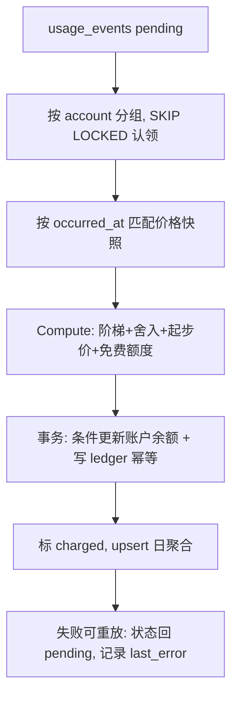

# 计费模块设计

> 状态：设计提案 | 日期：2026-09-20 | 范围：manager（控制面）+ wsserver/voicebot（数据面）

## 1. 结论

计费模块不按"计费模式"分支，而是把所有模式归一为 **`quantity × unit_price`**：

| 计费模式 | quantity 来源 | 计价单位 `unit` | 例子 |
| --- | --- | --- | --- |
| 按次收费 `count` | 固定为 1（或调用次数） | `call` | 音色复刻、MCP 工具调用 |
| 按使用时长 `duration` | 秒/分钟数 | `second` | ASR 识别时长、通话时长 |
| 按用量计费 `usage` | token / 字符数 | `token` / `char` | LLM input/output tokens、TTS 字符数 |
| 周期计费 `recurring`（预留） | 账期内固定 | `period` | 包月套餐 |

差异只落在三处：**计量点**（谁产生 quantity）、**舍入/阶梯规则**、**价格匹配范围**。因此新增一个计费项 = 一条计费项目录 seed + 一条价格行 + 一个数据面埋点，**不改结算代码、不加表**。这是"计费项可能很多"这个前提下的关键设计约束。

职责划分与现有控制面/数据面架构对齐：

- **数据面（wsserver / voicebot）只上报事实**：会话开始做准入校验，过程中本地聚合用量，turn / 会话结束批量上报。不持有定价逻辑、不碰账户余额。
- **控制面（manager）独占钱**：定价目录、价格匹配、金额计算、账户余额、流水、对账、报表。用量事件先落库（append-only 事实），再由结算 worker 幂等派生账单。
- **一过性费用（复刻音色）在控制面同步扣费**：它本来就在 manager 进程内发生，不需要绕数据面一圈。
- **计费不跟业务模块耦合**：计费只认“账户、价格、用量事件、入账”四样东西；钱的来路（订单、充值、退款）和业务对象（device、voicebot、agent）都是通过注入的窄接口从外面递进来的。将来把计费拆成独立服务时，只换两个实现，领域代码一行不动。详见 §19。

## 2. 现状与约束（代码事实）

| 事实 | 位置 | 对计费的意义 |
| --- | --- | --- |
| 设备 → voicebot → `OwnerID`(user) | `internal/store/models.go` | 计费主体可由 device 反查出来，无需数据面传 user_id |
| LLM 用量已有结构化字段 | `internal/llm/types.go` `Usage{InputTokens, OutputTokens, ReasoningTokens, CacheReadTokens, CacheWriteTokens, TotalTokens}` | LLM 计费只差埋点，不缺数据 |
| ASR 有厂商返回的音频时长 | `internal/provider/asr/factory.go` `Result.UsageDuration *int`（秒） | 按厂商口径计费，避免自有计时与厂商账单打架 |
| TTS 在 `internal/audio/tts.go` 按住进程分句合成，句子文本与音频字节都在手 | `TTSChunk{Text, Audio}`、`SynthesizeRequest.Input.Text` | 字符数与音频时长两种口径都可得 |
| provider/model 有 `IsSystem` 区分平台代付与用户自带 | `internal/store/models.go` `Provider.IsSystem`、`AIModel.IsSystem` | BYOK 必须免费，否则是错账 |
| manager 已有 `/internal/*` 无鉴权内部接口模式 | `cmd/manager/handler/internal.go`、`internal/channels/xiaozhi/device_config.go` | 用量上报沿用同一通道，但**必须补内部鉴权**（伪造用量=直接篡改账单） |
| 现有上报是 best-effort 异步 | `internal/memory/service.go` `saveTurnAsync` | 计费可复用该模式，但需要事件落盘/重试，不能纯丢包 |

## 3. 领域模型

### 3.1 计费项（Item）

```go
// internal/billing/item.go
type ChargeMode string

const (
    ChargeModeCount    ChargeMode = "count"    // 按次
    ChargeModeDuration ChargeMode = "duration" // 按时长
    ChargeModeUsage    ChargeMode = "usage"    // 按用量
    ChargeModeRecurring ChargeMode = "recurring" // 包月，预留
)

// Unit 是计价单位，也是 quantity 的物理含义。
type Unit string

const (
    UnitCall   Unit = "call"   // 次数
    UnitSecond Unit = "second" // 秒
    UnitToken  Unit = "token"  // token 数
    UnitChar   Unit = "char"   // 字符数
    UnitByte   Unit = "byte"   // 字节（对象存储类，预留）
    UnitPeriod Unit = "period" // 账期（包月类，quantity 恒为 1，由控制面定时任务产生，不走数据面）
)

type Item struct {
    Code        string     // llm:tokens:input / tts:characters / voice:clone
    Name        string     // 展示名
    ChargeMode  ChargeMode // 仅用于 UI 与校验，结算逻辑不分支
    Unit        Unit
    MeterSource string     // llm | tts | asr | voice:clone | session | mcp
    Enabled     bool
}
```

首批计费项（系统内置 seed，放在 `internal/store/billing_seed.go`，模式同 `agent_template_seed.go`）；code 用 `:` 分段，遵循 AGENTS.md 的命名约定。`billing_items` 表就是这份常量的投影：启动时按 `code` 做 upsert，代码里加一项、重启后就出现在库里；反过来，代码里删掉的项不物删，只标 `enabled=false`（历史事件和流水还引用着这个 code）。

| Code | 模式 | 单位 | 计量点 | 说明 |
| --- | --- | --- | --- | --- |
| `llm:tokens:input` | usage | token | agent step | 含缓存命中拆分维度 |
| `llm:tokens:output` | usage | token | agent step | 与 input 单价不同，必须分项 |
| `llm:tokens:reasoning` | usage | token | agent step | 可独立定价或并入 output |
| `tts:characters` | usage | char | TTS 合成 | 主流厂商口径 |
| `tts:audio:seconds` | duration | second | TTS 合成 | 备选口径，二者取一 |
| `asr:audio:seconds` | duration | second | ASR final | 用厂商 `UsageDuration` |
| `voice:clone` | count | call | manager 复刻接口 | 一过性 |
| `voice:retention` | recurring | period | 定时任务 | 复刻音色按月保留，预留 |
| `mcp:tool:call` | count | call | tools 执行 | 预留 |
| `kb:embedding:tokens` | usage | token | 知识库入库 | 预留 |

> 口径提醒：`tts:characters` 与 `tts:audio:seconds`、`asr:audio:seconds` 与"通话时长"是**互斥的计费口径**，同一部署只应启用一组，否则重复计费。

### 3.2 价格（Price）

价格是**版本化**的，适用范围由两个**互不混用**的维度表达：

- **主体维度** `AccountID`：谁的协议价。空 = 平台标准价。
- **资源维度** `ResourceType` + `ResourceID`：**择一**停在某一级粒度，`item`（兜底）→ `provider` → `model` → `voice`。

之所以不让 `provider` / `model` / `voice` 作为三个并列的可空外键，是因为它们本身是一条**层级链**（`ModelVoice.ModelID → AIModel.ProviderID`），voice 已隐含 model，model 已隐含 provider，不是正交维度。并列成多列会：

1. 允许表达矛盾行（`provider_id=X` 但 `aimodel_id=M`，而 M 不属于 X）；
2. 让优先级失去定义（"账户 A" 与 "模型 M" 谁更具体？没有天然答案，两行同特异性时结果不确定）；
3. 组合爆炸（4 个可空列 = 16 种组合，绝大多数冗余）。

```go
type ResourceType string // item | provider | model | voice

type Price struct {
    ID             string
    ItemCode       string
    AccountID      string       // '' = 平台标准价（沿用仓库 not null default '' 惯例，避免 PG 中 NULL 互不相等导致唯一索引失效）
    ResourceType   ResourceType // 粒度停在哪一级
    ResourceID     string       // 该级实体 ID；item 级为空
    Currency       string       // 单币种部署，P1 不做汇率
    UnitPriceMicro int64        // 微单位单价（1e-6 元）
    UnitSize       int64        // 每 N 个 unit 计价，如 "2 元 / 百万 token" → 2_000_000 / 1_000_000
    MinChargeMicro int64        // 起步价
    Rounding       string       // none | ceil | half:up
    Tiers          []Tier       // 阶梯价，见下；不用阶梯就留空
    EffectiveFrom  time.Time    // 生效时间，版本化的核心
    EffectiveTo    *time.Time   // 不设 = 一直有效；“停用一版价格”就是把这里收到当前时刻
}

// Tier 是阶梯的一档。阶梯按账期累计量**分档累进**（像个税），不是“达标后全量按新价”。
// 累进是增量结算唯一能自洽的口径：全额跳档在跨档那一瞬间的边际量是负数，
// 而 §16.1 的 charge = PriceOf(new) − PriceOf(old) 算出来会变成负的，被 max(...,0) 吃掉。
type Tier struct {
    UpTo           int64 // 本档上限（账期内累计 quantity）；0 = 最后一档，无上限
    UnitPriceMicro int64 // 落在本档区间内的量按这个单价算
}
```

阶梯在写入时校验两个不变量：`UpTo` 严格递增，最后一档必须是 0。错了在录入时就报，别留到结算时算出一笔怪账。

唯一索引 `(item_code, account_id, resource_type, resource_id, effective_from)` 保证同一 scope 同一时刻只有一版价格。匹配收敛为一条 SQL，`ORDER BY` 即优先级，不再有歧义：

```sql
SELECT * FROM billing_prices
WHERE item_code = $1
  AND (account_id = $2 OR account_id = '')
  AND (resource_type = 'item' OR (resource_type, resource_id) IN /* 由 reservation 快照里的非空资源 ID 动态拼接，见 §14.2 */)
  AND effective_from <= $3 AND (effective_to IS NULL OR effective_to > $3)
ORDER BY (account_id <> '') DESC,   -- 账户协议价优先
         CASE resource_type WHEN 'voice' THEN 3
                            WHEN 'model' THEN 2
                            WHEN 'provider' THEN 1
                            ELSE 0 END DESC,  -- 资源越具体越优先
         effective_from DESC                -- 同 scope 取最新版本
LIMIT 1
```

扩展新维度（`channel` / `device` / `org`）只需加枚举值与一个 rank，不改表结构。若将来真出现**多维正交**条件（地区 × 渠道 × 套餐并存），"单链择一"就不够用，需要升级为 `price_bindings(price_id, scope_type, scope_id)` 或 conditions jsonb——在此之前属于提前优化。

价格表上**没有 `enabled` 开关**，这是故意的：“这版价格生不生效”只能有一个来源，就是 `effective_from` / `effective_to` 这个区间。再加个布尔开关，两个字段说话不一致时没人知道该信谁。于是管理端的操作就两种：

- 已经生效的价格要停用 → 把 `effective_to` 收到当前时刻（不删行，历史账单还指着它）。
- 还没生效的价格要取消 → 直接删，它从来没匹配过任何事件，也没被任何流水引用。

若担心管理端误把协议价当目录价改，可按同一模型拆成 `billing_account_prices`（`account_id` 必填）与 `billing_prices`（`account_id` 恒空）两张表，匹配时先查前者、miss 再回退后者：语义不变，只是管理面隔离。

两个必须遵守的规则：

1. **按 `occurred_at` 匹配价格，而不是 `now`**。异步结算会晚几秒到几分钟，跨调价时刻时必须用事件发生时的价格。
2. **结算时把命中价格快照写进用量事件**（`price_id` + 单价 + 币种）。历史账单永不因调价或改价而变动。

### 3.3 金额与舍入

- 金额用 **int64 微单位**（1e-6 元），全链路不用 float。
- 计算：`amountMicro = round(Σ 阶梯内 quantity × UnitPriceMicro / UnitSize)`，中间量用 `big.Int` 防溢出，**在一次结算内只舍入一次**，避免逐 token 舍入误差累积。
- `duration` 类默认向上取整（`ceil`），`usage` 类默认精确（`none`），起步价 `MinChargeMicro` 在舍入后取 `max`。
- 免费额度就是 `billing_grants` 那张表（§4）：限定 `item_code` 的赠送额度，消耗优先级 `grant → balance → credit_limit`。不再另外做“优惠券 / 套餐”表。

### 3.4 价格里的数字从哪来

表结构定了，但“填什么数”还有三条规则，踩了会直接出账错。

**单价必须是整数微元，精度不够就抬 `unit_size`。** `unit_price_micro` 是 int64，写不了 0.8。遇到“每 token ¥0.0000008”这种进价，别四舍五入成 1，而是把 `unit_size` 抬上去，写成“每 1000 万 token ¥8”（`unit_price_micro = 8_000_000`，`unit_size = 10_000_000`）。`unit_size` 的主要用途就是这个，展示成“每百万 token ¥x”是 UI 的事。结算时 `qty × price / unit_size` 在一次结算内只舍入一次（§3.3）。

**定价口径直接挂厂商进价。** 因为 quantity 口径已经跟厂商对齐了（§13），所以售价就是“厂商单价 × (1 + 加价率)”，不需要为了凑整去重组用量。反过来，凡是打包价（比如“每分钟通话 ¥x”）都会跟时长口径打架，P1 不做，要做留给 P3 的订阅套餐。

**P1 的粒度停在 `model` 级。** LLM 和 TTS 的价格都跟着具体 model 走，`provider` 级和 `item` 级留作兜底（没配 model 价时不至于直接把会话拒了）。阶梯价和起步价 P1 不开——表结构留着，先把单价跑通。

还有两个跟定价绑在一起、容易被忽略的决定：

- **赠送额度按金额还是按量。** `billing_grants` 现在按 micro 金额存。如果对外宣传“送 60 分钟”，调价之后这 60 分钟就不准了。要么把 grant 改成按量（`granted_qty` + `item_code`），要么文案就不承诺时长、只写“送 ¥5”。建议后者。
- **缓存命中先按 input 全价收。** 口径已经把 cache 拆开了（§13），所以这只是“这一版先这么收”；想改成半价就是插一版新价格，代码不动。但心里要有数：这一版是按全价收缓存命中，毛利比看上去好看。

价格是运营数据，不该写死在代码里。但有一个**上线时必须人工做的步骤**：billing 一开、价格表为空的话，每个会话都会被 `price_missing` 拒掉（§14.3）。seed 里只放计费项目录和一条兜底价格，真实价格上线前用 admin API 录一遍。

### 3.5 账户与账本

```go
type Account struct {
    ID          string // 内部账户 ID（acct_ 前缀），`(subject_type, subject_id)` 唯一索引 → 见 §12 决策 1
    SubjectType string // user | org
    Currency    string
    BalanceMicro     int64 // 可用余额（可以为负 = 后付欠款）
    FrozenMicro      int64 // 预冻结（会话预授权占用）
    CreditLimitMicro int64 // 后付额度：0 = 纯预付费
    Status           string // active | suspended | closed
}

type Ledger struct { // append-only，只增不改
    ID            int64
    AccountID     string
    Direction     string // debit | credit
    AmountMicro   int64
    BalanceAfterMicro int64
    Kind          string // charge | grant | recharge | refund | adjust | reserve | release
    ItemCode      string
    RefType       string // usage:event | reservation | order | manual
    RefID         string
    IdempotencyKey string // unique，如 settle:<event_id>
    OccurredAt    time.Time
}
```

预付费与后付费是**同一条代码路径**，差别只在 `CreditLimitMicro` 是否为 0。准入判断统一为：

```
allowed = amount ≤ balance + credit_limit − frozen
```

## 4. 数据模型（Postgres / GORM）

新增 9 张表，全部加入 `store.Open` 的 `AutoMigrate`（`internal/store/db.go` 现有 18 个模型的列表末尾追加）：

| 表 | 作用 | 关键约束 |
| --- | --- | --- |
| `billing_items` | 计费项目录 | `code` unique |
| `billing_prices` | 版本化价格 | `(item_code, account_id, resource_type, resource_id, effective_from)` unique：同 scope 同时刻单版本 |
| `billing_accounts` | 账户/钱包 | 主键 = 内部 ID（`acct_`）；`(subject_type, subject_id)` unique |
| `billing_ledger` | 流水（append-only） | `idempotency_key` unique |
| `billing_usage_events` | 原始用量事实 | **主键 = 数据面生成的 `event_id`（天然幂等）**；`status` pending/charged/skipped；索引 `(status, created_at)` |
| `billing_reservations` | 会话级预冻结 + 定价快照 | `session_id` unique；`status` = open / settled / expired / degraded；列：`account_id` / `device_id` / `reserved_micro` / `expires_at` / 资源快照（provider、model、voice）/ 下发过的 `price_snapshot` |
| `billing_grants` | 限定计费项的赠送额度 | `(account_id, item_code, source)` unique；`used_micro ≤ granted_micro`，`expires_at` 到期作废 |
| `billing_period_states` | 账期累计量 | 主键 `(account_id, item_code, price_id, period_start)`；阶梯价/起步价/额度的边际计算依据，与 ledger 同一事务更新 |
| `billing_daily_stats` | 日聚合报表 | `(account_id, date, item_code, aimodel_id, voice_id)` unique，`INSERT ... ON CONFLICT DO UPDATE` 累加 |

用量事件是**唯一的事实来源**，也是结算队列（outbox 模式）：

```go
type UsageEvent struct {
    ID         string // 数据面生成 uuid，服务端主键 → 重试天然去重
    AccountID  string // 控制面按 session_id → reservation 反查填充，不信任上报体（§14.2）
    VoicebotID string
    DeviceID   string
    SessionID  string
    ItemCode   string
    Quantity   int64  // 已在数据面按 unit 归一，口径见 §13
    AIModelID  string // 计价匹配用快照
    ProviderID string
    VoiceID    string
    BYOK       bool   // 用户自带 key：只计量不计费
    OccurredAt time.Time // 数据面时钟
    ReceivedAt time.Time // 控制面落库时钟：两者偏差超阈值时告警并按 ReceivedAt 结算
    TurnIndex  int64     // 数据面会话内自增序号；不要用 session_turns.id（异步写入，可能缺行）
    Dimensions map[string]any // step / source=sub_agent / audio_ms / aborted ...
    // 结算产物
    Status      string
    PriceID     string
    AmountMicro int64
    LastError   string
}
```

保留策略：原始事件保留 90 天（可按月分区），聚合表永久保留。

## 5. 结算引擎

`internal/billing` 里的东西分两类：**纯领域**（`item` / `price` / `money` / `engine` / `estimate` / `wire`）和**实现**（仓储、worker、HTTP client）。纯领域那个包零依赖，数据面也能安全引用其中的 wire 类型；实现分别住 `billing/service` 和 `billing/client`，不要混进领域包（§19 讲了为什么）。

结算函数是唯一的定价入口，同步/异步、单条/批量都走它：

```go
// st 是该 (account, item_code, price_id) 在当前账期的累计量：
// 阶梯价与起步价必须按账期累计做边际计价，逐条独立计算会把两者都算错（见 §16.1）。
func Compute(ev UsageEvent, p Price, st PeriodState) ChargeResult

// PeriodState 是账期内这个 scope 的累计量，Compute 靠它做边际计价（§16.1）。
type PeriodState struct {
    Quantity       int64 // 账期内累计 quantity
    AmountMicro    int64 // 账期内累计已计金额（把起步价的影响也包含进来）
    GrantUsedMicro int64
}

// ChargeResult 是一次结算的产出，字段跟 §16.2 那个事务的步骤一一对应。
type ChargeResult struct {
    AmountMicro         int64  // 应收总额（阶梯 + 舍入 + 起步价之后）
    GrantCoveredMicro   int64  // 由赠送额度覆盖的部分
    BalanceChargedMicro int64  // 真正从余额 / 信用扣的部分
    PriceID             string // 命中的价格版本，写回事件供事后复核
    Skipped             bool   // BYOK（billable=false）或 quantity 为 0
    SkipReason          string
}
```

流程：



要点：

- **认领并发安全**：`SELECT ... FOR UPDATE SKIP LOCKED LIMIT n`，多实例 manager 可同时跑 worker。
- **扣费原子性**：`UPDATE billing_accounts SET balance_micro = balance_micro - $1 WHERE id = $2 AND balance_micro - $1 >= -credit_limit_micro`，用 `RowsAffected` 判定成功；失败按 `overdraft_policy` 处理：
  - `deny`（默认，预付费）：事件标 `unpaid` 并告警，账户置 `suspended`，数据面准入随即拒绝。
  - `allow`（后付）：允许余额转负至额度下限。
- **幂等**：`ledger.idempotency_key = "settle:" + event_id`，唯一索引兜底；worker 重放不会重复扣钱。
- **死锁规避**：同一批事件先按 `account_id` 排序再加锁。
- **结算延迟 = 最大透支窗口**。预付费场景靠三件事收敛：预冻结（`billing_reservations`）+ 数据面本地预算熔断 + worker tick 1~5s。若业务要求强一致，把结算入口改成请求内同步调用即可（`settlement_mode: sync|async` 开关），领域代码不动。

命名上只留一套动词，免得文档和代码对不上：完整的六个能力在 §19，这里只强调一点——`Compute` 是它们共同的内核，engine 内部的批量扣费函数用小写命名（`chargeEvents`），不对外。之前文档里出现过的 `chargeOnce` / `Settle()` 两个名字作废。

## 6. 数据面接入

### 6.1 三个内部接口

| 接口 | 时机 | 语义 |
| --- | --- | --- |
| `POST /internal/billing/authorize` | 会话建立时 | 校验 `balance+credit-frozen`，返回决策、限额、预留额、价格快照 |
| `POST /internal/billing/usage-events` | turn 结束 / 会话结束 | 批量上报事实，落库即返回，不做定价 |
| `POST /internal/billing/settle` | 会话结束 | 结算会话的预留（多退少补）并释放预冻结 |

`authorize` 返回给数据面（用于本地熔断，避免每 token 一次 RPC）：

```json
{
  "allowed": true,
  "account_id": "u_123",
  "reservation_id": "r_456",
  "reserved_micro": 500000,
  "max_session_seconds": 600,
  "price_snapshot": [
    {"item_code": "llm:tokens:input",  "billable": true,  "unit_price_micro": 2, "unit_size": 1},
    {"item_code": "tts:characters",    "billable": false, "reason": "byok"},
    {"item_code": "asr:audio:seconds", "billable": true,  "unit_price_micro": 24, "unit_size": 1}
  ]
}
```

`billable=false` 由**控制面判定**（BYOK / 系统代付 / 账户协议），数据面不做这个判断——判定逻辑只能有一份。

### 6.2 埋点位置

计量点就埋在这些位置上，口径见 §13。先看表，后面有一段得留意的：

| 计量点 | 埋点位置 | 数据 |
| --- | --- | --- |
| LLM | `internal/agent/step.go` 的 `EventResponseDone` 分支收集，`FinishedEvent` 带出（**错误路径也必须带**：中断的 turn 已经产生了 token） | 每 turn 汇总 input/cache/output/reasoning token 与 step 数；`finalResponse.Usage` 目前被丢弃，是本次要接上的唯一缺口 |
| TTS | `internal/audio/tts.go` dispatcher 出队处（分句已定稿、合成必然发生，`buildReq` 处取 `req.Input.Text`） | 每句 `len([]rune(...))`；音频字节数进 `dimensions` 供备选口径校验；`Interrupt()` 不减免已合成部分 |
| ASR | `internal/audio/asr.go` `runOneSession` 的结果归并点——**公共 `ASRResult` 目前不带 `UsageDuration`**，需要扩字段或在 processor 内直接上报 | `asr.Result.UsageDuration`（秒）；同一 recognizer task 多条 final 的归并规则见 §13 |
| 会话时长 | 通道层（`internal/channels/xiaozhi`、`tg`）会话生命周期 | wall-clock 秒；启用了 ASR/TTS 时长计费时禁用 |
| 复刻音色 | `cmd/manager/handler/voice_clone.go` | 见 6.3 |
| MCP 工具 | `internal/tools` 每次调用 | 次数（预留） |

有一处我原来想岔了，写在这里免得实施时照着做。我原本打算让 TTS / ASR 在 processor 内部直接调 `Sink.Record`，理由是少一层转发。但那等于让 `internal/audio` 知道 `item_code` 这套计费词汇，将来计费拆成独立服务时，这个包会被一起拖下水。改成让 `internal/audio` / `internal/agent` 只吐**原始事实**（合成了多少字、多少音频字节、厂商报了多少秒、token 用了多少），回调形状跟现有的 `OnChunk` / `OnResult` 一样；`item_code` 的映射放在接线层 `internal/channels`，那儿本来就同时认识 audio 和 billing。

代价是多一层转发。但它换来的是 audio 和 agent 对计费零知识——数据面的 client 换成远程实现时，它们一行都不用改。

子代理的用量也得算进来。`runStep` 是主 agent 和子代理共用的，所以累加器不能挂在某个 Agent 实例上——放在**会话级的 collector 里，用 ctx 递下去**：`runStep` 拿到 `finalResponse.Usage` 就往里加（带锁，并行子代理安全），主 agent 在 turn 边界 `Take()` 一次取走并清零，塞进 `FinishedEvent`。这样子代理不需要认识计费也能被算上。已知的小偏差：task 可以异步挂载、活得比 turn 长，那部分用量会落到下一个 turn 的 `turn_index` 上——金额不丢，维度会偏，可以接受。

计费的 port 就长这样，实现它的是数据面的接线层（不是 audio / agent 本身）：

```go
// internal/billing/sink.go
type Sink interface {
    // Record 非阻塞：写入会话内存缓冲，按 unit 累加
    Record(itemCode string, quantity int64, dims map[string]any)
    // Flush 在 turn/会话边界批量上报（含补报重试）
    Flush(ctx context.Context) error
}
```

装配：`channels.Dependencies`（`internal/channels/channel.go`）新增 `Billing billing.Sink`，由 `cmd/wsserver/main.go` 构造（参照 `memory.NewService` 的写法），每个设备会话一个 Sink 实例。

### 6.3 复刻音色（一过性费用）

控制面内同步完成，不需要上报链路（这里的扣费全部走 §19 的能力接口，`voice_clone.go` 不碰计费的表）：

```
余额校验/预冻结(voice:clone) → 调厂商 CloneVoice → 失败：释放预留，不计费
                                              → 成功：写 ModelVoice + 事务内扣费(幂等键 voice:clone:<voice_id>) + 读流水
```

顺序不能反：**先预冻结再调厂商**，否则余额不足的用户可以白嫖复刻。若扣费事务失败，事件落 `pending`，由 worker 补偿；不允许"先给结果后补扣"的静默失败。

### 6.4 控制面的业务动作怎么报账

6.3 那种“先冻结、调完再扣”的流程不该只为复刻音色写一遍。控制面里凡是平台代付、会产生一次性费用的动作（复刻音色、MCP 工具调用、知识库入库、将来的图片生成之类），都走同一个 port：

```go
// internal/billing —— 业务模块唯一需要认识的东西
type Meter interface {
    // Charge：动作已经完成，立即扣费。用于 MCP 调用、按次收费的入库
    Charge(ctx context.Context, req ChargeRequest) (ChargeResult, error)
    // Reserve：动作还没做，先占住钱；做完再 Settle，失败就 Release
    Reserve(ctx context.Context, req ReserveRequest) (Reservation, error)
}

type ChargeRequest struct {
    SubjectType string // user | org
    SubjectID   string
    ItemCode    string // 用 billing 导出的常量，别写字面量
    Quantity    int64
    RefType     string // 外部引用类型，如 voice:clone / mcp:call
    RefID       string // 外部实体 ID；幂等键由 RefType + RefID 拼
    Dims        map[string]any
}
```

三个约定：

- **幂等键由外部引用拼**（`charge:<ref_type>:<ref_id>`），不由调用方随手生成。这样重试、重放都安全，也让“这笔账对应哪次业务操作”永远查得到。
- **业务模块说“我干了什么、多大量”，不说钱。** 金额、有没有免费额度、要不要按账期阶梯算，全是计费的活。
- **同一个 port 不给数据面用。** 数据面是异步、可合并、可丢（少收方向），控制面这条是同步、不能丢（业务动作已经发生了）。合成一个接口，只会让两边的失败策略互相污染。

`ItemCode` 用 `billing` 导出的常量而不是字面量。这看起来像“业务模块依赖了计费”，但方向是对的（业务 → 计费），而且 `internal/billing` 是零依赖的纯领域包，引进来不拖任何东西（§19）。

## 7. 平台代付 vs BYOK

| 场景 | `Provider.IsSystem` | 是否计费 | 理由 |
| --- | --- | --- | --- |
| 平台内置模型/音色 | true | **计费** | 平台承担厂商成本，需向用户回收 |
| 用户自建 key（BYOK） | false | **不计费**，只记用量 | 用户已直接付给厂商，再收一次是错账 |
| 复刻音色（用平台 key 调厂商） | true | 计费 | 一次性成本 |
| 用户自带 TTS key 复刻 | false | 只记用量 | 同上 |

规则落在 `authorize` / 价格匹配阶段：命中 BYOK 的计费项返回 `billable=false`，仍写 `billing_usage_events`（`byok=true`）供额度限制与用量统计，金额为 0。这样"限额"与"计费"两件事解耦。

## 8. 对外的 API 面

管理端（`is_admin`，`middleware.IsAdmin`）：

| 方法 | 路径 | 说明 |
| --- | --- | --- |
| GET/POST/PUT | `/api/billing/items` | 计费项目录（系统内置项只读） |
| GET/POST/PUT/DELETE | `/api/billing/prices` | 价格版本管理（改价 = 新增 `effective_from`，不覆盖历史；按 `account_id` + `resource_type/resource_id` 定位 scope） |
| GET | `/api/billing/accounts` | 账户列表（余额、欠费、状态） |
| POST | `/api/billing/accounts/:id/adjust` | 人工调整（赠送/扣减，写 `adjust` 流水，必须带备注） |
| GET | `/api/billing/ledger` | 流水查询 |
| GET | `/api/billing/stats` | 报表（按账户/计费项/模型/时间段聚合） |

用户端（JWT）：

| 方法 | 路径 | 说明 |
| --- | --- | --- |
| GET | `/api/billing/summary` | 余额 + 本月消耗 + 按计费项 Top |
| GET | `/api/billing/usage` | 用量明细（分页，可按 item_code / 时间段过滤） |
| GET | `/api/billing/usage-by-model` | 按模型 × 计费项聚合的用量与已计费金额（控制台「模型监控」页） |
| GET | `/api/billing/prices` | 当前生效价格公示 |

内部（数据面）：见 §6.1 和 §14，**必须加内部鉴权**——`Authorization: Bearer`，且未配置 token 时拒绝（§14.1）。现有 `/internal/*` 无鉴权，对读接口尚可接受，对写账单不可接受。

## 9. 一致性与可观测性

- **幂等三道闸**：事件 `event_id` 主键 → 流水 `idempotency_key` unique → worker 状态机（pending→charged 单向）。
- **重放**：`status='pending'`（或 `rejected`）的事件保留 `last_error`，支持按账户/时间段手工重放。
- **对账**：日聚合金额与流水金额按账户做校验任务（`SUM(ledger.amount) == SUM(stats.amount)`），不一致告警。
- **指标**：待结算事件数、结算延迟 P99、未结算金额、欠费/停服账户数、BYOK 占比。
- **日志**：走 `internal/logging`，关键路径（准入拒绝、余额不足、结算失败）用 `Warnf/Errorf` 带 `account_id`/`event_id`。

## 10. 分阶段实施

**P1（正确性优先，可用最短路径跑通闭环）**

1. 迁移 + seed：9 张表 + 首批计费项 + 默认价格（价格可先由 admin API 录入）。
2. `internal/billing` 领域层：`money`（微单位、舍入）、`price`（主体/资源二维 scope 匹配、阶梯、起步价）、`Compute` + 单元测试（边界：跨档、跨调价、0 单价、免费额度、scope 优先级）。
3. `internal/store/billing_*.go` 仓储 + `internal/billing/service`（`Authorize` / `ReportUsage` / `Settle`，内部 `chargeEvents`）。
4. 数据面埋点：agent / tts / asr 的用量采集 + `Sink` + 批量上报（本地缓冲 + 重试 + 退出前 flush）。
5. 复刻音色同步扣费（含预冻结）。
6. 查询 API（用户侧 summary/usage，管理侧 ledger/adjust）。
7. 准入：余额不足直接拒绝会话（`deny` 策略）。BYOK 豁免。

**P2（体验与风控）**：会话级预冻结 + 数据面本地预算熔断（`max_session_seconds`）、阶梯价与免费额度正式启用、日聚合报表与看板、欠费策略（挂账/停服）、结算指标与对账任务、价格热更新下发。

**P3（商业化）**：充值订单与支付渠道、月结账单/发票、组织（多租户）计费主体、多币种、事件表按月分区与归档、订阅套餐。

## 11. 待确认的决策点

设计初期列下的六个问题，**结论都在 §12**。这里是问题本身，留作索引：

1. **计费主体粒度**：账户落在 `User`，还是要提前引入 `Organization`？
2. **预付费还是后付费**：默认纯预付费，还是给部分账户后付额度？
3. **是否要求强一致结算**：接受秒级结算延迟 + 预冻结兜底，还是必须请求内同步扣费？
4. **TTS/ASR 计费口径**：TTS 按字符还是按音频时长？ASR 按厂商 `UsageDuration` 秒数，还是按通话时长打包计价？
5. **BYOK 是否收平台服务费**：完全免费（只统计用量），还是收一笔固定的会话/服务费？
6. **协议价是否分表**：账户协议价与平台目录价同表，还是拆两张？

## 12. 先把 §11 那几个问题定下来

有一条顺序上的事我想先说清楚，因为很容易搞反：**口径和价格不是一回事，别一起改**。

口径是事件里那个 `quantity` 到底数什么——是 token 还是字符、缓存命中的 token 算不算进 input。它一旦落库就是历史事实，改口径等于把历史账单全部推翻重算。价格只是价格表里的一行版本化数据，随时可以加一版、明天生效，昨天的账一分钱都不受影响。所以 P1 就把口径钉死（§13），价格先给个凑合的值也没关系：缓存命中的 token 先按普通 input 算，reasoning 先按 output 算，等拿到厂商真实折扣再补一版价格。反过来做会很难收拾。

§11 那六个问题，我逐条给答案。

**计费主体落在哪一级。** 账户主键别直接用 user id，用内部 ID（`acct_` 开头），另加 `(subject_type, subject_id)` 唯一索引。理由很实际：P3 要支持 Organization 时，如果主键是 user id，我得回填所有历史 `usage_events` / `ledger` / `daily_stats` 的外键，还得跟线上正在写入的会话抢时间；如果主键是内部 ID，那时候只是多插一行账户，老数据一个字都不用动。代价是 authorize 多查一次表——但这次查询本来就要按 `device_id` 找 voicebot，合并成一条 JOIN 就没了。

**预付费还是后付费。** 默认纯预付费（`credit_limit_micro = 0`）。但这里有个得先想到的坑：`credit_limit = 0` 加上余额 0，等于新用户注册完第一次连设备就被拒。所以注册赠送额度不是可选项，是 P1 的一部分。赠款走 `billing_grants`，**不要**图省事直接写进 `balance_micro`——那样赠款和充值款在账上就分不开了，退款、对账、算实收全说不清。赠款 30 天过期，过期时写一条 `Kind = expire` 的反向流水，别删行、也别悄悄改数。

**要不要强一致结算。** 我选异步加预冻结，但把 `settlement_mode: sync|async` 留在配置里。数据面只在 turn 边界上报，控制面 worker 每 1~5 秒跑一轮；透支窗口靠两层收敛，开会话时的预冻结，加上数据面自己的本地熔断，最后落到“单个 turn 的增量”这个量级。语音链路上每个 turn 多一次同步 RPC，换不来这个场景需要的确定性，只会稳定地增加延迟。

**TTS 和 ASR 怎么算。** TTS 按字符（`tts:characters`），ASR 按厂商返回的 `UsageDuration`，通话时长那套打包计价关掉。这三者是互斥口径，只能启用一组，靠 `billing_items.enabled` 卡住，具体理由在 §13。

**BYOK 收不收服务费。** 不收，只记用量。真有一天要收，应该新增一个独立计费项（比如 `session:platform:fee`，跟会话绑、跟用量无关），而不是给 BYOK 的 token 定价——后者等于把“用户自带 key”记成“平台代付”，账面上就是错的。

**协议价分不分表。** 同表。分表唯一的收益是防止管理端把协议价当目录价改，代价是价格匹配要查两次加一层应用层回退，唯一索引还得拆成两条。管理端按 `account_id` 是否为空分成两个 tab 展示，效果一样。

## 13. quantity 数的是什么

这一节其实是数据面和控制面之间的契约。后面所有对不上的账，八成都是从这里开始的。

三条规则，按重要性排：

1. **任意两个计费项的 quantity 不能重叠。** 厂商字段里凡是“子集”关系——reasoning 是 output 的一部分、cached 是 prompt 的一部分——都必须在归一阶段做减法。不做的话同一份 token 会被计两次，而且没人会立刻发现。
2. **跟厂商计费的那个量对齐。** token 就用厂商报的 token 数，秒数就用厂商回的时长，别自己数采样点算。自己算出来的数字跟厂商账单永远差一点点，而“差一点点”在计费里是最难查的那类 bug。
3. **口径一次定型，价格渐进**（理由见 §12 开头）。

按计费项过一遍：

| item_code | quantity 取自 | 归一规则 |
| --- | --- | --- |
| `llm:tokens:input` | `llm.Usage.InputTokens` | 已剔除缓存命中与缓存写入 |
| `llm:tokens:cache:read` | `CacheReadTokens` | 缓存命中输入 |
| `llm:tokens:cache:write` | `CacheWriteTokens` | 仅 Anthropic 有；OpenAI 恒 0，不发事件 |
| `llm:tokens:output` | `OutputTokens` | 已剔除 reasoning |
| `llm:tokens:reasoning` | `ReasoningTokens` | Anthropic 恒 0（已并入 output） |
| `tts:characters` | 实际发给厂商的文本 | `len([]rune(req.Input.Text))` |
| `asr:audio:seconds` | `asr.Result.UsageDuration` | 见下文 |
| `voice:clone` | 固定 1 | 控制面同步扣费，见 §6.3 |

这张表是**接线层**的活，不是 audio / agent 的活。`internal/audio` 和 `internal/agent` 只管把原始事实吐出来（合成了多少 rune、多少音频字节、厂商报了多少秒、各类 token 各是多少），`item_code` 和 quantity 的对应关系在 `internal/channels` 那一层拼。这样计费的词汇不会漏进音视频包和 agent 包（原因见 §19）。

表里有两处代码得改，不然就等着收错钱。

OpenAI 的两个 adapter（`chat.go` / `responses.go`）现在是把 `prompt_tokens` / `input_tokens` 原样写进 `InputTokens`，既没解析 cached 子集，也没把 reasoning 从 output 里减掉。也就是说缓存命中的那部分现在会按全价收。Anthropic 那边已经分开了，所以现状是同一套代码在不同 provider 下的计费口径根本不一样。补解析这件事得在埋点之前做。

另外，`llm.Usage` 这个类型目前全仓库只写不读——三个 adapter 往里赋值，没有任何消费方。所以顺手把归一后的语义写进字段注释，改动成本是零，但能省掉下一个人的困惑。

**ASR 时长有两个我没法在文档里拍板的地方，得实测。** 一是 `UsageDuration` 在同一个 recognizer task 的多条 final result 里到底是累计值还是增量值（DashScope 是在 sentence 级事件里带的）。在 `runOneSession` 打一次原始 payload 就能确认：累计就取 max，增量就求和。不管哪种，归并只允许发生在一个函数里：

```go
// internal/audio/asr.go
// 归并规则（max / 求和）必须跟厂商口径一致，改起来只动这一行。
func asrSecondsOf(results []asr.Result) int64
```

二是 VAD 模式下同一个 turn 可能起多个 recognizer task（`runOneSession` 每个 task 一次），每个 task 的时长都要算；参与归并的只有 `IsFinal && Text != ""` 的结果，跟现有 `emitResult` 的过滤条件保持一致。另外公共类型 `ASRResult` 现在不带 usage（只有内部 `asr.Result` 有），得加出来，字段名带单位，别让人猜是秒还是毫秒。

事件表里只存**事实和量**，不存内容：TTS 合成了哪段文本、ASR 收到的音频、LLM 的 prompt，这些都不进 `billing_usage_events`。定价用不到它们，存了白担隐私和体积。但原始量要留在 `dimensions` 里（rune 数、音频字节数、step 序号、是否被打断），将来口径要重算时才有东西可依。真要查某笔账对应哪段对话，用 `session_id` + `turn_index` 去 `session_turns` 找，两边不重复存。

落地时这张表里的计量点要逐个对账——跑一次真实会话，把事件的 quantity 跟厂商后台的数字对一下。漏埋一个就是长期少收，而且不会有任何报错。

**打断怎么算账。** 用户打断 TTS 时，已经合成但还没播出去的那段音频我倾向照收不误——厂商已经合成完了也计了费，成本是真的发生了。反过来，分句已经切好但还没发给厂商的文本不算。LLM 那边同理：流式中途被打断，已经产出的 token 厂商照样收费，所以 `FinishedEvent` 在错误路径上也必须把 usage 带出来，不然这部分钱是我们白担的。会话因为余额熔断被强制中断时，已经发生的照常计费，熔断只拦后续 turn。

## 14. 数据面和控制面之间怎么说话

### 14.1 先谈鉴权

现有的 `/internal/*` 一点鉴权都没有（§2 里已经记了这条）。以前那些接口读多写少，现在要往上写账单，不能再这样。

做法就是加个 `middleware.InternalAuth(token)`：Bearer token，加 `crypto/subtle.ConstantTimeCompare` 比较。有一个细节得定下来：**token 没配的时候要拒绝，不能放行**，同时在启动日志里 `Warnf` 提醒。这个方向的错误值钱——“忘了配”如果等于“不鉴权”，那迟早会发生在生产上。

配置项 manager 是 `internal.token`（env `INTERNAL_TOKEN`），wsserver 是 `manager.token`（env `MANAGER_TOKEN`）。

挂的范围建议只挂新增的 `/internal/billing/*`，先不动存量接口。存量那些 `/internal/*` 的调用方有 TG 通道和 voicebot CLI，一起改就要搭上一轮跟计费无关的回归，P1 没必要。存量加固单开一个排期。

请求签名就不做了：token 都泄露了，签名密钥也一起泄露，收益不大，调试成本倒是实打实的。链路的完整性交给部署（同机、内网、TLS）。

### 14.2 上报里不要相信账户

`account_id`、`billable`、价格，全部由控制面自己推。数据面只负责说发生了什么。

`authorize` 请求只带 `device_id` + `session_id`（`channel` 可选），控制面按 device → voicebot → owner → account 反查，结果写进 `billing_reservations`。之后每条用量事件都必须带 `session_id`，控制面拿它去 reservation 反查账户。

查不到 reservation 时分两步，别直接丢：

1. 先看能不能补一条 `status='degraded'` 的 reservation——用事件里的 `device_id` 反查账户，能反查到就补，这批事件照常落库（这就是 §14.3 里 authorize 超时放行的那些会话）。补出来的行没有 authorize 快照，所以资源 ID 只能用事件里带的那份。
2. `device_id` 也反查不出账户，才进隔离队列（标 `rejected`、原因写进 `last_error`），既不静默丢掉也不记账。

注意这一步不能省：降级会话压根没有 reservation（authorize 失败了），如果按“没 reservation 就进隔离队列”处理，它们的事件会永远入不了账——那 fail open 就变成了白送。

好处在写代码之前就能说清：即使内部 token 泄露了，伪造的人也只能对已经存在的会话灌用量，金额上限还被 `reserved_micro` 卡着。如果信任 body 里的 account_id，泄露就等于能随便给别人记账。

资源 ID（provider / model / voice）也照这个思路办：**以 authorize 时快照进 reservation 的那份为准**，事件里带的只用于校验，对不上就记 `dimensions.resource_mismatch` 并告警。原因很实际——会话的 pipeline 是连接时按当时加载的配置建的，之后管理员改了 voicebot 的模型配置，并不影响这个会话实际在调谁。真拿事件里的 ID 去匹配价格，反而会按错的价格记账。

### 14.3 authorize

`POST /internal/billing/authorize`，请求很小：

```json
{"device_id": "d_123", "session_id": "s_abc", "channel": "xiaozhi"}
```

响应体就是 §6.1 那个形状，多四个字段：`account_id` / `balance_micro` / `expires_at` / `reservation_id`，不重复贴了。被拒的时候也返回 HTTP 200，只是 `allowed=false`——这是业务判断不是传输错误，用 200 能让数据面少一条错误分支：

```json
{"allowed": false, "account_id": "acct_123", "reject_reason": "insufficient_balance", "balance_micro": 12000, "required_micro": 500000}
```

几个语义上的约定：

- 幂等靠 `session_id` 唯一。数据面断线重连、同一个 session 再发一次 authorize，应该拿回同一个 reservation，不能重复冻结。
- 价格匹配要用的模型链由控制面查，不劳数据面：authorize 时按 `device_id` 取 voicebot 配置，拿到这次会话的 LLM / ASR / TTS 三个 `provider_id` / `model_id` / `voice_id`，再走 §3.2 那条匹配 SQL。数据面不需要知道价格是怎么来的。
- `reserved_micro` P1 就简单取 `max_session_seconds × 各单价之和`，用 `billing.reserve_seconds` / `billing.reserve_rate_micro` 调。
- `expires_at` = 现在 + `max_session_seconds` + 60 秒，而且**每收到这个会话的上报就顺延**（§14.4）。所以 `max_session_seconds` 的语义是“沉默多久算死”，不是“会话最多活多久”——还在说话的会话每轮都在上报，冻结永远不会被回收；崩掉或断网的会话停止上报，窗口一到才释放。
- `reject_reason` 目前四个值：`insufficient_balance` / `account_suspended` / `no_account` / `price_missing`。最后那个要特别注意：**价格查不到时必须拒绝会话，不能按 0 元放行**。放行的后果是定价表漏配一条就给用户开了免费服务，而且不会有任何报错。
- **authorize 本身失败或超时要放行（fail open），但得有边界。** 超时定在 800ms——它卡在设备等 hello 的关键路径上，不能慢慢等。放行的会话由控制面补一条 `status='degraded'` 的 reservation（金额 0、无冻结、不预扣），这样落账仍然只有一条路径，代码里不用为降级单开分支。

  选 fail open 是因为：结算的一致性本来就不建立在 authorize 上（价格按 `occurred_at` 匹配，不依赖下发的快照），所以 fail closed 换来的“精确”是假的，代价却是 manager 抖一下、全屋设备变砖。唯一例外是**已被停服的账户**——本地留一个带 TTL 的标记，上次 authorize 返回过 `account_suspended` 的 device，即使 manager 不可达也拒。这不是 fail closed，是用已知的最后状态。

  代价说清：降级期间既没有预冻结也没有熔断参数，本地估算无机可用，只能只上报不熔断。透支风险就是这段时间，靠告警盯。

### 14.4 usage-events

```json
{"session_id": "s_abc", "events": [
  {"event_id": "018f...a1", "item_code": "llm:tokens:input", "quantity": 1234, "turn_index": 3,
   "occurred_at": "2026-09-20T10:12:33.123Z", "model_id": "m_1", "provider_id": "p_1",
   "dimensions": {"step": 2, "source": "main"}}
]}
```

单批上限打算定 500 条 / 256 KB，超了整批拒绝（413）。整批拒绝是故意的：半批成功会让重试语义变复杂，而这里的事件量根本不需要靠批大小省那点开销。

响应逐条给结果，大概长这样：`{"accepted": 12, "duplicated": 0, "rejected": [{"event_id": "...", "reason": "unknown_session"}]}`。数据面只关心 `rejected`；`duplicated` 是正常现象（重试撞上了），不用告警也不用重发。

这个接口落库就返回，**不做定价**。这是有意的：定价要匹配价格、要锁账户行，把这两件事塞进上报路径，等于让语音热路径去等数据库的锁。

时钟上做个防御：`received_at` 由服务端填，`|occurred_at − received_at|` 超过 5 分钟就记个维度并告警；正常情况下价格匹配用 `occurred_at`，例外情况见 §17。

还有一个副产品：**上报顺带当心跳用**。每收到一批某个 session 的事件，就把它的 reservation `expires_at` 往后顺延一个窗口（和事件落库同一个事务，一行 UPDATE）。不加这个的话，一个活得很长的会话会在 `max_session_seconds` 到点后被回收任务当成死会话，把冻结放掉——同一笔钱就能再开一个会话花第二次。有了心跳，只有真正沉默的会话才会被回收。

### 14.5 settle

```json
// 请求 → 响应
{"session_id": "s_abc", "reason": "client_close", "ended_at": "2026-09-20T10:20:11Z"}
{"charged_micro": 12345, "released_micro": 487655, "balance_micro": 7987655, "settled": true}
```

幂等键是 `settle:<session_id>`，重复调用返回第一次的结果。

调用顺序上有一条硬要求：**数据面必须先 flush 成功，再调 settle**。反过来的话，这个会话的 pending 事件会在 settle 之后才到——worker 最终还是会结算它们，但用户挂断电话发现余额没变、过一会儿又变了，这种是要接投诉的。

settle 内部做的事：把这个 session 的 pending 事件立刻结算掉（不等 worker 下一轮 tick），释放预冻结，把实际金额返回。这样挂断电话余额就定下来了。

崩溃或断网没调 settle 的会话交给回收任务，见 §16.3。

## 15. 数据面这个 Sink 怎么活

### 15.1 会话状态机

一句话说完：会话从 `authorizing` 开始，拒绝就 `rejected` 结束；通过就是 `active`，在 turn 边界 flush。本地估算撞到天花板会进 `quota_exhausted`，然后中断会话、进 `settling`；连接关闭或者出错也是进 `settling`。`settling` 里把账交出去就结束了，重试耗尽的极端情况由控制面的回收任务兜底。

还有一种结果：authorize 请求本身失败，那就按 §14.3 降级进 `active`——只是这种会话没有预留额度也没有熔断参数，只上报、不熔断。

### 15.2 拒绝一个会话怎么表达

`wsproto.HelloMessage` 没有 error 字段，`NewHelloResponse` 也没有，所以只能这样：先照常回一条 `hello`（不回的话设备会一直卡在等 hello 的状态），紧接着发一个 Close 帧，code `1008`（policy violation），reason 用稳定的机器可读串。gorilla 的话就是 `WriteControl(websocket.CloseMessage, websocket.FormatCloseMessage(1008, "insufficient_balance"), deadline)`。同时不建 session、不建 pipeline、不写 reservation。

“能不能播一句余额不足”这种体验依赖设备固件怎么处理，放 P2 再看（走 `welcome_msg` 或者干脆合成一句话推过去）。P1 只要保证连接被干净地拒绝，别留个半死的会话。

### 15.3 缓冲和 flush

缓冲就是个 `map[bufferKey]int64`，key 是 `(item_code, turn_index, 维度哈希)`。纯内存累加，不碰网络，一把 `sync.Mutex` 足够。

flush 的时机有四个：turn 结束（`FinishedEvent`）、会话结束（`close()`，这里要阻塞到成功或者重试耗尽）、每 30 秒兜一次底（防止超长会话一直在内存里堆）、以及缓冲超过 64 条。失败就指数退避重试，100ms 起、最多 5 秒、5 次封顶，缓冲留着不丢。会话结束时如果重试还是失败，`Errorf` 加一个 `billing_flush_failed_total` 指标，然后**照样调 settle**——宁可少收这笔钱，也不能把连接释放卡住。

顺便把方向说清楚：内存缓冲加进程崩溃，等于丢事件，等于我们少收钱，不会多收用户的钱。P1 我接受这个方向，因为它是安全的那一侧。P2 如果业务上需要更强保证，再落本地 spool 文件（NDJSON，启动时扫尾补报）。

最后一条纪律：`Record` 不能阻塞、也不能丢。它跑在音频和 LLM 的热路径上，任何网络调用或者带阻塞的 channel 写入，最后都会变成用户听到的卡顿。

### 15.4 本地熔断

数据面不决定价格，但它得知道自己还能撑多久：

```go
// internal/billing/estimate.go
// 纯函数，不 import 任何东西。只用于熔断判断，不产生账单——账单只由控制面的 Compute 生成。
func Estimate(quantities map[string]int64, snap map[string]PriceSnapshot) int64
```

阈值两个：估算到 `reserved_micro` 的 90% 时不再接受新的 listen 窗口（当前这个 turn 让它走完），到 100% 就中断会话（TTS `Interrupt` 加取消 agent 的 ctx），然后 flush → settle → close。

单价和 `unit_size` 都来自 authorize 返回的 `price_snapshot`。数据面没有能力、也没有机会去挑价格版本，定价权始终在控制面。

### 15.5 装配

```go
// internal/channels/manager.go
type Dependencies struct {
    DeviceCfgLoader DeviceConfigLoader
    Sessions  *session.Manager
    Tasks     *task.Registry
    Providers *provider.Pool
    Billing   billing.Sink // 新增；nil = 计费关闭，所有调用 no-op
}
```

在 `cmd/wsserver/main.go` 里构造，位置跟 `memory.NewService` 一样，每个设备会话一个 Sink 实例。`cmd/voicebot` 传 nil——本地自己用的链路没必要给自己算钱。

原始事实到 `item_code` 的映射也在这一层做，所以 `internal/audio` / `internal/agent` 不需要 import 任何计费包。

**P1 只接 xiaozhi WS 通道。** TG 那边的会话边界本来就是模糊的——一个聊天窗口可以活好几天、中间几小时不说话，硬套“一次连接 = 一次会话”会引出一堆没人答得上来的问题（半小时间隔的两句话算一次会话还是两次？会话期间的冻结算多少？）。所以 `cmd/wsserver` 给 TG 的 `Billing` 显式传 nil，等它有了明确的会话定义再接。

有个容易顺手做错的地方：别把 billing 挂到 memory 那套上报封装上复用。memory 是可丢的 best-effort，billing 是“可以少、不可以多”，重试策略和失败处理都不一样，值得各写一套。

## 16. 结算引擎里 §5 没说到的几件事

### 16.1 阶梯价和起步价，必须按账期算

§5 里写的 `Compute(ev, price)` 是逐事件独立计算的，这跟 `Tiers` 和 `MinChargeMicro` 的语义是打架的。阶梯价是“账期内累计量”的函数，起步价是“一个账期只收一次”的门槛。逐事件算的结果是：每条事件都按第一档计价，而且每条都收一次起步价。这条不改，P2 一开阶梯就是一批错账。

改法是把账期内的累计量也喂进去，每次结算收的是**增量**而不是全量：

```
newQuantity = st.Quantity + q
newAmount   = PriceOf(newQuantity)         // 阶梯 + 舍入，只在这里舍一次
charge      = max(newAmount − st.AmountMicro, 0)
```

`PriceOf()` 是纯函数，所以单测里可以直接断言一个很强的性质：**分三次小额结算的总金额，必须等于一次性大额结算的金额**。这是增量结算能替代批结算的前提，也是我最想让它被测试盯住的地方。

起步价被这个公式顺带解决了：`PriceOf(0) = 0`，`PriceOf(正数) = max(minCharge, 按量算出来的钱)`。

剩下几条：改价意味着 `price_id` 变了，那就另起一行 state，别拿新价格去套已经走过的档位；账期边界由配置给（自然月），跨期就新建一行，阶梯重新起算。

还有一条我建议 P1 就做、别拖到 P2：**即使 P1 不启用阶梯价，也把 `billing_period_states` 建起来、把 `PeriodState` 打通**。否则 P2 启阶梯的时候要动结算引擎最核心的那条路径，而那时候线上已经有账单了。

### 16.2 一个事件是怎么进账的

一个事件（或者一批同账户的事件）在同一个事务里走完这些：

1. 先 `INSERT ... ON CONFLICT DO NOTHING` 建 `billing_period_states` 行，再 `SELECT ... FOR UPDATE` 上锁。先建行再加锁是为了躲开并发插入时的幻读。
2. `SELECT ... FOR UPDATE` 锁 `billing_accounts`。锁序固定下来（先 account 再 period state，或者统一按 id 排序），§5 提过的死锁问题就没了。
3. `Compute`，拿到 `GrantCoveredMicro` 和 `BalanceChargedMicro`。
4. 先扣 `billing_grants`（条件：`used_micro + x ≤ granted_micro` 且 `expires_at > occurred_at`），不够的部分走余额。
5. 写 `billing_ledger`，`idempotency_key = "settle:" + event_id`，`BalanceAfterMicro` 在事务里算出来。
6. 把事件标成 `charged`，写上 `price_id` 和 `amount_micro`。
7. 更新账户余额，条件里带 `balance_micro - x >= -credit_limit_micro`，看 `RowsAffected` 判断成没成；同时累加 `billing_period_states`。
8. 日聚合 `INSERT ... ON CONFLICT DO UPDATE`。

退款和人工调整走的是另一条路（写 `adjust` 流水），**不动历史事件行**。append-only 的价值就在这儿，改历史等于毁证据。

### 16.3 预冻结的归宿与回收

reservation 有三种归宿：`open → settled`（数据面老老实实调了 settle）、`open → expired`（沉默超过窗口，那边崩了或者断网了）、`degraded → settled`（authorize 超时放行的会话，事后补的行，没有冻结可释放）。几种转换都靠 `WHERE status='open'` / `WHERE status='degraded'` 的条件更新，保证只有一个赢家。

回收 tick 跟结算 worker 同进程，另起一个 goroutine，10 秒一次：`UPDATE ... SET status='expired' WHERE status='open' AND expires_at < now() RETURNING *`，然后释放 `FrozenMicro`，`Warnf` 带上 `session_id`——这条日志的意思是“数据面漏了一次 settle，而且已经沉默过一个窗口”，出现频率值得盯。心跳（§14.4）到位的话，正常会话不会走到这条路上。

这里有个容易搞错的点：**回收只释放冻结，不取消已经上报的用量**。用量是事实，事件照旧会被 worker 结算。回收之后余额可能被扣成负数，那就由 `overdraft_policy` 去兜，同时告警。

### 16.4 worker 放在哪、怎么停

worker 就是 `cmd/manager` 里的一个 goroutine（`billing.NewWorker(db, cfg)`），跟 HTTP 服务同进程。多实例部署的话靠 `SKIP LOCKED` 天然分片，不需要额外的协调。

参数：tick 1 秒、每批 200 条、单批超时 5 秒，连续失败就退避到 30 秒。

退出时 SIGTERM → `cancel()` → `wg.Wait()`，等在途的那批跑完。被截断的事务只会回滚，事件还是 pending，下次启动会重放，所以不会丢账；但要留意别让它每次都卡在截断上，那就变成空转了。

## 17. 几个坏情况

幂等、调价、时钟漂移这些的表现在 §3.2 / §5 / §14.4 已经交代过，这里只列真会把账弄脏的：

- 会话刚建起来进程就崩，一条事件都没上报。账单是 0，靠 reservation 到期回收把冻结放掉。
- 会话正常但 flush 全失败。少收钱，重试加指标告警兜着，不会多收。
- 同一批事件重发。`event_id` 主键冲突，只记一次，返回 `duplicated`。
- 会话当中余额被耗尽。数据面自己熔断；控制面按 `overdraft_policy` 处理，`deny` 的话账户置 `suspended` 并告警。
- 数据面漏调 settle。冻结悬挂到 `expires_at`，回收任务收拾。
- authorize 请求超时。降级放行（§14.3），这段窗口里没有预冻结也没有熔断，用量照记。
- 某个 model 忘了配价格。直接拒绝会话（`price_missing`），不按 0 元放行。
- 复刻音色那种“厂商调成功了、扣费事务挂了”的情况。事件落 pending，worker 拿 `voice:clone:<voice_id>` 这个幂等键补扣。

## 18. 从哪儿开始写

设计文档里不维护文件清单，那东西一周就过期了。按 §10 的 P1 顺序走，第一个 PR 我建议只做两块：

第一个 PR 先把三个包的分界立起来（§19），这会儿改还是零成本，等代码长起来就贵了：`internal/billing` 只做纯领域，`internal/billing/service` 做仓储和 worker，`internal/billing/client` 做数据面客户端。里面具体写 `item` / `price` / `money` / `engine` / `estimate` / `wire`，加上 `Compute` 的单测——其中必须有 §16.1 那条“分次结算 == 一次性结算”的性质。

第二个 PR 再上 9 张表的仓储和 §14 那三个内部接口，鉴权走 `InternalAuth`。数据面埋点、复刻音色扣费、查询 API 按 §10 的顺序排在后面。

测试按仓库的既有习惯来：表格驱动加 `*_test.go` 里的内联 mock struct，不引 mock 生成器。

动手之前本来有三件事悬着，现在都有结论了，记在这里当索引：

1. 账户主键用内部 ID（§12 第一条）。
2. P1 带上 `billing_period_states`（§16.1）；§10 的 P1 清单本来就是按 9 张表写的。
3. 数据面崩溃丢事件可以接受（少收方向），本地 spool 留到 P2（§15.3）。

## 19. 边界：计费不依赖别人，别人也不直接碰它

“将来可能有各种订单、计费可能独立成服务”这条约束，比一般意义上的“注意解耦”硬得多。它直接决定了包结构、接口形状，以及谁能碰哪张表。我把它落成三条规则，后面写代码时按这个判。

**一、只有计费写钱。** `billing_accounts` / `billing_ledger` / `billing_grants` / `billing_usage_events` 的写入口只有计费自己的接口。订单、支付、复刻音色、管理端都不许直接写，也不许 `JOIN`。将来有了订单模块，它要干的事只有一件：调一次入账接口，带上金额、外部引用和幂等键。

反过来说，钱的来路对计费是黑盒——计费不知道什么是订单、什么是退款审批，只认“一笔钱进来了”和“这笔钱要撒回”。所以 `ledger.kind` 和 `ref_type` 从第一天起就当开放枚举用（`order` / `manual` 是特意留的），别写成某个 `switch` 里穷举的封闭集合，否则每接一种新单据都要改计费。

**二、计费不反向依赖业务。** authorize 要知道“这个 device 属于谁、用的是哪个 model”，但这份知识不该长在计费里，用一个窄接口从外面递进去：

```go
// 由计费的宿主（现在是 manager）实现，计费只调它
type SubjectResolver interface {
    ResolveAccount(ctx context.Context, deviceID string) (subjectType, subjectID string, err error)
    // provider / model / voice 快照，用于价格匹配
    ResolveSessionProfile(ctx context.Context, deviceID string) (SessionProfile, error)
}
```

进程内的实现走 `store.DeviceStore` / `VoicebotStore`，脏活都在这儿；哪天计费独立成服务，换成一次内部 API 调用就行。计费的领域层不 import `store`、不 import `internal/agent` / `internal/audio`，也拿不到 `gin.Context`。

**三、别人也不依赖计费的内部。** 数据面拿到的是 port 接口加 wire DTO，实现是注入的； `Sink` 为 nil 就代表计费关闭。

包结构现在就按这个切，以后拆服务只动后两个：

```
internal/billing/           纯领域：item / price / money / engine / estimate / wire + port 定义
internal/billing/service/   控制面实现：仓储、结算事务、worker、回收 —— 唯一 import store 的地方
internal/billing/client/    数据面客户端 + Sink 实现 —— 唯一 import net/http 的地方
```

`internal/store/billing_*.go` 只被 `billing/service` 用。领域包保持零依赖，数据面才能安全地引 wire 类型和 `Estimate`。

再补一条经验：**计费的表不要跟业务表 JOIN**。现在 authorize 里的 `device → voicebot → owner` 一条 JOIN 就能解决，但那条 JOIN 是 `SubjectResolver` 的实现细节，别写进计费的领域 SQL。真正拆服务时，它变成一次内部调用，只需要改一处。今天这些表跟业务表共用一个 Postgres 没问题——将来要搬走的是这几张表，因为没人碰过其他表，所以搬起来才不疼。

计费对外的全部能力就下面这些。现在它们以 HTTP 内部接口的形式存在，将来换成 gRPC 或者消息队列都不影响语义，因为这些能力本来就不是“表的 CRUD”：

- `Authorize` / `ReportUsage` / `Settle`：数据面调（HTTP 路由 `/internal/billing/authorize` / `/usage-events` / `/settle`），幂等键是 `session_id` / `event_id` / `session_id`。
- `credit`：入账，订单模块和管理端调（充值、赠款、退款回滚），幂等键用外部引用的 `ref_id`。
- `adjust`：人工调整，管理端调，必须带备注和操作者。
- `charge` / `reserve`：控制面业务动作（复刻音色、MCP 调用、知识库入库），由业务模块调，幂等键用外部引用（§6.4）。
- 查询类：余额、用量明细、账单，只读。

P1 里只有 `authorize` / `report` / `settle` 走 HTTP（wsserver 在另一个进程里）；`charge` / `reserve` / `release` / `credit` / `adjust` / 查询都只在 manager 进程内被调用（复刻音色就在 manager 里），不急着开 endpoint。但接口都定义在 `internal/billing`，将来 HTTP 化只是给同一个 port 换一个实现，调用方不用改。

这条约束得用工具盯住，不能靠自觉。项目已经在用 golangci-lint，可以加一条 depguard 规则，让领域包一旦 import 了数据库或框架就直接报错：

```yaml
linters:
  enable:
    - depguard
  settings:
    depguard:
      rules:
        billing-domain:
          files:
            - "**/internal/billing/*.go"
          deny:
            - pkg: "gorm.io/gorm"
              desc: "计费领域层不能依赖数据库"
            - pkg: "github.com/gin-gonic/gin"
              desc: "计费领域层不能依赖 HTTP 框架"
            - pkg: "github.com/liuscraft/orion-x/internal/store"
              desc: "计费领域层不能依赖仓储实现"
```

这段我还没往 `.golangci.yml` 里放，因为仓里要求改完跑一遍 `golangci-lint run ./...`，而我在这边跑不了命令（终端不可用），规则语法没验证过。要加的话请先跑一次确认。
