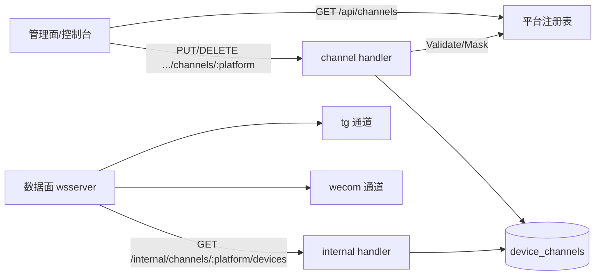
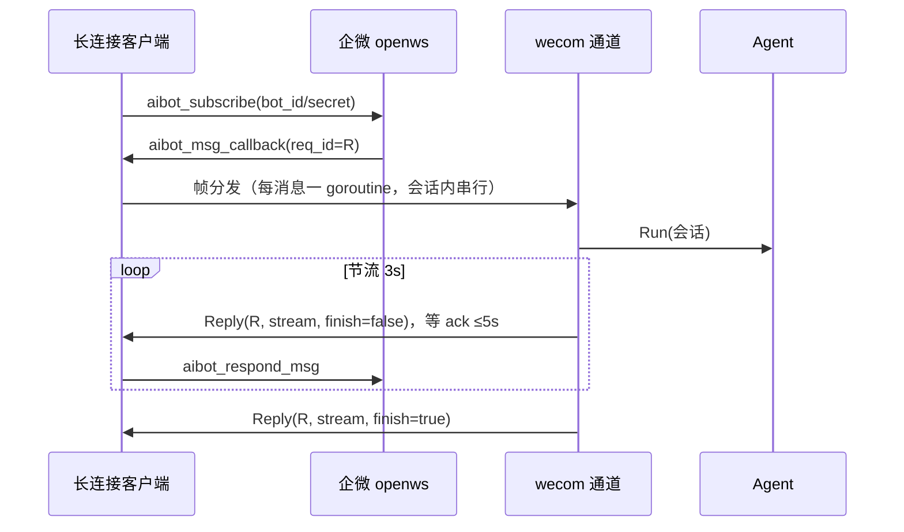
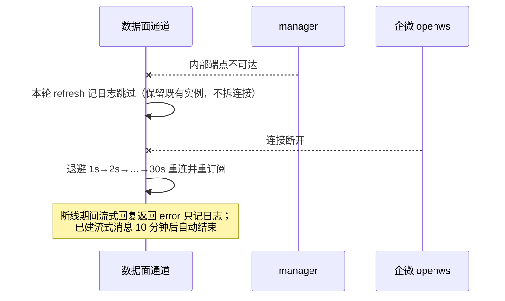

# 通道平台抽象与企业微信接入设计

> 状态：已实现（TG 已迁移到通用端点，WeCom 待真机联调） | 日期：2026-09-30 | 范围：`internal/channels`（平台注册表 + TG/WeCom 通道）、`cmd/manager`（通用通道配置接口与内部下发）、`internal/store`（`device_channels` 表与一次性回填） | 关联：[智能机器人长连接](https://developer.work.weixin.qq.com/document/path/101463)（访问 2026-09-30）、[接收消息](https://developer.work.weixin.qq.com/document/path/100719)（访问 2026-09-30）

## 评审面（≤3 屏 / 约 120 行）

### 1. 结论与边界

把「一个平台一组端点/一组设备列」改成**平台注册表**：每个通道平台（telegram、wecom……）在 `internal/channels/platform` 声明自己的标识、能力与**配置字段 Schema**，manager 只提供两个通用接口——`GET /api/channels` 取平台与其配置方式，`PUT/DELETE /api/voicebots/:id/devices/:did/channels/:platform` 按 Schema 配置；凭证统一存 `device_channels(device_id, platform, config jsonb)`，数据面按平台名拉取。WeCom 智能机器人（API 模式长连接）作为第二个平台接入，走同一套接口。

| 决策 | 选择（被否候选） | 理由 | 代价 |
| --- | --- | --- | --- |
| D1 配置面抽象 | 平台注册表 + 通用端点（否：每平台加一组端点/列，如现状 TG） | 现状每接一个平台要动 store/handler/route/swagger/internal 五处（`cmd/manager/handler/device.go:154`、`internal/store/models.go:57`）；加 Schema 后新增平台=加一条 descriptor | 字段值统一为 `map[string]string`，复杂结构（文件、多值）需要扩展 Schema 类型 |
| D2 凭证存储 | 新表 `device_channels(device_id, platform, config jsonb)`（否：继续按平台加列；否：凭证进配置文件） | 列方案每平台一次迁移；配置文件方案改配置要重启数据面、与「设备级绑定」冲突 | 需要一次性把存量 `devices.tg_bot_token` 回填进新表（幂等，旧列保留不删） |
| D3 配置形态 | 字符串字段 + 描述符声明必填/敏感/提示（否：每个平台自定义 JSON Schema） | 现有两类凭证都是字符串；Schema 只服务「表单渲染 + 校验 + 掩码」三件事 | 数值/布尔/嵌套配置要扩 `Field.Type` |
| D4 API 兼容 | `telegram` 专用端点与 `devices.telegram` 字段直接下线（否：保留旧端点做别名） | 唯一调用方是仓库内的控制台（`web/manager/src/lib/api.ts:116`），本 PR 同步改成通用端点；保留两套写路径必然漂移 | 外部脚本若直连旧端点需改；swagger 同步换版 |
| D5 数据面下发 | 一个端点 `GET /internal/channels/:platform/devices`（否：每平台一个） | 数据面 loader 收敛成一个方法 `ListDeviceChannels(platform)`；与配置面同一份平台命名 | 数据面与 manager 需同版本升级（同仓库同发布，可接受） |
| D6 WeCom 接入与回复 | API 模式长连接 + 流式 `aibot_respond_msg`（否：回调 URL 短连接；否：群机器人 Webhook；否：整段一次性回复） | 无需公网 IP 与加解密；Agent 本就流式产出，长连接没有刷新回调，不主动推流等于白等 | 需自维护心跳/重连与 3s 节流（30 条/分钟/会话）；中途失败用户看到半截；展开见 §C.1 |

**非目标**：模板卡片、素材上传/下载与 AES 解密、主动推送（`aibot_send_msg`）、`feedback_event`；平台 Schema 的非字符串字段（文件、多值）；存量 `devices.tg_bot_token` 列的删除；Xiaozhi 通道的配置面（它不走设备凭证）。

**现状**：TG 通道已有完整链路——manager 存凭证 → 内部端点列出（`cmd/manager/handler/internal.go:84`）→ wsserver 轮询拉起实例（`internal/channels/tg/channel.go:168`），但凭证列（`internal/store/models.go:57`）、管理端点（`handler/device.go:154`）、响应字段、swagger、内部端点各写一份。｜**为什么现在做**：第二个平台（企业微信）的配置字段与 TG 不同，按现状要再复制一遍五处改动。

**关键约束**：配置接口幂等（PUT 覆盖写、DELETE 未配置也 200）；公网响应只回掩码，明文只在内部端点出现；内部端点限内网（`internal.token`）；WeCom 心跳 30s、单会话 30 条/分钟、流式消息 10 分钟内必须 `finish=true`、欢迎语须在 `enter_chat` 5s 内发出。

### 2. 骨架

| 模块 | 职责 | 不负责 | 依赖 | 落点 |
| --- | --- | --- | --- | --- |
| 平台注册表 | 声明各平台标识/能力/配置字段，提供校验与掩码 | 不碰存储、不建连接、不认识设备 | `internal/channels`（类型） | `internal/channels/platform/` |
| 通道配置存储 | `device_channels` 的读写与一次性回填 | 不校验字段语义（交给注册表） | gorm | `internal/store/device_channel.go` |
| 管理面 handler | 列平台、按 Schema 配置/解绑、设备响应回显 | 不判断凭证真伪、不建连接 | 注册表 + store | `cmd/manager/handler/channel.go` |
| 控制台通道面板 | 按 Schema 渲染配置表单与已连接状态 | 不写死平台分支、不做字段校验 | `GET /api/channels`、通用 PUT/DELETE | `web/manager/src/lib/api.ts`、`pages/agents/AgentDetailPage.tsx` |
| 内部下发 handler | 按平台列出设备与原始配置 | 不做缓存 | store | `cmd/manager/handler/internal.go` |
| 数据面 loader | 组装内部 HTTP 请求并解码 | 不重试 | `net/http` | `internal/channels/xiaozhi/device_config.go` |
| TG / WeCom 通道 | 按平台名取配置、起实例、消息→Agent→回复 | 不校验配置字段、不写库 | `channels.Dependencies` | `internal/channels/tg/`、`internal/channels/wecom/` |



关键约束：注册表是 Schema 的唯一权威，manager 与数据面共用同一份平台命名（`platform.Telegram` / `platform.WeCom` 常量），不允许在别处再写字面量。



关键约束：所有回复必须复用回调的 `req_id`，同一 `req_id` 的回复串行发送；读循环是唯一读方，从建连起就运行（否则订阅回执永远等不到）。

### 3. 契约

#### 3.1 接口

```go
// internal/channels/platform —— Schema 与校验（加载/掩码见实现）
type Field struct{ Key, Label string; Required, Secret bool; Hint string }
type Descriptor struct{ Name, DisplayName string; Type channels.ChannelType; Capabilities []channels.Capability; Fields []Field }
func All() []Descriptor
func Get(name string) (Descriptor, bool)
func (d Descriptor) Validate(config map[string]string) error   // 缺字段/未知字段/超长
err := d.Validate(cfg); d.Mask(cfg)                            // Mask：敏感字段只留首尾

type DeviceChannelInfo struct{ DeviceID, DeviceName, VoicebotID string; Config map[string]string }
// internal/channels 新增：ListDeviceChannels(platform string) ([]DeviceChannelInfo, error)
```

- 错误语义：`Validate` 返回用户可读错误（缺字段/未知字段/超长），handler 转 400；`ListDeviceChannels` 失败由通道记日志跳过本轮（与现状 TG 一致，不重试）。
- 并发与所有权：`device_channels` 行的写者只有 manager；数据面只读。
- 兼容规则：`Field` 可加字段；平台不可改名（改名=数据迁移）；旧 `telegram` 端点已移除，见 D4/D5。

#### 3.2 对外端点

| 方法 | 路径 | 谁可调 | 一句话 | 状态码 |
| --- | --- | --- | --- | --- |
| GET | `/api/channels` | 登录用户 | 平台列表 + 配置字段 Schema | 200 |
| PUT | `/api/voicebots/:id/devices/:did/channels/:platform` | voicebot owner | 按 Schema 绑定/覆盖 | 200/400/403/404 |
| DELETE | `/api/voicebots/:id/devices/:did/channels/:platform` | 同上 | 解绑 | 200/403/404 |
| GET | `/internal/channels/:platform/devices` | 内网（`internal.token`） | 下发该平台已配置设备（含明文） | 200 |

已移除：`.../channels/telegram` 与 `GET /internal/devices/tg-bots`；设备响应中的 `telegram` 字段换成通用 `channels` 数组（控制台同一 PR 改完）。

```bash
curl http://localhost:9090/api/channels -H "Authorization: Bearer $TOKEN"
curl -X PUT http://localhost:9090/api/voicebots/VB_ID/devices/DEV_ID/channels/wecom \
  -H "Authorization: Bearer $TOKEN" -H 'Content-Type: application/json' \
  -d '{"config":{"bot_id":"AIBOTxxxx","bot_secret":"s3cr3t"}}'
```

```json
[{"name":"telegram",...,"fields":[{"key":"bot_token","label":"Bot Token","required":true,"secret":true}]},
 {"name":"wecom",...,"fields":[{"key":"bot_id","label":"Bot ID","required":true},{"key":"bot_secret","label":"Secret","required":true,"secret":true}]}]
// 完整字段：type/capabilities/display_name/hint，见 platform.All() 实现
```

{"platform":"wecom","display_name":"企业微信智能机器人","enabled":true,"config":{"bot_id":"AIBOTxxxx","bot_secret":"supe...alue"}}

{"config":{"bot_id":"AIBOTxxxx"}} → 400 {"error":"bot_secret is required"}
{"config":{"bot_id":"x","bot_secret":"y","extra":"z"}} → 400 {"error":"unknown field \"extra\""}
```

幂等：PUT 覆盖写（同值重复调用结果一致）；DELETE 对未配置平台返回 200；`GET /api/channels` 无副作用。凭证端点只接受用户 JWT——机器人 Secret 泄漏也不该能改绑定。

#### 3.3 数据结构

```go
// internal/store/models.go 新增；devices.tg_bot_token 字段从模型移除（列保留，见 D2）
type DeviceChannel struct {
    DeviceID string            `gorm:"primaryKey;type:varchar(128)"`
    Platform string            `gorm:"primaryKey;type:varchar(32)"` // platform.Telegram / platform.WeCom
    Config   datatypes.JSONMap `gorm:"type:jsonb;not null"`         // 字段集合由注册表 Schema 定义
    BaseModel
}
```

- 字段权威：配置权威在 `device_channels`；Schema 权威在代码里的注册表（库只存值，不存字段定义）。
- 状态机：无状态列，「已启用」= 存在一行且必填字段非空（写入前必过 `Validate`）。
- 持久化：主键 `(device_id, platform)`；回填 `devices.tg_bot_token → device_channels(platform='telegram')` 幂等（`ON CONFLICT DO NOTHING`），在 manager 启动时跑（`cmd/manager/main.go:69`）。
- 不变量：`Config` 键集合 ⊆ 该平台 Schema（写入路径唯一）；删设备时同步删掉它的通道行。

### 4. 决策与风险

| 风险 | 影响 | 缓解 | 触发条件（回滚/换方案） |
| --- | --- | --- | --- |
| R1 回填遗漏/旧端点下线 | 老 TG 设备静默掉线；外部脚本 404 | 回填幂等且启动即跑、旧列保留可核对；仓库内唯一调用方（控制台）同 PR 改完 | 上线后发现设备未被拉起或出现 404 → 手工补行/加回别名 |
| R2 Secret 明文入库（jsonb） | 库泄漏即可冒充机器人上线 | 与既有 `tg_bot_token` 同权限；内部端点限内网；公网只回掩码 | 设备凭证加密方案（api-key-design P2）落地时一起迁移 |
| R3 会话历史无裁剪 | 长对话上下文变长、成本上升 | 空闲 30 分钟回收；每会话串行 | 出现单会话 >20 轮的真实用法时加裁剪 |
| R4 同机器人多实例互踢 | 两个 wsserver 抢同一连接 | 收到 `disconnected_event` 后退避 60s | 复现持续互踢 → 改为不自动重连并告警 |

待验证假设：WeCom 最终 `finish=true` 帧的 `content` 覆盖展示全文（文档仅写「展示最终消息」）；群聊 `text.content` 是否必然带 `@机器人名` 前缀（已按剥离实现）。

### 5. 未决问题

- 平台 Schema 是否需要非字符串字段（文件、多选）→ 等第三个平台接入时定；触发条件：出现需要它们的平台。
- `devices.tg_bot_token` 列何时物理删除 → 需要一个可回滚的发布窗口后再做（当前留列，无期限）。

## 支撑材料（按触发写；不触发写"不适用"）

### A. 背景与现状（展开）

| 现状 | 位置 |
| --- | --- |
| 通道接口与类型（server/polling/client） | `internal/channels/channel.go:12-52` |
| TG 通道：30s 轮询、按设备起实例、消息→Agent | `internal/channels/tg/channel.go:26,141,168,265` |
| TG 凭证列与读写 | `internal/store/models.go:57`、`internal/store/device.go:49-64` |
| TG 管理面与响应字段 | `cmd/manager/server.go:153`、`cmd/manager/handler/device.go:26-52,154` |
| TG 内部下发 | `cmd/manager/handler/internal.go:84`、`cmd/manager/server.go:311` |
| 数据面 loader | `internal/channels/xiaozhi/device_config.go:24,68` |
| 控制台通道面板（旧端点唯一调用方） | `web/manager/src/lib/api.ts:116`、`web/manager/src/pages/agents/AgentDetailPage.tsx:2019,532` |
| 通道装配 | `cmd/wsserver/main.go:147-160` |
| 启动期同步先例 | `cmd/manager/main.go:70-95`（SyncSystemProviders / Sync*） |

为什么不够用：每接一个平台要复制 store 列、handler、路由、swagger、内部端点五处改动，且各平台配置字段不同（TG=1 个 token，WeCom=bot_id+secret），继续复制会让设备响应与内部下发出现 N 份相似不复用的代码。

### B. 需求与约束（展开）

| 编号 | 需求 | 判定方式 |
| --- | --- | --- |
| FR-1 | 前端/调用方能一次拿到「有哪些平台、各自要配什么」 | `GET /api/channels` 返回字段 Schema；新增平台无需改前端判分支 |
| FR-2 | 用同一对端点配置任意平台 | 对 telegram 与 wecom 各跑一次 PUT/DELETE，路径只差 `:platform` |
| FR-3 | 公网响应不外泄敏感值 | 单测：`Mask` 后 token 只留首尾；handler 响应断言不含明文 |
| FR-4 | 存量 TG 设备无需重配 | 回填后 `GET /internal/channels/telegram/devices` 能列出老设备 |
| FR-5 | WeCom 单聊/群聊文本可问答、断线可恢复 | 真机联调：回复可见、拔网线后 30s 内恢复 |

质量属性：`GET /api/channels` 无 IO（纯内存表）p99 < 10ms；配置写入一次事务（upsert）≤ 1 次往返；WeCom 收到回调到首帧回复 p95 < 10s（LLM 首 token 正常时）。

约束：不改 Xiaozhi 通道与 `/api/*` 既有鉴权；`internal.token` 语义不变；不接受机器人凭证调用管理面。

### C. 业界调研

触发（新协议 + 新外部依赖 + 配置面抽象）。检索词：「企业微信 智能机器人 长连接 WebSocket 协议」「wecom-aibot go SDK」「智能机器人 aibot_subscribe」「channel platform config schema API」。

| 做法 | 可借鉴什么 | 为什么不直接用 | 来源（访问 2026-09-30） |
| --- | --- | --- | --- |
| 官方 Python / Node SDK | 心跳 30s、订阅等 ack、同一 `req_id` 回复串行、指数退避 | 跨语言进程；官方无 Go SDK | [长连接文档](https://developer.work.weixin.qq.com/document/path/101463)、[python-sdk](https://github.com/WecomTeam/wecom-aibot-python-sdk) |
| 第三方 Go 实现（`cywzzk/wecom-aibot-go-sdk` 等） | 命令常量与流式回复形态参考 | 个人仓库，供应链风险 > 协议复杂度 | [pkg.go.dev](https://pkg.go.dev/github.com/cywzzk/wecom-aibot-go-sdk) |
| 开放平台普遍做法（如 Slack/飞书集成配置） | 「平台描述符 + 通用配置端点」是集成类产品的常见形状：前端按 schema 渲染表单 | —（作为本设计 D1/D3 的外部佐证） | 检索词「channel platform config schema API」未找到可引用的规范原文，故仅列为行业惯例，不作为决策依据 |

结论：协议层借鉴「心跳/退避/串行回复」三条（落到 D6 与客户端实现）；配置面不引任何框架，用 20 行注册表即可（D1/D3）。

#### C.1 WeCom 专项决策（从评审面下沉）

| 决策 | 选择（被否候选） | 理由 | 代价 |
| --- | --- | --- | --- |
| 消息范围 | text + voice（转写文本）+ mixed（取文本项）；image/file/video 回固定文案（否：全类型含素材下载 + AES 解密） | 与 TG 通道现状（`internal/channels/tg/channel.go:250`）对齐，先打通主链路 | 图片/文件消息本次不可用 |
| 会话边界 | 每会话一个 session，空闲 30 分钟回收（否：照抄 TG 每条消息关会话） | 会话历史进 LLM 上下文（`internal/agent/context_builder.go:16`），TG 式关闭会让「那明天呢」失去指代 | 会话内历史无裁剪（风险 R3） |
| 长连接实现 | 自研（gorilla/websocket + JSON 帧）（否：引第三方 Go SDK；否：官方 Node/Python SDK 另起进程） | 官方只提供 Node/Python SDK；第三方 Go 包均为个人仓库，供应链风险 > 协议本身复杂度（协议只有 7 条命令） | 约 300 行自维护的重连/心跳/ack 关联代码 |

### D. 落地与验证

阶段 1（本 PR）：注册表 + `device_channels` 表与回填 + 通用端点 + TG 迁移到新路径（含控制台面板改按 Schema 渲染）+ WeCom 通道 + 单测。阶段 2（真机联调，需用户提供 BotID/Secret）：单聊、群聊 @、语音、断链恢复。

回滚：TG 路径切换与 WeCom 新增都在同一 PR，回滚 = revert（旧列未被删除，回填只增行，可安全重跑）。

验证：`go test ./...`；`make swagger` 后确认 `/api/channels` 与 `:platform` 路由出现在 `docs/manager/swagger.json`；控制台 `npm run build`（tsc + vite）通过。上线后观察：回填条数日志、配置写入错误率、WeCom subscribe/重连日志、单会话回复条数。

### E. 失败路径



清理责任：连接由客户端 `Run` 的每轮 session 负责关闭；会话与 chatState 由通道 janitor 按空闲 TTL 回收；配置行由 DELETE 或设备删除清理（`DeviceStore.Delete` 同步删行）。重试语义：refresh 幂等（新增/断开/凭证变更三类对齐），回复帧靠 `req_id` 幂等（同 id 刷新同一条消息）。

### F. 附录

术语：平台（platform，如 `telegram`/`wecom`，配置与下发的键）；描述符（Descriptor，平台的能力与字段 Schema）；`req_id`（WeCom 帧关联 ID，回复必须透传回调的 `req_id`）；`stream.id`（流式消息标识，同 id 刷新同一条消息）。

变更记录：

| 日期 | 改动 | 原因 |
| --- | --- | --- |
| 2026-09-30 | 初稿：每平台一组端点的 WeCom 接入 | 新增 wecom 通道 |
| 2026-09-30 | 改为平台注册表 + 通用配置接口，TG 一并迁移 | 评审意见：不应每个通道新增一个入口 |
| 2026-09-30 | 实现完成：注册表、`device_channels` 与回填、通用端点、WeCom 长连接客户端；修掉「读循环在订阅后才启动导致订阅回执等不到」的缺陷 | 单测发现；见 D6/D7 |
| 2026-09-30 | 控制台通道面板改为按 Schema 渲染（原先写死 Telegram） | 前端是旧 `channels/telegram` 端点的真实调用方，D4 的「仅接口变更」不成立 |
