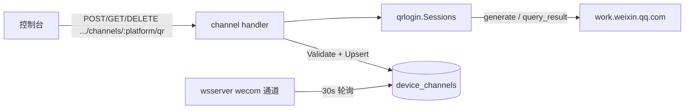
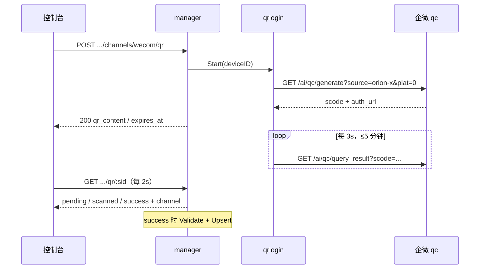
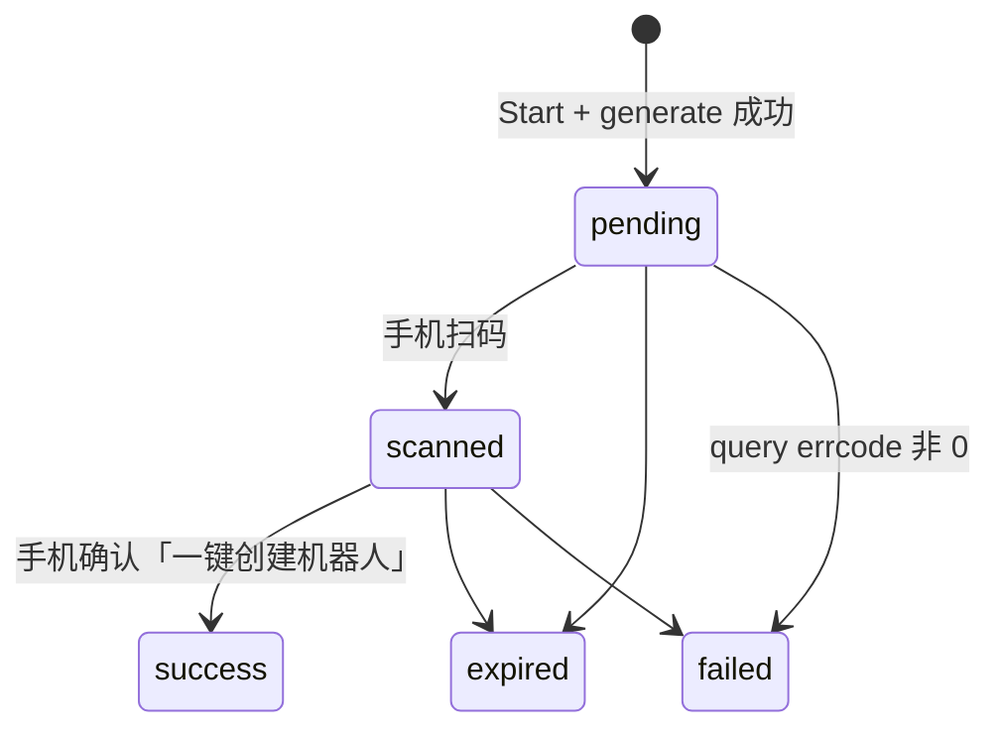
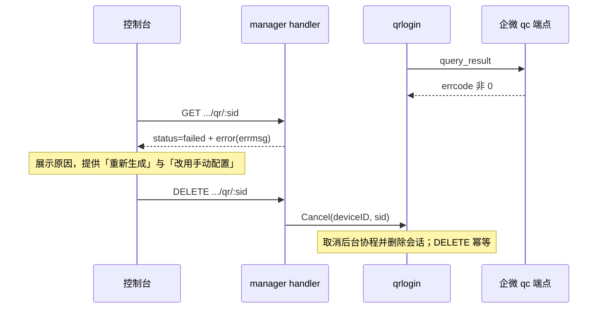

# 企业微信智能机器人扫码开通设计

> 状态：评审中（实现与单测完成，待真机扫码联调） | 日期：2026-09-30 | 范围：`cmd/manager`（配置面 + 控制台）、新增 `internal/channels/wecom/qrlogin` 与 `internal/channels/qrbind`；wsserver 不改 | 关联：[通道平台抽象与企业微信接入设计](wecom-channel-design.md)、[支持扫码关联OpenClaw](https://open.work.weixin.qq.com/help?doc_id=21670)（访问 2026-09-30）、[智能机器人长连接](https://developer.work.weixin.qq.com/document/path/101463)（访问 2026-09-30）

## 评审面（≤3 屏 / 约 120 行）

### 1. 结论与边界

给控制台的通道面板加「扫码开通」：manager 调企业微信扫码会话端点生成二维码，用户扫码并在手机上点「一键创建机器人」，Bot ID / Secret 由 manager 自动写 `device_channels`，wsserver 30s 内自动拉起长连接（现有轮询不用改）。手填 Bot ID / Secret 的路径保留为兜底。

| 决策 | 选择（被否候选） | 理由 | 代价 |
| --- | --- | --- | --- |
| D1 会话归属 | manager 持有会话并出网（否：浏览器直连企微；否：wsserver 持有） | `device_channels` 的写者只有 manager（`wecom-channel-design.md:86`），凭证不进浏览器 | manager 需能出网访问 `work.weixin.qq.com`（根地址可配） |
| D2 用哪套端点 | 企微网页端点 `/ai/qc/generate` + `/ai/qc/query_result`（否：维持手抄；否：等公开开发者 API） | 官方帮助与 LangBot / PicoClaw 两个开源实现都走这条路，是扫码创建的真实链路 | 非公开接口，可能变更/限流；见 R1、R2 |
| D3 会话生命周期 | manager 后台协程每 3s 轮询，内存持有，5 分钟 TTL + 终态保留 30s（否：控制台每次轮询触发出网；否：落库） | 出网频率与标签页数量解耦、短时状态没有第二个读者、不引迁移 | 多一条 goroutine 生命周期要管；manager 重启/将来多实例时会话查不到 → 重新生成 |

**非目标**：其它平台扫码；URL 回调模式；绑定已有机器人（企微扫码只能新建）；wsserver 改动；企微应用 API 授权链路。

**现状**：wecom 要求从企微后台手抄 `bot_id`/`bot_secret`（`internal/channels/platform/platform.go:64-67`），控制台按 Schema 渲染两个输入框（`AgentDetailPage.tsx:2074-2113`），唯一写路径是 `Validate` + `Upsert`（`cmd/manager/handler/channel.go:44-74`）。｜**为什么现在做**：企微已有扫码创建链路，自研控制台的用户同样预期扫码；手抄 Secret 是当前开通最大摩擦点。

**关键约束**：二维码 5 分钟有效（第三方实现口径，企微未公开）；出网单次 15s 超时、轮询 3s；每设备同时 1 个会话；同一机器人同时只有一条长连接（`101463`），换绑即踢掉旧连接；手填路径必须始终可用。

### 2. 骨架

| 模块 | 职责 | 不负责 | 依赖 | 落点 |
| --- | --- | --- | --- | --- |
| 扫码会话（契约 + 企微实现） | 定义 `Binder`/`Session`；generate、3s 轮询、状态机、TTL、取消 | 不认识设备/用户/Schema，不写库 | `net/http` | `internal/channels/qrbind/`、`internal/channels/wecom/qrlogin/` |
| 通道 handler | 3 个新端点；成功时 `Validate` + `Upsert`，返回标准通道状态 | 不拼协议参数、不解析企微响应 | `qrbind` + store + 平台注册表 | `cmd/manager/handler/channel.go` |
| 平台注册表 | wecom 声明 `qr_binding`，控制台据此显示入口 | 不实现扫码 | — | `internal/channels/platform/platform.go` |
| 控制台通道面板 | 扫码弹窗（二维码/状态/重新生成）+ 保留手填表单 | 不直连企微 | manager API | `web/manager/src/pages/agents/AgentDetailPage.tsx`、`lib/api.ts` |



关键约束：写库只发生在 handler；`qrlogin` 单向依赖 `qrbind`，不 import 平台注册表与数据面通道；摘掉 binder 装配即可整体下线扫码。



主链路阻塞点：`generate`（15s 超时，失败即 502）与轮询结果；控制台的每次查询不出网。

### 3. 契约

#### 3.1 接口

```go
// internal/channels/qrbind —— 配置面与平台实现共用的契约
type Status string // pending | scanned | success | expired | failed
type Session struct {
    ID, QRContent string // QRContent 仅 pending/scanned 有值
    Status        Status
    ExpiresAt     time.Time
    Error         string            // failed 的原因（企微 errmsg 或本地判断）
    Config        map[string]string // success 时的平台字段（bot_id / bot_secret）
}
var ErrSessionNotFound = errors.New("qr session not found")
type Binder interface {
    Start(deviceID string) (Session, error) // 重复调用替换旧会话；失败不产生会话
    Get(deviceID, sessionID string) (Session, error)
    Cancel(deviceID, sessionID string) // 幂等，未知会话返回 nil
}
```

**语义**：`Start` 失败 = 现在拿不到二维码（出网失败或 `errcode != 0`），handler 转 502；`success`/`expired`/`failed` 是终态，终态后再保留 30s 供控制台取走，之后清理；`Config` 只在 success 后非空。
**并发与所有权**：会话归 `qrlogin.Sessions` 所有，`Get` 返回深拷贝；单设备单活跃会话；TTL 到期或 `Cancel` 停后台协程；`Sessions` 挂在 manager 的 worker 上下文上，进程退出即停。
**兼容规则**：状态与字段只增不改；`Config` 键集合由平台 Schema 校验，Schema 改名会被 `Validate` 拦下（有单测钉住）。

#### 3.2 对外端点

| 方法 | 路径 | 谁可调 | 一句话 | 状态码 |
| --- | --- | --- | --- | --- |
| POST | `/api/voicebots/:id/devices/:did/channels/:platform/qr` | owner（JWT / key，`device:write`） | 开始扫码会话 | 200/400/404/502 |
| GET | `.../channels/:platform/qr/:sid` | 同上 | 查询状态（成功带通道状态） | 200/404 |
| DELETE | `.../channels/:platform/qr/:sid` | 同上 | 取消会话 | 200/404 |

未变更端点（`GET /api/channels`、PUT/DELETE `.../channels/:platform`）见 `wecom-channel-design.md` §3.2。

```bash
curl -X POST http://localhost:9090/api/voicebots/VB_ID/devices/DEV_ID/channels/wecom/qr -H "Authorization: Bearer $TOKEN"
# 200；GET 同路径 + /:sid 拿同一结构（成功后多一个 channel）
{"session_id":"3f2a...","platform":"wecom","status":"pending",
 "qr_content":"https://work.weixin.qq.com/ai/qc/...?scode=...","expires_at":"2026-09-30T12:05:00Z"}
{"session_id":"3f2a...","platform":"wecom","status":"success","expires_at":"...",
 "channel":{"platform":"wecom","display_name":"企业微信智能机器人","enabled":true,
            "config":{"bot_id":"AIBOTxxxx","bot_secret":"supe...alue"}}}
```

幂等：POST 重复调用 = 旧会话作废、返回新二维码；DELETE 幂等 200；GET 无副作用。
关键失败：`400 {"error":"platform does not support qr binding"}`；生成失败 `502`，控制台引导改手填。**不接受的凭证**：无——写的是设备凭证，与手填同级。

#### 3.3 数据结构

`qrbind.Session` 只在内存：`ID` 标识一次开通动作、与 `device_id` 绑定；`Config` 是「待写值」，写库前必过 `Descriptor.Validate`，写库后随会话到期消亡。**字段权威**：凭证在 `device_channels`；`scode`/`bot_info` 在企微，manager 只透传映射，不补造。



**持久化**：无新表、无迁移；成功即 `device_channels.Upsert`（`internal/store/device_channel.go:61`）。

| 不变量 | 由谁保证 |
| --- | --- |
| 单设备单活跃会话 | `qrlogin` 内存 map（Start 替换） |
| 会话 5 分钟后不再被查询，终态再留 30s 可读 | `qrlogin` TTL + retention（代码） |
| 写库字段合法；`qr_binding` 为真的平台都有 binder | handler 调 `Descriptor.Validate`；装配处一致性测试 |

### 4. 决策与风险

| 难点 | 候选方案 | 决策 | 理由 | 代价 |
| --- | --- | --- | --- | --- |
| 出网位置 | manager 直连 / 走代理 / 用户在本地跑 CLI | manager 直连，根地址可配 | 帮助页与云厂商都在"部署侧"调用；托管控制台没有"用户本地 CLI"的角色 | 部署需出网或配代理 |
| 会话粒度 | 每设备一会话 / 每用户一会话 / 全局池 | 每设备一会话 | 凭证是设备级，一台设备只该有一个机器人 | 多设备要分别扫码 |

| 风险 | 影响 | 缓解 | 触发回滚/换方案的条件 |
| --- | --- | --- | --- |
| R1 非公开端点变更/加签/限流，或 `source` 被校验/封禁 | 扫码不可用 | 手填路径始终可用；协议集中在 `qrlogin`；`source`/根地址可配；`errmsg` 透传控制台 | generate 连续报错且换 `base_url`/`source` 无效 → `channels.qr_binding.enabled: false` |
| R2 manager 多实例 | 会话 GET 404 | 当前单实例；装配只有一处 | 上多实例 → 会话落库或粘性路由 |
| R3 扫码替换既有绑定 | 旧机器人不再应答 | 确认文案写明"将新建机器人并替换当前绑定" | 出现误替换 → 二次确认 |
| R4 扫码人无创建权限 | 拿不到 Secret，流程走不完 | 失败态透出企微文案 | — |

**待验证假设**：扫码只能新建、不能选已有（LangBot 文档，待真机）；`plat=0` 对服务端有效（LangBot 用 0、PicoClaw 用 OS 码，语义未公开）；二维码 5 分钟有效（第三方实现假设，非官方口径）。

### 5. 未决问题

| 问题 | 阻塞谁 | 谁能定 | 最晚答复时间 |
| --- | --- | --- | --- |
| 是否接受依赖非公开企微网页端点（R1 的产品判断）；不接受则本设计作废、现状不变 | 实现 | 项目 owner | 合入前 |
| 开通成功后是否需要主动发验证消息 | 体验 | 项目 owner | 可后置 |

## 支撑材料（按触发写；不触发写"不适用"）

### A. 背景与现状（展开）

| 现状 | 位置 |
| --- | --- |
| wecom 平台 descriptor：手填 `bot_id` + `bot_secret` | `internal/channels/platform/platform.go:57-68` |
| 通用配置端点：Validate → Upsert，响应只回掩码 | `cmd/manager/handler/channel.go:44-74`、`:113-123` |
| 路由与 scope 中央表（新增路由必须同步） | `cmd/manager/server.go:145-160`、`cmd/manager/middleware/scope_table.go:48-55` |
| 控制台按 Schema 渲染输入框与「断开」 | `web/manager/src/pages/agents/AgentDetailPage.tsx:2028-2121`、`web/manager/src/lib/api.ts:139-154` |
| 数据面：30s 轮询 manager，凭 `bot_id`/`bot_secret` 建长连接 | `internal/channels/wecom/channel.go:202-256` |
| 前端二维码展示先例（支付） | `web/manager/src/pages/billing/RechargePage.tsx:615-623` |

**为什么不够用**：手抄 Secret 要在企微后台与管理端之间来回三步，Secret 只在创建时展示一次，抄错/抄漏是必然摩擦。
**为什么现在做**：企微对 OpenClaw 与云厂商开放了扫码创建链路（帮助页 doc_id 21670、腾讯云/天翼云控制台都有"扫码授权"），用户对此有预期。
**相关文档**：`docs/wecom-channel-design.md`。

### B. 需求与约束（展开）

| 编号 | 需求 | 判定方式 |
| --- | --- | --- |
| FR-1 | 控制台对 wecom 提供扫码入口，扫码后自动完成绑定 | 真机端到端：出现二维码 → 手机确认 → 通道已连接 → 对话有回复 |
| FR-2 | 手填 `bot_id`/`bot_secret` 保留可用 | 现有手填路径与测试不受影响 |
| FR-3 | 会话状态可观测（等待/已扫码/成功/过期/失败） | GET 端点状态机单测 + 控制台文案 |
| FR-4 | 失败可自愈：重新生成、取消 | 单测覆盖 Start 替换、Cancel 幂等、TTL 过期 |

| 维度 | 目标 | 口径（部署 / 数据量） |
| --- | --- | --- |
| 出网延迟 | generate ≤15s，超时即失败 | manager 单实例、公网可达 |
| 轮询负载 | 每会话 20 次/分钟，≤5 分钟 | 单设备单会话；企微未公布限流口径 |
| 会话并发 | ≤ 设备数 | 内存 map；单实例 |
| 兼容 | 老数据/老接口零变化 | 无迁移、无既有端点改动 |

**约束**：技术 —— 只用 `net/http`，前端只加一个二维码库；组织 —— `source` 默认 `orion-x`，未与企微报备；兼容与迁移 —— 不加表、不改 Schema 字段。

### C. 业界调研

检索角度与检索词：「企业微信 扫码 一键创建智能机器人」「wecom qc generate query_result」「help2/pc/21704 / doc_id=21670」，以及开源实现源码（LangBot / PicoClaw / wecom-cli）。

| 方案 | 做法 | 可借鉴 | 为什么不直接用 | 来源（访问日期） |
| --- | --- | --- | --- | --- |
| 企微官方帮助与 OpenClaw 插件 | 扫码 → 手机端「一键创建机器人」→ 自动接入 | 交互与文案（仅新建、不能选已有） | Node CLI，不适用于 Go 控制台 | [doc_id=21670](https://open.work.weixin.qq.com/help?doc_id=21670)（2026-09-30） |
| LangBot（Python） | `GET /ai/qc/generate?source=langbot&plat=0` → 前端渲染 `auth_url` → 3s 轮询 `GET /ai/qc/query_result?scode=` → `data.bot_info.botid/secret` | 端点与字段、3s 间隔、TTL 300s、状态机 | 其 WebUI 直接持有会话；我们让 manager 持有，凭证不进浏览器 | [镜像提交 f412127](https://git.xiganglive.com/xinyin025/LangBot/commit/f412127fb0c9d22e33cc9d4ae53c600fe596c31d)（2026-09-30） |
| PicoClaw（Go） | 同端点；`source`/`sourceID`=picoclaw，`plat`=OS 码；3s 轮询、5 分钟超时、15s HTTP 超时；处理 `success`/`expired`/`scaned` | 可抄的 Go 结构：响应解析、errmsg 检查、超时常量 | CLI 把凭据写本地文件，与管理端职责不同 | [wecom.go](https://github.com/sipeed/picoclaw/blob/7b478723/cmd/picoclaw/internal/auth/wecom.go)（2026-09-30） |
| wecom-cli（Rust） | 同端点；终端渲染 `auth_url`，浏览器页 `/ai/qc/gen?source=..&scode=..` | 浏览器兜底页 URL 形式 | 终端场景不需要 | [qrcode.rs](https://docs.rs/crate/wecom-cli/latest/source/src/auth/qrcode.rs)（2026-09-30） |

**结论**：借鉴端点、参数与轮询参数（落到 D2/D3 与状态机）；采用 manager 持有会话而非 CLI 落盘（D1）；不采用浏览器兜底页（D4）。端点未出现在企微开发者中心文档中，按 R1/R2 处理。

### D. 落地与验证

| 阶段 | 内容 | 可独立验证的点 |
| --- | --- | --- |
| 1 | `qrbind` 契约 + `qrlogin` 客户端 + 单测（httptest 假企微） | 未接 manager 也能跑：状态机、TTL、取消、errcode |
| 2 | manager 端点 + 配置 + scope/swagger + 单测 | 假 binder 的 handler 测试；`make test`；`make swagger` |
| 3 | 控制台扫码弹窗 + 手填兜底 | `npm run build`；真机扫码端到端（FR-1） |

**兼容策略**：无迁移；`GET /api/channels` 只多一个 `qr_binding`，老控制台忽略即回到现状。二维码渲染选控制台 `qrcode.react`（否：manager 返回图片）：不引 Go 依赖，支付页已有前端展示二维码的先例（`web/manager/src/pages/billing/RechargePage.tsx:615-623`），代价是多一个前端依赖（MIT）。
**开关 / 灰度 / 回滚**：`channels.qr_binding.enabled: false` 隐藏入口（binder 不装配）；回滚 = revert 本 PR + 重发 manager（无数据影响；已写入凭证照常工作）。
**验证**：单元 —— 契约/客户端、handler 三端点、装配一致性；集成 —— 假企微 httptest 全链路；端到端 —— 真机扫码一次（含无权限失败路径）；压测不需要。
**上线后观测指标**：扫码会话成功率（success/Start）、`generate` 错误率与 errcode 分布、手填路径占比。

### E. 失败路径



- **谁清理什么**：`qrlogin` 在 goroutine 里负责终态与 TTL 清理；`Cancel` / 进程退出（worker 上下文）取消协程；manager 不落库，无补偿。
- **重试与幂等**：`generate` 失败不产生会话（直接 502，用户重新生成）；轮询期间网络抖动不改状态，继续到 TTL；`Upsert` 幂等，重复 GET 成功态最多重复写一次相同凭证。

### F. 附录

**术语表**：scode —— 企微扫码会话标识；auth_url —— 二维码内容（手机扫码打开的授权页）；qr_binding —— 平台是否支持扫码开通的声明字段。

**来源**（访问日期均为 2026-09-30）：

- [支持扫码关联 OpenClaw（企业微信帮助中心，doc_id=21670）](https://open.work.weixin.qq.com/help?doc_id=21670)（页面当前返回英文版；中文逐字引文见转载 [blog.zxiaolin.com](https://blog.zxiaolin.com/docs/OpenClawdocs/OpenClawweo)）
- [智能机器人长连接（企业微信开发者中心，path/101463）](https://developer.work.weixin.qq.com/document/path/101463)：一机一连接、30 条/分钟/会话、流式 `finish` 语义
- [PicoClaw wecom.go](https://github.com/sipeed/picoclaw/blob/7b478723/cmd/picoclaw/internal/auth/wecom.go)、[LangBot 镜像提交](https://git.xiganglive.com/xinyin025/LangBot/commit/f412127fb0c9d22e33cc9d4ae53c600fe596c31d)、[wecom-cli qrcode.rs](https://docs.rs/crate/wecom-cli/latest/source/src/auth/qrcode.rs)
- [腾讯云 ADP 远程终端渠道](https://cloud.tencent.com/document/product/1759/132562)：「可以通过扫码授权或手动配置两种方式获取 Bot ID、Secret。推荐使用扫码授权方式」

**变更记录**

| 日期 | 改动 | 原因 |
| --- | --- | --- |
| 2026-09-30 | 初稿 | 扫码开通立项 |
