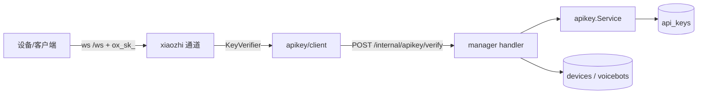
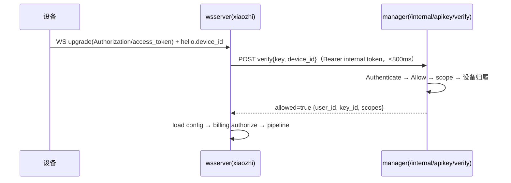
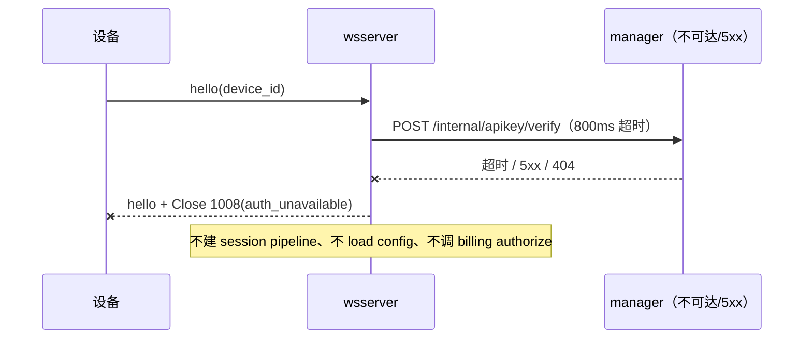

# wsserver WS 握手鉴权设计

> 状态：已实现（阶段 1 + 2；`auth.enabled` 默认关闭，灰度开启） | 日期：2026-09-27 | 范围：`cmd/wsserver` 的 `/ws` 握手 + `cmd/manager` 新增内部校验端点（`/api/*`、控制台、TG 通道不改） | 关联：`internal/apikey/`、`cmd/manager/handler/apikey.go`、`internal/channels/xiaozhi/`、[api-key-design](./api-key-design.md)、[wsserver-protocol-design](./wsserver-protocol-design.md)

## 评审面（≤3 屏 / 约 120 行）

### 1. 结论与边界

给 `cmd/wsserver` 的 `/ws` 握手加账号 API Key 鉴权：连接必须携带有效的 `ox_sk_` key，且该 key 属于会话所用设备的归属账号并具备 `device:connect` scope；校验由 manager 新增的 `/internal/apikey/verify` 完成，开关默认关闭。**不新建设备凭证体系**——设备凭证仍按 [api-key-design](./api-key-design.md) §2.4/Q4 留待 P2。

| 决策 | 选择（被否候选） | 理由 | 代价 |
| --- | --- | --- | --- |
| D1 凭证形态 | 账号 key + 设备归属 + `device:connect`（否：新设备凭证表；否：不鉴权） | key 管理/撤销/限流已就绪（#63），复用成本最低；归属校验修掉"知道 device_id 就能白嫖"；设备凭证表要新管理面+固件轮换 | key 进固件后难以按设备轮换；撤销粒度是 key，多设备共用时影响面大 |
| D2 校验路径 | manager `/internal/apikey/verify`（否：wsserver 直连 DB） | 数据面不连 DB、不复制 key 判定；manager 是唯一权威；撤销即时 | 每新连接一次 RPC；manager 故障时启用鉴权的 wsserver 拒新连接 |
| D3 校验时机 | 读完 hello 之后（否：升级前用 header device-id） | `hello.device_id` 才是会话实际使用的标识（`channel.go:321`），避免 header/hello 不一致绕过 | 无效 key 也会先完成 WS 升级 |
| D4 失败方向 | fail closed（否：照计费 fail open） | 鉴权是入口防线；fail open 等于 manager 一挂鉴权消失 | 新连接可用性绑定 manager；靠开关回退 |
| D5 scope | 新增目录项 `device:connect`（否：不要求 scope；否：复用 `device:read`） | deny-by-default；只读 key 不该能消耗余额开语音会话；`device:read` 语义是"看"不是"连" | 存量 key 没有它，开启鉴权前必须换发；覆盖测试要登记数据面消费方 |
| D6 开关 | `auth.enabled` 默认 false（否：直接强制） | 存量只发 device_id 的客户端零变化；可灰度可回滚 | 开启是一次显式运维动作，需先发 key |

**非目标**：设备凭证（P2）；TG 通道；`/healthz` 与 `/internal/device-config` 鉴权；连接中途撤销/心跳复验；Origin 白名单（凭证是 Bearer 不是 Cookie）；`/api/*` 任何改动。

**现状**：`/ws` 唯一身份是客户端自报的 `hello.device_id`（`internal/channels/xiaozhi/channel.go:321`），Authorization/access_token 只被读出来打日志（`channel.go:194-200`）；manager 的 key 体系已落地但只保护 `/api/*`（`docs/api-key-design.md:15` D1）。｜**为什么现在做**：key 体系刚可自助创建；不加鉴权时任何人知道 device_id 就能消耗设备主的余额。

**关键约束**：校验端到端超时 800ms（唯一新增阻塞点，在 hello 的 10s 窗口内）；撤销对下一次连接即时生效、已建连接不受影响；`auth.enabled: false` 时行为与现状一致。

### 2. 骨架

| 模块 | 职责 | 不负责 | 依赖 | 落点 |
| --- | --- | --- | --- | --- |
| manager 内部校验 handler | 校验 key、限流、scope、设备归属；只回事实 | 不签发/撤销 key；不建会话；不认识通道 | `apikey.Service` + device/voicebot store | `cmd/manager/handler/apikey.go`（并入 `APIKeyHandler`） |
| wire + 数据面 client | 路径、DTO；调内部端点并区分业务拒绝与传输失败 | 不做任何判定；不缓存、不重试 | 标准库、`net/http` | `internal/apikey/wire.go`、`internal/apikey/client/` |
| 通道接线 + xiaozhi 通道 | `KeyVerifier` 注入；读 token、日志脱敏、调校验、失败回 hello+Close 1008、身份注入 memory | 不做 key 校验、不关心实现 | 通道依赖 | `internal/channels/manager.go`、`internal/channels/xiaozhi/channel.go` |
| wsserver 入口 | `auth.enabled` 配置、组装 verifier、启动期校验 | 不解析 key | `apikey/client` | `cmd/wsserver/main.go`、`internal/channels/xiaozhi/config.go` |
| 覆盖性登记 | 声明 `device:connect` 由数据面消费 | 不做运行时判定（仅测试登记） | `apikey` 目录 | `cmd/manager/middleware/scope_table.go` |



关键约束：数据面只走 HTTP，不 import `internal/store`；key 有效性只有 `apikey.Service.Authenticate`（`internal/apikey/service.go:166`）一个判定点；identity 只以 `user_id` 注入 memory 上下文（`channel.go:443` 不再用 device_id）。



拒绝路径（reason 透传、Close 1008）见 §E；verify 是唯一新增阻塞（≤800ms），其后的 device config（3s）与 billing authorize（800ms）是既有链路。

### 3. 契约

#### 3.1 接口

`internal/apikey/wire.go`（与 billing/wire.go 同形，领域包仍零依赖）：`PathVerify` + `VerifyRequest{key, device_id}` + `VerifyResponse{allowed, key_id, user_id, scopes, reject_reason, required, granted}`。

```go
// internal/channels：通道看到的最小能力（测试内联假实现）
type KeyVerifier interface {
    Verify(ctx context.Context, rawKey, deviceID string) (apikey.VerifyResponse, error)
}

// internal/apikey/client
func New(cfg Config) *Client // BaseURL / Token / Timeout(默认 800ms) / HTTPClient
func (c *Client) Verify(ctx context.Context, rawKey, deviceID string) (apikey.VerifyResponse, error)
```

**错误语义**：`200` 一律 decode 成 `VerifyResponse`（`allowed=false` 是业务结论，`err == nil`）；非 2xx / 网络 / 超时 / decode 失败返回 error（内部 401 包 `ErrUnauthorized` 便于日志区分"配错"）。有 verifier 时 error 一律 fail closed，关帧 reason 记 `auth_unavailable`。
**并发与兼容**：`Client` 无状态可并发，超时由 context 控制，结果只用于本次连接；DTO 字段只增、`reject_reason` 可扩且原样透传未知值、`allowed` 恒在。

#### 3.2 对外端点

| 方法 | 路径 | 谁可调 | 一句话 | 状态码 |
| --- | --- | --- | --- | --- |
| POST | `/internal/apikey/verify` | manager 内部（Bearer internal token） | 校验 key + 限流 + scope + 设备归属 | 200 / 400 / 401 / 404（apikey 关闭） |
| WS | `/ws` | 客户端（额外携带 `ox_sk_`） | 连接准入；鉴权开启后无效 key 拒绝 | 101 / 401（无 key，升级前）/ 1008（校验拒绝） |

`reject_reason` 取值（下划线风格与 `billing.RejectReason` 对齐）：`invalid_key`、`key_revoked`、`key_expired`、`insufficient_scope`、`device_not_owned`、`rate_limited`；wsserver 本地新增 `auth_unavailable`。

```bash
curl -X POST http://localhost:9090/internal/apikey/verify -H "Authorization: Bearer $INTERNAL_TOKEN" \
  -d '{"key":"ox_sk_7Qm2Vx4bTk_9fJ3aPz0Lq8Rw5Nc1Yh6BdE2Gs4UmXk_8hKq2P","device_id":"dev-1"}'
```

```text
200 OK {"allowed":true,"key_id":"0b0e5c3a...","user_id":"u-1","scopes":["device:connect"]}

200 OK {"allowed":false,"reject_reason":"insufficient_scope","required":["device:connect"],"granted":["agent:read"]}
```

`/ws` 行为变更：`Authorization: Bearer ox_sk_...` 或 `?access_token=ox_sk_...`；无 key → 升级前 `401 {"error":"missing api key"}`；业务校验失败 → 升级后回 hello 再 Close 1008，reason 即 `reject_reason`（本地失败是 `auth_unavailable`）；通过后流程不变。

**幂等**：verify 纯校验无副作用；唯一可变状态是每 key 限流桶与 `call_count`/`last_used_at` 内存计数（非精确口径，与 HTTP 面共用同一个桶，见 api-key-design §3.2）。
**不接受**：`/healthz` 保持匿名（探针）；`/internal/device-config` 本期不挂鉴权（存量内部调用，范围外）。

#### 3.3 数据结构

不新增表、不新增列、无迁移。校验期只读 `api_keys` 与 `devices → voicebots.owner_id`；权威仍在原域，wsserver 不复制字段（只在连接上下文持有 `user_id`/`key_id`）。状态机沿用 api-key-design §5.4（Active → Revoked / Expired），"连接"不是状态；鉴权关闭时 verifier 为 nil、通道不调用校验。

| 不变量 | 由谁保证 |
| --- | --- |
| key 有效性只有 `apikey.Service.Authenticate` 一处判定 | HTTP 中间件与 verify handler 调同一函数 |
| `allowed=true` ⇒ key 有效 + `device:connect` + `device→voicebot.OwnerID == user_id`；设备不存在与不属于本账号统一 `device_not_owned`（不给枚举面） | handler 顺序判定 + 表驱动测试 |
| 日志与关帧不含完整 key（只允许 `lookup`） | 单测断言（对齐 `apikey_log_test.go`） |

### 4. 决策与风险

决策候选与被否理由已并入 §1 决策表；换方案的触发条件：一设备一 key 维持不住 → 启动 P2 设备凭证（Q1）；连接量级压垮 manager → 改本地校验 + 短 TTL 缓存；manager 可达性低于 SLO → 关开关或 D2 换向。

| 风险 | 影响 | 缓解 | 触发回滚/换方案的条件 |
| --- | --- | --- | --- |
| 存量 key 无 `device:connect`，开启后连不上 | 高 | 默认关；先测试环境 + 公告；控制台目录自动展示该 scope；开关回退 | 开启后 `insufficient_scope` 占比高 → 关开关并补发 key |
| manager 不可达 → 新连接全拒 | 中 | 800ms 超时、复用计费同源监控、`auth_unavailable` 告警 | manager 可用性低于 SLO → 关开关或改本地校验 |
| 现有 `handleWS` 打印完整 Authorization（`channel.go:199`） | 高 | 先做日志脱敏 + 单测；开关默认关使暴露窗口为零 | 日志出现完整 `ox_sk_` → 立即轮换（api-key-design R3 流程） |
| 长连接期间撤销不生效 | 中 | 文档写明"撤销在下次连接生效" | 合规要求 ≤ N 分钟 → 加心跳复验（Q2） |
| key 走 `access_token` query 被代理日志记录 | 中 | 同时支持 header；文档建议 header（RFC 6750 §2.3） | 代理日志无法脱敏 → 推固件改 header 后下线 query |

**待验证假设**：A1 manager 故障率低到 fail closed 可接受；A2 存量客户端都能带 token（header 或 query）；A3 连接频率远低于 key 限流桶上限（20 rps / 40 burst）。

### 5. 未决问题

| 问题 | 阻塞谁 | 谁能定 | 最晚什么时候要有答案 |
| --- | --- | --- | --- |
| Q1 设备凭证（P2）还要不要做、形态（随机串/非对称） | 固件侧改造 | 架构 + 客户端负责人 | 下次动固件前（api-key-design Q4） |
| Q2 长连接期间撤销是否需要主动断开（心跳复验周期） | 通道实现 | 产品 + 安全 | 鉴权开启后第一次复盘 |
| Q3 `access_token` query 的弃用时间表 | 固件 | 客户端负责人 | 不影响本轮实现 |

## 支撑材料（按触发写；不触发写"不适用"）

### A. 背景与现状（展开）

| # | 事实 | 证据 |
| --- | --- | --- |
| F1 | `/ws` 唯一身份是自报 device_id；token 只读出来打日志；device_id 还被当 memory userID | `internal/channels/xiaozhi/channel.go:194-200`、`:321`、`:443` |
| F2 | 设备配置来自匿名 `/internal/device-config` | `internal/channels/xiaozhi/device_config.go:44`；`cmd/manager/server.go:295` |
| F3 | manager 已有完整 key 能力：Authenticate / Allow / RecordUsage、管理 handler、scope 目录、限流桶 | `internal/apikey/service.go:166,197,202`；`cmd/manager/handler/apikey.go`；`cmd/manager/middleware/scope_table.go` |
| F4 | 内部端点先例：billing 三条挂 `InternalAuth`，业务拒绝用 `allowed=false`/200 | `cmd/manager/server.go:318-323`；`cmd/manager/handler/billing.go:118`；`internal/billing/wire.go:44` |
| F5 | 通道拒绝机制：回 hello + Close 1008(reason)，不建 pipeline | `internal/channels/xiaozhi/channel.go:258-276`、`:385-388` |
| F6 | 归属解析已有同构实现：device→voicebot.OwnerID | `internal/billing/service/resolver.go:37-46`；`internal/store/voicebot.go:36` |
| F7 | wsserver 注入点在 `channels.Dependencies`；配置无 auth 段 | `internal/channels/manager.go:35`；`cmd/wsserver/main.go:119-125`；`data/wsserver.yaml:1-9` |
| F8 | 覆盖性测试反向要求每个目录 scope 被路由使用或 Deprecated | `cmd/manager/middleware/scope_table.go:205-210` |

**为什么不够用**：任何人知道一个已注册 device_id 就能开语音会话，消耗设备主余额、读写其记忆；计费准入只校验余额，不校验"你是谁"。
**为什么现在做**：key 体系刚落地；把数据面接上同一条身份链是自然下一步，越晚做存量无 key 客户端越多。
**相关文档**：api-key-design（D1/Q4/§5.3）、wsserver-protocol-design（hello 握手）、billing-design §14.1（内部 token）。
**与 `cmd/manager/handler/apikey.go` 的关系**：那个文件是 key 的**自助管理面**（创建/列表/撤销，只接 JWT，本次不改）；本设计复用的是它背后的 `apikey.Service` 与 key 表。

### B. 需求与约束（展开）

| 编号 | 需求 | 判定方式 |
| --- | --- | --- |
| FR-1 | 鉴权开启时，无 key 的 `/ws` 握手在升级前 401 | 集成测试 |
| FR-2 | key 无效/撤销/过期/缺 scope/设备不归属 → hello+Close 1008，reason 可区分 | 表驱动测试断言 close reason |
| FR-3 | key 有效 + `device:connect` + 归属匹配 → 连接与未开鉴权行为一致 | 回归测试 |
| FR-4 | 会话 memory 的 `user_id` 取 key 的 user_id（不再用 device_id） | 单测/代码检查 |
| FR-5 | 日志与关闭帧不含完整 key | 日志断言单测 |
| FR-6 | `auth.enabled: false` 时行为与现状一致 | 回归测试 |
| FR-7 | `apikey.enabled: false` 时 verify 端点 404，wsserver 记 `auth_unavailable` 并拒绝 | 集成测试 |
| FR-8 | WS 连接计入 `call_count`/`last_used_at`（与 HTTP 面同桶） | 单测 |

| 维度 | 目标 | 口径 |
| --- | --- | --- |
| verify 延迟 | manager 侧 p99 ≤ 30ms；端到端超时 800ms | 单实例、PG 同机房、api_keys ≤ 10 万行、每连接 3 次索引点查（假设，上线实测） |
| 撤销时效 | 下一次连接即失效 | 无缓存；已建连接不受影响 |
| 容量 | 每新连接 +3 次点查；连接频率 << HTTP QPS | 连接频率待观测 |
| 成本 | 0 新依赖、0 新表 | `go.mod` 不变 |

**约束**：Go + Gin + GORM；不新增依赖；`internal/apikey` 零依赖纪律不破（wire 只用标准库）；wsserver 默认关闭；`/api/*` 语义零变化。

### C. 业界调研

触发：方案与业界默认有两处不同——为兼容存量设备接受 query token；P1 不做连接中复验。

| 做法 | 可借鉴 | 为什么不直接用 | 来源 |
| --- | --- | --- | --- |
| RFC 6750 §2.3/§5.3：Bearer token SHOULD NOT 放 URI query（会被历史/日志记录），除非无法用 header/body | 同时支持 header 并文档建议之；query 仅为兼容 | 存量设备只支持 query，本轮无法强制 | RFC 6750（访问 2026-09-27） |
| OWASP WebSocket Cheat Sheet：WS 无内建鉴权；握手时鉴权；长连接应定期复验、登出即断；不要打印完整 token；限制连接数 | 握手鉴权 + 日志脱敏 + 复用 key 限流桶 | 定期复验/登出即断进 Q2；Origin 白名单针对 Cookie 型 CSWSH，本服务是 Bearer + 原生客户端 | OWASP Cheat Sheet Series: WebSocket Security（访问 2026-09-27） |

**结论**：鉴权放握手（D3）、header 优先 query 兼容、失败关闭（D4）；复验列 Q2。

### D. 落地与验证

| 阶段 | 内容 | 可独立验证的点 |
| --- | --- | --- |
| 1 manager | wire + internal handler + 路由 + scope 目录 + 覆盖测试登记 | curl verify 的成功/拒绝矩阵；`go test ./...` |
| 2 wsserver | 配置 + client + 通道接线 + 日志脱敏 | 单测 + 假 manager 集成；默认关闭回归 |
| 3 灰度开启 | 公告并让用户换发带 `device:connect` 的 key；测试环境 → 生产 | 连接成功率、1008 reason 分布 |

**兼容策略**：`/api/*` 零变化；老 key 在开关开启前行为不变。开启后无 key/无 scope 客户端断连是预期破坏性变更，必须先公告。
**开关 / 灰度 / 回滚**：`auth.enabled`（wsserver 配置；开启时 `manager.token` 必须已配，启动期校验）；回滚 = `enabled: false` 重启 wsserver（manager 端点留着无害）。
**验证**：单测（handler 拒绝矩阵、client 错误语义、通道拒绝路径、日志脱敏）｜集成（httptest manager + 真 WS 客户端）｜端到端（真设备/脚本）｜上线后观测 `reject_reason` 分布、`auth_unavailable` 计数、verify p99、连接成功率。
**提交前**：`golangci-lint run ./...` + `make test`。

### E. 失败路径



谁清理什么：校验在 device config / billing / pipeline 之前，失败时只有"为回 hello 而创建的 session"走 `newConnection` 的 deferred `CloseSession`；billing 不入账。verify 幂等可安全重试，但本轮不重试——凭证错误是配置问题（见 401 语义），重试无意义。

### F. 附录

**术语表**：握手鉴权 = WS upgrade 后、建会话前的凭证校验；verify = manager 内部校验端点；`device:connect` = 允许连接设备开启语音会话的 scope；fail closed = 校验链路故障时拒绝。

**来源**：RFC 6750 The OAuth 2.0 Authorization Framework: Bearer Token Usage — https://www.rfc-editor.org/rfc/rfc6750#section-2.3（访问 2026-09-27）；OWASP Cheat Sheet Series: WebSocket Security — https://cheatsheetseries.owasp.org/cheatsheets/WebSocket_Security_Cheat_Sheet.html（访问 2026-09-27）；`docs/api-key-design.md`；`docs/billing-design.md`。

**变更记录**

| 日期 | 改动 | 原因 |
| --- | --- | --- |
| 2026-09-27 | 初稿：账号 key + 设备归属 + `device:connect`，manager 内部 verify，默认关闭 | 立项评审：数据面"知道 device_id 就能白嫖"（api-key-design F3）；确认复用账号 key 而非新建设备凭证 |
| 2026-09-28 | 按本文实现阶段 1 + 2：`internal/apikey/wire.go` + `client/`、`cmd/manager/handler/apikey_internal.go` + `/internal/apikey/verify`、`device:connect` 目录/数据面覆盖登记；wsserver `auth` 配置 + 通道接线 + 日志脱敏。两处落地选择：① verify 在 `apikey.enabled: false` 时路由不注册（自然 404，对齐计费内部端点）；② 设备归属解析抽成 `DeviceOwner` 接口（store 实现），让 handler 无 DB 可测 | 实现与设计一致；阶段 3（灰度开启）仍是显式运维动作 |
| 2026-09-28 | 评审修订：内部校验端点并入 `cmd/manager/handler/apikey.go` 的 `APIKeyHandler`（`apikey_internal.go` 删除）；`owner` 与 store 依赖构造期强校验（nil panic），去掉 handler 内的 nil 兜底与冗余判断 | 评审：同一份 apikey HTTP 面不必两个 handler 类型；强依赖从 New 收口 |
